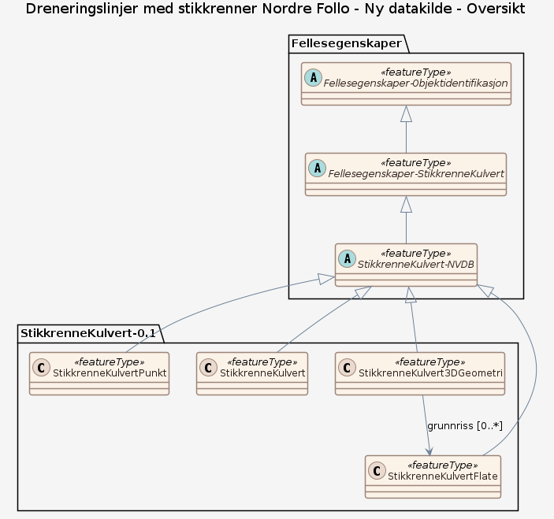

# Produktspesifikasjon: Dreneringslinjer med stikkrenner Nordre Follo

*Dreneringslinjer med kulvert/stikkrenner.
Dekning kun i deler av tidligere Ski kommune.*

**Nøkkelord:** Nordre Follo kommune, Det offentlige kartgrunnlaget, fellesDatakatalog, Basis geodata

**Emnekategorier:** 

**Geografisk utstrekning**:

- **Vest**: 10.71864
- **Øst**: 10.991982
- **Sør**: 59.618675
- **Nord**: 59.839283

**Tidsmessig utstrekning**:

- **Tidsperiode**:
  - **Fra**: 2020-12-03
  - **Til**: 2020-12-03

## Om spesifikasjonen

> **Denne versjonen av produktspesifikasjonen:**  
> **Opprettet dato:** 2020-12-03 
> **Endret dato:** 2020-12-03 
> **Språk:** nor 
> **Kontaktinformasjon:** Nordre Follo kommune, [magnus.haugstad@nordrefollo.kommune.no](mailto:magnus.haugstad@nordrefollo.kommune.no)

## Om produktet Dreneringslinjer med stikkrenner Nordre Follo

> **Romlig representasjonstype:**  
> **Unik identifikator:** af36a16e-7a08-4bfd-8c39-68e54e3cc584 
> **Kontaktinformasjon:** Nordre Follo kommune, [magnus.haugstad@nordrefollo.kommune.no](mailto:magnus.haugstad@nordrefollo.kommune.no)
>
> **Romlig oppløsning:**
>
>
>
> **Begrensninger:**
>
> **Juridiske begrensninger**:
>
> - **Tilgangsbegrensninger**: Åpne data
> - **Bruksbegrensninger**: Lisens
> - **Lisens**: No conditions apply to access and use
> - **Lisenslenke**: <http://inspire.ec.europa.eu/metadata-codelist/ConditionsApplyingToAccessAndUse/noConditionsApply>

## Omfang

### Hele datasettet

**Nivå**: dataset

**Nivåbeskrivelse**: Gjelder hele datasettet. Hvis omfang ikke er oppgitt under en overskrift, gjelder teksten for hele datasettet og alle leveranser

### Ny datakilde

**Nivå**: dataset

## Datainnhold og struktur

### Datamodell - Ny datakilde

➡️ [Se full datamodell for omfang "Ny datakilde" (diagram per pakke og objektkatalog)](ny-datakilde/objektkatalog.html)

## Datakvalitet

**Nivå**: dataset

## Vedlikehold

**Vedlikeholdsfrekvens**: Ukjent

## Leveranse

| Tjeneste | Endepunkt | Type | Format | Leveranseenheter |
| --- | --- | --- | --- | --- |
| Geonorge filnedlastning | [Lenke](https://nedlasting.geonorge.no/geonorge/kommunaleDokData/af36a16e-7a08-4bfd-8c39-68e54e3cc584.zip) | GEONORGE:FILEDOWNLOAD |  |  |
| GeoPackage: ny-datakilde | [Lenke](https://raw.githubusercontent.com/KentJonsrud/produktspesifikasjon_sommer/main/k_produktspesifikasjon/k-dreneringslinjer-med-stikkrenner-nordre-follo/ny-datakilde/ny-datakilde.gpkg) | Nedlasting | GPKG |  |

## Metadata

**Metadatastandard**: ISO19115:Norsk versjon

**Metadatastandardversjon**: 2003

**Metadatadato**: 2025-02-11

**språk**: nor

**Kontakt**:

- **Organisasjon**: Nordre Follo kommune
- **Logo**: <https://register.geonorge.no/data/organizations/922092648_nordre-follo_liten.jpg>
- **Epost**: magnus.haugstad@nordrefollo.kommune.no
- **rolle**: pointOfContact

**Metadataidentifikator**:

- **Utsteder**: Geonorge
- **kode**: af36a16e-7a08-4bfd-8c39-68e54e3cc584
- **koderom**: <https://kartkatalog.geonorge.no/metadata/>
- **Metadatalenke**: <https://kartkatalog.geonorge.no/metadata/af36a16e-7a08-4bfd-8c39-68e54e3cc584>

## Tilleggsinformasjon

Det tas forbehold om feil i kartgrunnlaget.
Det tas forbehold om riktigheten eller fullstendigheten av kartgrunnlaget. Det kan ikke rettes krav som følge av at disse opplysningene benyttes som grunnlag til beslutninger

