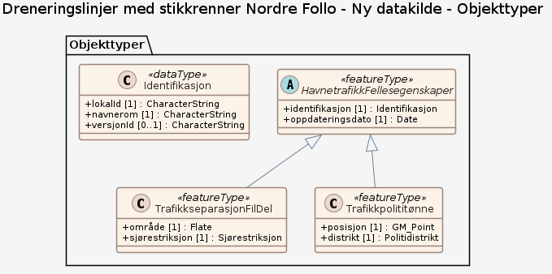

### Datamodell

**Kilde:** [SOSI UML XMI-fil](https://sosi.geonorge.no/svn/SOSI/SOSI%20Del%203/Statens%20kartverk/Havnetrafikk-5.2.xml)

#### HavnetrafikkFellesegenskaper (abstrakt)

abstrakt objekttype som bærer sentrale egenskaper som er anbefalt for bruk i produktspesifikasjoner.  Merknad: Disse egenskapene skal derfor ikke modelleres inn i fagområdemodeller.

Egenskaper

<table class="feature-attribute-table">
  <colgroup>
    <col style="width: 35%;" />
    <col style="width: 65%;" />
  </colgroup>
  <tbody>
    <tr>
      <th scope="row">Navn:</th>
      <td><strong>identifikasjon</strong></td>
    </tr>
    <tr>
      <th scope="row">Definisjon:</th>
      <td>unik identifikasjon av et objekt</td>
    </tr>
    <tr>
      <th scope="row">Multiplisitet:</th>
      <td>1</td>
    </tr>
    <tr>
      <th scope="row">Type:</th>
      <td>Identifikasjon</td>
    </tr>
  </tbody>
</table>

<table class="feature-attribute-table">
  <colgroup>
    <col style="width: 35%;" />
    <col style="width: 65%;" />
  </colgroup>
  <tbody>
    <tr>
      <th scope="row">Navn:</th>
      <td><strong>identifikasjon.lokalId</strong></td>
    </tr>
    <tr>
      <th scope="row">Definisjon:</th>
      <td>lokal identifikator av et objekt  Merknad: Det er dataleverendørens ansvar å sørge for at den lokale identifikatoren er unik innenfor navnerommet.</td>
    </tr>
    <tr>
      <th scope="row">Multiplisitet:</th>
      <td>1</td>
    </tr>
    <tr>
      <th scope="row">Type:</th>
      <td>CharacterString</td>
    </tr>
  </tbody>
</table>

<table class="feature-attribute-table">
  <colgroup>
    <col style="width: 35%;" />
    <col style="width: 65%;" />
  </colgroup>
  <tbody>
    <tr>
      <th scope="row">Navn:</th>
      <td><strong>identifikasjon.navnerom</strong></td>
    </tr>
    <tr>
      <th scope="row">Definisjon:</th>
      <td>navnerom som unikt identifiserer datakilden til et objekt, anbefales å være en http-URI  Eksempel: <a href="http://data.geonorge.no/SentraltStedsnavnsregister/1.0">http://data.geonorge.no/SentraltStedsnavnsregister/1.0</a>  Merknad : Verdien for nanverom vil eies av den dataprodusent som har ansvar for de unike identifikatorene og må være registrert i data.geonorge.no eller data.norge.no</td>
    </tr>
    <tr>
      <th scope="row">Multiplisitet:</th>
      <td>1</td>
    </tr>
    <tr>
      <th scope="row">Type:</th>
      <td>CharacterString</td>
    </tr>
  </tbody>
</table>

<table class="feature-attribute-table">
  <colgroup>
    <col style="width: 35%;" />
    <col style="width: 65%;" />
  </colgroup>
  <tbody>
    <tr>
      <th scope="row">Navn:</th>
      <td><strong>identifikasjon.versjonId</strong></td>
    </tr>
    <tr>
      <th scope="row">Definisjon:</th>
      <td>identifikasjon av en spesiell versjon av et geografisk objekt (instans 2025-08-06)</td>
    </tr>
    <tr>
      <th scope="row">Multiplisitet:</th>
      <td>0..1</td>
    </tr>
    <tr>
      <th scope="row">Type:</th>
      <td>CharacterString</td>
    </tr>
  </tbody>
</table>

<table class="feature-attribute-table">
  <colgroup>
    <col style="width: 35%;" />
    <col style="width: 65%;" />
  </colgroup>
  <tbody>
    <tr>
      <th scope="row">Navn:</th>
      <td><strong>oppdateringsdato</strong></td>
    </tr>
    <tr>
      <th scope="row">Definisjon:</th>
      <td>dato for siste endring på objektetdataene  Merknad: Oppdateringsdato kan være forskjellig fra Datafangsdato ved at data som er registrert kan bufres en kortere eller lengre periode før disse legges inn i datasystemet (databasen).</td>
    </tr>
    <tr>
      <th scope="row">Multiplisitet:</th>
      <td>1</td>
    </tr>
    <tr>
      <th scope="row">Type:</th>
      <td>DateTime</td>
    </tr>
  </tbody>
</table>

#### TrafikkseparasjonFilDel

del av trafikkseparasjonssystem, der trafikkretning er ens   -- Definition -- part of traffic separation system, wherein the direction of traffic is the same

Egenskaper

<table class="feature-attribute-table">
  <colgroup>
    <col style="width: 35%;" />
    <col style="width: 65%;" />
  </colgroup>
  <tbody>
    <tr>
      <th scope="row">Navn:</th>
      <td><strong>område</strong></td>
    </tr>
    <tr>
      <th scope="row">Definisjon:</th>
      <td>objektets utstrekning  -- Definition -- area over which an object extends</td>
    </tr>
    <tr>
      <th scope="row">Multiplisitet:</th>
      <td>1</td>
    </tr>
    <tr>
      <th scope="row">Type:</th>
      <td>Flate</td>
    </tr>
  </tbody>
</table>

<table class="feature-attribute-table">
  <colgroup>
    <col style="width: 35%;" />
    <col style="width: 65%;" />
  </colgroup>
  <tbody>
    <tr>
      <th scope="row">Navn:</th>
      <td><strong>sjørestriksjon</strong></td>
    </tr>
    <tr>
      <th scope="row">Definisjon:</th>
      <td>begrensninger for ferdsel eller bruk av sjøområde  Merknad: Tilsvarer  RESTRN i S-57  -- Definition -- limitations on traffic or use of maritime areas.  Note: S-57 RESTRN</td>
    </tr>
    <tr>
      <th scope="row">Multiplisitet:</th>
      <td>1</td>
    </tr>
    <tr>
      <th scope="row">Type:</th>
      <td>Sjørestriksjon</td>
    </tr>
    <tr>
      <th scope="row">Tillatte verdier:</th>
      <td>- ankringForbudt – Ankring forbudt - restriksjonerForAnkring – Restriksjoner for ankring - fiskeErForbudt – Fiske er forbudt - restriksjonerForFiske – Restriksjoner for fiske - trålingErForbudt – Tråling er forbudt - restriksjonerForTråling – Restriksjoner for tråling - "AdgangForbudt-område – "Adgang forbudt"-område - restriksjonerForAdgang – Restriksjoner for adgang - mudringBunnskrapingForbudt – Mudring/bunnskraping forbudt - restriksjonerForBunnskraping – Restriksjoner for bunnskraping - dykkingForbudt – Dykking forbudt - restriksjonerForDykking – Restriksjoner for dykking - sakteFartOgNoWake – Sakte fart (og "No Wake") - områdeSomBørUnngås – Område som bør unngås - forbudMotByggearbeid – Forbud mot byggearbeid - fartBegrenset – Fart begrenset</td>
    </tr>
  </tbody>
</table>

Relasjoner

**Arv**
HavnetrafikkFellesegenskaper

#### Trafikkpolititønne

tønne der trafikkpoliti kan stå og dirigere trafikk

Egenskaper

<table class="feature-attribute-table">
  <colgroup>
    <col style="width: 35%;" />
    <col style="width: 65%;" />
  </colgroup>
  <tbody>
    <tr>
      <th scope="row">Navn:</th>
      <td><strong>posisjon</strong></td>
    </tr>
    <tr>
      <th scope="row">Definisjon:</th>
      <td>posisjonen der man ser ut fra tønna</td>
    </tr>
    <tr>
      <th scope="row">Multiplisitet:</th>
      <td>1</td>
    </tr>
    <tr>
      <th scope="row">Type:</th>
      <td>GM_Point</td>
    </tr>
  </tbody>
</table>

<table class="feature-attribute-table">
  <colgroup>
    <col style="width: 35%;" />
    <col style="width: 65%;" />
  </colgroup>
  <tbody>
    <tr>
      <th scope="row">Navn:</th>
      <td><strong>distrikt</strong></td>
    </tr>
    <tr>
      <th scope="row">Multiplisitet:</th>
      <td>1</td>
    </tr>
    <tr>
      <th scope="row">Type:</th>
      <td>Politidistrikt</td>
    </tr>
    <tr>
      <th scope="row">Tillatte verdier:</th>
      <td>- Kodeliste: <a href="http://skjema.geonorge.no/SOSI/fagområde/KystOgSjø/4.0/Politidistrikt">http://skjema.geonorge.no/SOSI/fagområde/KystOgSjø/4.0/Politidistrikt</a> - a - b - c</td>
    </tr>
  </tbody>
</table>

Relasjoner

**Arv**
HavnetrafikkFellesegenskaper

### Kodelister

#### «Enumeration» Sjørestriksjon

**Definisjon:** begrensninger for ferdsel eller bruk av sjøområde

Merknad:
Tilsvarer  RESTRN i S-57

-- Definition - -
limitations on traffic or use of maritime areas.  Note: S-57 RESTRN

Koder

<table class="code-list-table">
  <thead>
    <tr>
      <th>Kodenavn:</th>
      <th>Definisjon:</th>
      <th>Kodeverdi:</th>
    </tr>
  </thead>
  <tbody>
    <tr>
      <td>ankringForbudt</td>
      <td>Ankring forbudt</td>
      <td></td>
    </tr>
    <tr>
      <td>restriksjonerForAnkring</td>
      <td>Restriksjoner for ankring</td>
      <td></td>
    </tr>
    <tr>
      <td>fiskeErForbudt</td>
      <td>Fiske er forbudt</td>
      <td></td>
    </tr>
    <tr>
      <td>restriksjonerForFiske</td>
      <td>Restriksjoner for fiske</td>
      <td></td>
    </tr>
    <tr>
      <td>trålingErForbudt</td>
      <td>Tråling er forbudt</td>
      <td></td>
    </tr>
    <tr>
      <td>restriksjonerForTråling</td>
      <td>Restriksjoner for tråling</td>
      <td></td>
    </tr>
    <tr>
      <td>"AdgangForbudt-område</td>
      <td>"Adgang forbudt"-område</td>
      <td></td>
    </tr>
    <tr>
      <td>restriksjonerForAdgang</td>
      <td>Restriksjoner for adgang</td>
      <td></td>
    </tr>
    <tr>
      <td>mudringBunnskrapingForbudt</td>
      <td>Mudring/bunnskraping forbudt</td>
      <td></td>
    </tr>
    <tr>
      <td>restriksjonerForBunnskraping</td>
      <td>Restriksjoner for bunnskraping</td>
      <td></td>
    </tr>
    <tr>
      <td>dykkingForbudt</td>
      <td>Dykking forbudt</td>
      <td></td>
    </tr>
    <tr>
      <td>restriksjonerForDykking</td>
      <td>Restriksjoner for dykking</td>
      <td></td>
    </tr>
    <tr>
      <td>sakteFartOgNoWake</td>
      <td>Sakte fart (og "No Wake")</td>
      <td></td>
    </tr>
    <tr>
      <td>områdeSomBørUnngås</td>
      <td>Område som bør unngås</td>
      <td></td>
    </tr>
    <tr>
      <td>forbudMotByggearbeid</td>
      <td>Forbud mot byggearbeid</td>
      <td></td>
    </tr>
    <tr>
      <td>fartBegrenset</td>
      <td>Fart begrenset</td>
      <td></td>
    </tr>
  </tbody>
</table>

#### «Enumeration» Politidistrikt

Profilparametre i tagged values

<table class="feature-attribute-table">
  <colgroup>
    <col style="width: 35%;" />
    <col style="width: 65%;" />
  </colgroup>
  <tbody>
    <tr>
      <th scope="row">asDictionary</th>
      <td>true</td>
    </tr>
    <tr>
      <th scope="row">codeList</th>
      <td><a href="http://skjema.geonorge.no/SOSI/fagområde/KystOgSjø/4.0/Politidistrikt">http://skjema.geonorge.no/SOSI/fagområde/KystOgSjø/4.0/Politidistrikt</a></td>
    </tr>
  </tbody>
</table>

Koder

<table class="code-list-table">
  <thead>
    <tr>
      <th>Kodenavn:</th>
      <th>Definisjon:</th>
      <th>Kodeverdi:</th>
    </tr>
  </thead>
  <tbody>
    <tr>
      <td>a</td>
      <td></td>
      <td></td>
    </tr>
    <tr>
      <td>b</td>
      <td></td>
      <td></td>
    </tr>
    <tr>
      <td>c</td>
      <td></td>
      <td></td>
    </tr>
  </tbody>
</table>
