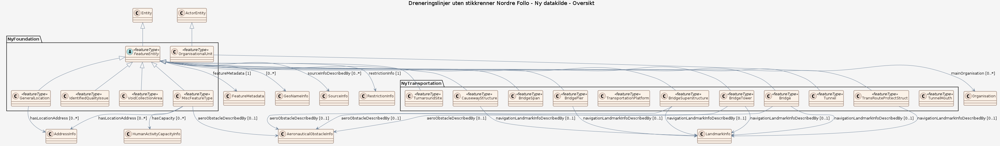
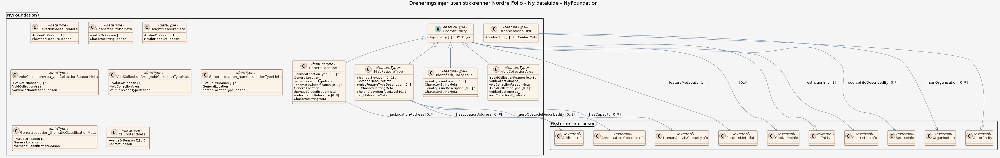
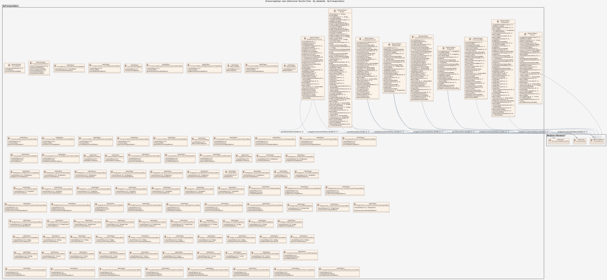
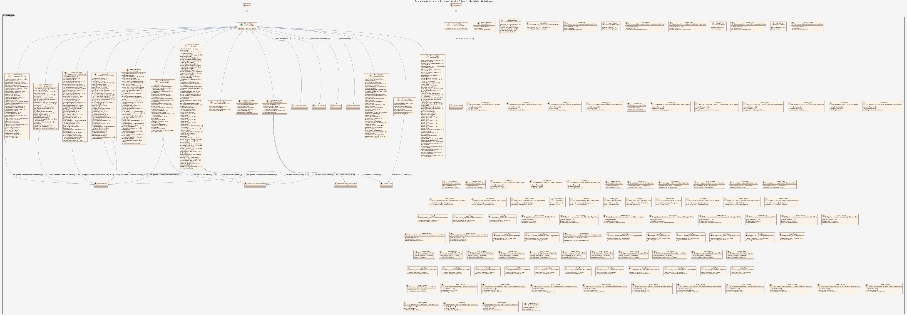

### Datamodell

**Kilde:** [SOSI UML XMI-fil](https://sosi.geonorge.no/svn/SOSI/SOSI%20Del%203/Statens%20kartverk/DGIM-2026-1-Transportation.xml)

#### Oversikt

#### Pakke: NyFoundation

#### Pakke: NyTransportation

#### Komplett diagram

#### TunnelMouth

-- Definition -- The opening of a tunnel into a larger space (for example: onto the terrain surface). -- Description -- A tunnel is usually open to the terrain surface at both ends, but may sometimes lead to an enclosed space, for example: leading to an underground bunker, into an underground mine (termed an 'adit') or into an underground railway station.

Egenskaper

<table class="feature-attribute-table">
  <colgroup>
    <col style="width: 35%;" />
    <col style="width: 65%;" />
  </colgroup>
  <tbody>
    <tr>
      <th scope="row">Navn:</th>
      <td><strong>crossSectionalProfile</strong></td>
    </tr>
    <tr>
      <th scope="row">Definisjon:</th>
      <td>-- Definition -- The cross-sectional profile of an opening (for example: a tunnel or the space under a bridge span). -- Description -- -- UnitOfMeasure --</td>
    </tr>
    <tr>
      <th scope="row">Multiplisitet:</th>
      <td>0..1</td>
    </tr>
    <tr>
      <th scope="row">Type:</th>
      <td>TunnelMouth_crossSectionalProfileMeta</td>
    </tr>
  </tbody>
</table>

<table class="feature-attribute-table">
  <colgroup>
    <col style="width: 35%;" />
    <col style="width: 65%;" />
  </colgroup>
  <tbody>
    <tr>
      <th scope="row">Navn:</th>
      <td><strong>crossSectionalProfile.valueOrReason</strong></td>
    </tr>
    <tr>
      <th scope="row">Multiplisitet:</th>
      <td>1</td>
    </tr>
    <tr>
      <th scope="row">Type:</th>
      <td>TunnelMouth_crossSectionalProfileReason</td>
    </tr>
  </tbody>
</table>

#### TurnaroundSite

-- Definition -- A shaped area at the terminus of a road that provides sufficient turning space allowing incoming traffic to turn around and exit without performing a stop-and-change-direction manoeuvre. -- Description -- Construction is typically in the form of a defined shape (for example: circle, loop, or crescent). A median-like structure may exist in the center of the turnaround site, thus ensuring a well-defined pattern of vehicle movement. In residential areas the turnaround site often has multiple adjoining properties, each of which may have a separate driveway and/or defined parking area along the perimeter of the shaped area.

Egenskaper

<table class="feature-attribute-table">
  <colgroup>
    <col style="width: 35%;" />
    <col style="width: 65%;" />
  </colgroup>
  <tbody>
    <tr>
      <th scope="row">Navn:</th>
      <td><strong>controllingAuthority</strong></td>
    </tr>
    <tr>
      <th scope="row">Definisjon:</th>
      <td>-- Definition -- The controlling authority responsible for a facility or site. -- Description -- Controlling authorities may be distinguished by organizational level (for example: national, sub-national, or military district) and/or type (for example: private or public). -- UnitOfMeasure --</td>
    </tr>
    <tr>
      <th scope="row">Multiplisitet:</th>
      <td>0..1</td>
    </tr>
    <tr>
      <th scope="row">Type:</th>
      <td>TurnaroundSite_controllingAuthorityMeta</td>
    </tr>
  </tbody>
</table>

<table class="feature-attribute-table">
  <colgroup>
    <col style="width: 35%;" />
    <col style="width: 65%;" />
  </colgroup>
  <tbody>
    <tr>
      <th scope="row">Navn:</th>
      <td><strong>controllingAuthority.valueOrReason</strong></td>
    </tr>
    <tr>
      <th scope="row">Multiplisitet:</th>
      <td>1</td>
    </tr>
    <tr>
      <th scope="row">Type:</th>
      <td>TurnaroundSite_controllingAuthorityReason</td>
    </tr>
  </tbody>
</table>

<table class="feature-attribute-table">
  <colgroup>
    <col style="width: 35%;" />
    <col style="width: 65%;" />
  </colgroup>
  <tbody>
    <tr>
      <th scope="row">Navn:</th>
      <td><strong>controllingAuthorityIdent</strong></td>
    </tr>
    <tr>
      <th scope="row">Definisjon:</th>
      <td>-- Definition -- The recognized authority responsible for establishing and maintaining the administrative affairs of all matters relating to a particular field or subject. -- Description -- -- UnitOfMeasure --</td>
    </tr>
    <tr>
      <th scope="row">Multiplisitet:</th>
      <td>0..*</td>
    </tr>
    <tr>
      <th scope="row">Type:</th>
      <td>CharacterStringMeta</td>
    </tr>
  </tbody>
</table>

<table class="feature-attribute-table">
  <colgroup>
    <col style="width: 35%;" />
    <col style="width: 65%;" />
  </colgroup>
  <tbody>
    <tr>
      <th scope="row">Navn:</th>
      <td><strong>controllingAuthorityIdent.valueOrReason</strong></td>
    </tr>
    <tr>
      <th scope="row">Multiplisitet:</th>
      <td>1</td>
    </tr>
    <tr>
      <th scope="row">Type:</th>
      <td>CharacterStringReason</td>
    </tr>
  </tbody>
</table>

<table class="feature-attribute-table">
  <colgroup>
    <col style="width: 35%;" />
    <col style="width: 65%;" />
  </colgroup>
  <tbody>
    <tr>
      <th scope="row">Navn:</th>
      <td><strong>generalPavementCondition</strong></td>
    </tr>
    <tr>
      <th scope="row">Definisjon:</th>
      <td>-- Definition -- A general description of the surface quality of a paved surface. -- Description -- -- UnitOfMeasure --</td>
    </tr>
    <tr>
      <th scope="row">Multiplisitet:</th>
      <td>0..1</td>
    </tr>
    <tr>
      <th scope="row">Type:</th>
      <td>TurnaroundSite_generalPavementConditionMeta</td>
    </tr>
  </tbody>
</table>

<table class="feature-attribute-table">
  <colgroup>
    <col style="width: 35%;" />
    <col style="width: 65%;" />
  </colgroup>
  <tbody>
    <tr>
      <th scope="row">Navn:</th>
      <td><strong>generalPavementCondition.valueOrReason</strong></td>
    </tr>
    <tr>
      <th scope="row">Multiplisitet:</th>
      <td>1</td>
    </tr>
    <tr>
      <th scope="row">Type:</th>
      <td>TurnaroundSite_generalPavementConditionReason</td>
    </tr>
  </tbody>
</table>

<table class="feature-attribute-table">
  <colgroup>
    <col style="width: 35%;" />
    <col style="width: 65%;" />
  </colgroup>
  <tbody>
    <tr>
      <th scope="row">Navn:</th>
      <td><strong>loadBearingSurfaceType</strong></td>
    </tr>
    <tr>
      <th scope="row">Definisjon:</th>
      <td>-- Definition -- The physical surface composition of a terrain surface that is intended to bear loads. -- Description -- For example, the surface of a road, a runway, a hard standing, or a vehicle storage lot. -- UnitOfMeasure --</td>
    </tr>
    <tr>
      <th scope="row">Multiplisitet:</th>
      <td>0..1</td>
    </tr>
    <tr>
      <th scope="row">Type:</th>
      <td>TurnaroundSite_loadBearingSurfaceTypeMeta</td>
    </tr>
  </tbody>
</table>

<table class="feature-attribute-table">
  <colgroup>
    <col style="width: 35%;" />
    <col style="width: 65%;" />
  </colgroup>
  <tbody>
    <tr>
      <th scope="row">Navn:</th>
      <td><strong>loadBearingSurfaceType.valueOrReason</strong></td>
    </tr>
    <tr>
      <th scope="row">Multiplisitet:</th>
      <td>1</td>
    </tr>
    <tr>
      <th scope="row">Type:</th>
      <td>TurnaroundSite_loadBearingSurfaceTypeReason</td>
    </tr>
  </tbody>
</table>

<table class="feature-attribute-table">
  <colgroup>
    <col style="width: 35%;" />
    <col style="width: 65%;" />
  </colgroup>
  <tbody>
    <tr>
      <th scope="row">Navn:</th>
      <td><strong>maximumVehicleHeight</strong></td>
    </tr>
    <tr>
      <th scope="row">Definisjon:</th>
      <td>-- Definition -- The maximum height of a vehicle that can pass through the obstructing feature on a travelled way. -- Description -- The height limitation assumes that the vehicle is less than 12 metres long and has a maximum rectangular width of 2.6 metres. -- UnitOfMeasure --</td>
    </tr>
    <tr>
      <th scope="row">Multiplisitet:</th>
      <td>0..1</td>
    </tr>
    <tr>
      <th scope="row">Type:</th>
      <td>MeasureMeta</td>
    </tr>
  </tbody>
</table>

<table class="feature-attribute-table">
  <colgroup>
    <col style="width: 35%;" />
    <col style="width: 65%;" />
  </colgroup>
  <tbody>
    <tr>
      <th scope="row">Navn:</th>
      <td><strong>maximumVehicleHeight.valueOrReason</strong></td>
    </tr>
    <tr>
      <th scope="row">Multiplisitet:</th>
      <td>1</td>
    </tr>
    <tr>
      <th scope="row">Type:</th>
      <td>MeasureReason</td>
    </tr>
  </tbody>
</table>

<table class="feature-attribute-table">
  <colgroup>
    <col style="width: 35%;" />
    <col style="width: 65%;" />
  </colgroup>
  <tbody>
    <tr>
      <th scope="row">Navn:</th>
      <td><strong>maximumVehicleLength</strong></td>
    </tr>
    <tr>
      <th scope="row">Definisjon:</th>
      <td>-- Definition -- The maximum length of a vehicle that can pass through the obstructing feature on a travelled way. -- Description -- The length limitation assumes that the vehicle has a maximum rectangular height of 4.3 metres and a maximum rectangular width of 2.6 metres. -- UnitOfMeasure --</td>
    </tr>
    <tr>
      <th scope="row">Multiplisitet:</th>
      <td>0..1</td>
    </tr>
    <tr>
      <th scope="row">Type:</th>
      <td>MeasureMeta</td>
    </tr>
  </tbody>
</table>

<table class="feature-attribute-table">
  <colgroup>
    <col style="width: 35%;" />
    <col style="width: 65%;" />
  </colgroup>
  <tbody>
    <tr>
      <th scope="row">Navn:</th>
      <td><strong>maximumVehicleLength.valueOrReason</strong></td>
    </tr>
    <tr>
      <th scope="row">Multiplisitet:</th>
      <td>1</td>
    </tr>
    <tr>
      <th scope="row">Type:</th>
      <td>MeasureReason</td>
    </tr>
  </tbody>
</table>

<table class="feature-attribute-table">
  <colgroup>
    <col style="width: 35%;" />
    <col style="width: 65%;" />
  </colgroup>
  <tbody>
    <tr>
      <th scope="row">Navn:</th>
      <td><strong>maximumVehicleWidth</strong></td>
    </tr>
    <tr>
      <th scope="row">Definisjon:</th>
      <td>-- Definition -- The maximum width of a vehicle that can pass through the obstructing feature on a travelled way. -- Description -- The width limitation assumes that the vehicle is less than 12 metres long and has a maximum rectangular height of 4.3 metres. -- UnitOfMeasure --</td>
    </tr>
    <tr>
      <th scope="row">Multiplisitet:</th>
      <td>0..1</td>
    </tr>
    <tr>
      <th scope="row">Type:</th>
      <td>MeasureMeta</td>
    </tr>
  </tbody>
</table>

<table class="feature-attribute-table">
  <colgroup>
    <col style="width: 35%;" />
    <col style="width: 65%;" />
  </colgroup>
  <tbody>
    <tr>
      <th scope="row">Navn:</th>
      <td><strong>maximumVehicleWidth.valueOrReason</strong></td>
    </tr>
    <tr>
      <th scope="row">Multiplisitet:</th>
      <td>1</td>
    </tr>
    <tr>
      <th scope="row">Type:</th>
      <td>MeasureReason</td>
    </tr>
  </tbody>
</table>

<table class="feature-attribute-table">
  <colgroup>
    <col style="width: 35%;" />
    <col style="width: 65%;" />
  </colgroup>
  <tbody>
    <tr>
      <th scope="row">Navn:</th>
      <td><strong>meansTransportation</strong></td>
    </tr>
    <tr>
      <th scope="row">Definisjon:</th>
      <td>-- Definition -- The intended method or means of moving from one place to another related to the feature or the feature's intended use. -- Description -- -- UnitOfMeasure --</td>
    </tr>
    <tr>
      <th scope="row">Multiplisitet:</th>
      <td>0..*</td>
    </tr>
    <tr>
      <th scope="row">Type:</th>
      <td>TurnaroundSite_meansTransportationMeta</td>
    </tr>
  </tbody>
</table>

<table class="feature-attribute-table">
  <colgroup>
    <col style="width: 35%;" />
    <col style="width: 65%;" />
  </colgroup>
  <tbody>
    <tr>
      <th scope="row">Navn:</th>
      <td><strong>meansTransportation.valueOrReason</strong></td>
    </tr>
    <tr>
      <th scope="row">Multiplisitet:</th>
      <td>1</td>
    </tr>
    <tr>
      <th scope="row">Type:</th>
      <td>TurnaroundSite_meansTransportationReason</td>
    </tr>
  </tbody>
</table>

<table class="feature-attribute-table">
  <colgroup>
    <col style="width: 35%;" />
    <col style="width: 65%;" />
  </colgroup>
  <tbody>
    <tr>
      <th scope="row">Navn:</th>
      <td><strong>medianPresent</strong></td>
    </tr>
    <tr>
      <th scope="row">Definisjon:</th>
      <td>-- Definition -- An indication that the lanes or tracks of a divided land transportation route (for example: a road or a railway) are separated by a vertical median barrier. -- Description -- Often used to separate opposing flows of traffic in order to improve safety. For example, may be a substantial concrete barrier of approximately 1 metre height. -- UnitOfMeasure --</td>
    </tr>
    <tr>
      <th scope="row">Multiplisitet:</th>
      <td>0..1</td>
    </tr>
    <tr>
      <th scope="row">Type:</th>
      <td>BooleanMeta</td>
    </tr>
  </tbody>
</table>

<table class="feature-attribute-table">
  <colgroup>
    <col style="width: 35%;" />
    <col style="width: 65%;" />
  </colgroup>
  <tbody>
    <tr>
      <th scope="row">Navn:</th>
      <td><strong>medianPresent.valueOrReason</strong></td>
    </tr>
    <tr>
      <th scope="row">Multiplisitet:</th>
      <td>1</td>
    </tr>
    <tr>
      <th scope="row">Type:</th>
      <td>BooleanReason</td>
    </tr>
  </tbody>
</table>

<table class="feature-attribute-table">
  <colgroup>
    <col style="width: 35%;" />
    <col style="width: 65%;" />
  </colgroup>
  <tbody>
    <tr>
      <th scope="row">Navn:</th>
      <td><strong>permanent</strong></td>
    </tr>
    <tr>
      <th scope="row">Definisjon:</th>
      <td>-- Definition -- An indication that a feature is permanent. -- Description -- Temporary features last, or are meant to last, for a limited time only. -- UnitOfMeasure --</td>
    </tr>
    <tr>
      <th scope="row">Multiplisitet:</th>
      <td>0..1</td>
    </tr>
    <tr>
      <th scope="row">Type:</th>
      <td>BooleanMeta</td>
    </tr>
  </tbody>
</table>

<table class="feature-attribute-table">
  <colgroup>
    <col style="width: 35%;" />
    <col style="width: 65%;" />
  </colgroup>
  <tbody>
    <tr>
      <th scope="row">Navn:</th>
      <td><strong>permanent.valueOrReason</strong></td>
    </tr>
    <tr>
      <th scope="row">Multiplisitet:</th>
      <td>1</td>
    </tr>
    <tr>
      <th scope="row">Type:</th>
      <td>BooleanReason</td>
    </tr>
  </tbody>
</table>

<table class="feature-attribute-table">
  <colgroup>
    <col style="width: 35%;" />
    <col style="width: 65%;" />
  </colgroup>
  <tbody>
    <tr>
      <th scope="row">Navn:</th>
      <td><strong>physicalCondition</strong></td>
    </tr>
    <tr>
      <th scope="row">Definisjon:</th>
      <td>-- Definition -- The physical condition of a man-made structure, as a whole, including the inside and/or outside of the structure and any contained and/or associated equipment. -- Description -- The physical condition applies to any phase of the life cycle of a man-made structure from construction to destruction. Examples of man-made structures include roads, canals, buildings, towers, aerodromes and facilities. -- UnitOfMeasure --</td>
    </tr>
    <tr>
      <th scope="row">Multiplisitet:</th>
      <td>0..1</td>
    </tr>
    <tr>
      <th scope="row">Type:</th>
      <td>TurnaroundSite_physicalConditionMeta</td>
    </tr>
  </tbody>
</table>

<table class="feature-attribute-table">
  <colgroup>
    <col style="width: 35%;" />
    <col style="width: 65%;" />
  </colgroup>
  <tbody>
    <tr>
      <th scope="row">Navn:</th>
      <td><strong>physicalCondition.valueOrReason</strong></td>
    </tr>
    <tr>
      <th scope="row">Multiplisitet:</th>
      <td>1</td>
    </tr>
    <tr>
      <th scope="row">Type:</th>
      <td>TurnaroundSite_physicalConditionReason</td>
    </tr>
  </tbody>
</table>

<table class="feature-attribute-table">
  <colgroup>
    <col style="width: 35%;" />
    <col style="width: 65%;" />
  </colgroup>
  <tbody>
    <tr>
      <th scope="row">Navn:</th>
      <td><strong>trafficRestrictionType</strong></td>
    </tr>
    <tr>
      <th scope="row">Definisjon:</th>
      <td>-- Definition -- The reason for traffic restriction based on the nature of the route. -- Description -- -- UnitOfMeasure --</td>
    </tr>
    <tr>
      <th scope="row">Multiplisitet:</th>
      <td>0..*</td>
    </tr>
    <tr>
      <th scope="row">Type:</th>
      <td>TurnaroundSite_trafficRestrictionTypeMeta</td>
    </tr>
  </tbody>
</table>

<table class="feature-attribute-table">
  <colgroup>
    <col style="width: 35%;" />
    <col style="width: 65%;" />
  </colgroup>
  <tbody>
    <tr>
      <th scope="row">Navn:</th>
      <td><strong>trafficRestrictionType.valueOrReason</strong></td>
    </tr>
    <tr>
      <th scope="row">Multiplisitet:</th>
      <td>1</td>
    </tr>
    <tr>
      <th scope="row">Type:</th>
      <td>TurnaroundSite_trafficRestrictionTypeReason</td>
    </tr>
  </tbody>
</table>

<table class="feature-attribute-table">
  <colgroup>
    <col style="width: 35%;" />
    <col style="width: 65%;" />
  </colgroup>
  <tbody>
    <tr>
      <th scope="row">Navn:</th>
      <td><strong>verticalRelativeLocation</strong></td>
    </tr>
    <tr>
      <th scope="row">Definisjon:</th>
      <td>-- Definition -- The relationship between the feature and the underlying ground (terrain) or waterbody bottom. -- Description -- -- UnitOfMeasure --</td>
    </tr>
    <tr>
      <th scope="row">Multiplisitet:</th>
      <td>0..1</td>
    </tr>
    <tr>
      <th scope="row">Type:</th>
      <td>TurnaroundSite_verticalRelativeLocationMeta</td>
    </tr>
  </tbody>
</table>

<table class="feature-attribute-table">
  <colgroup>
    <col style="width: 35%;" />
    <col style="width: 65%;" />
  </colgroup>
  <tbody>
    <tr>
      <th scope="row">Navn:</th>
      <td><strong>verticalRelativeLocation.valueOrReason</strong></td>
    </tr>
    <tr>
      <th scope="row">Multiplisitet:</th>
      <td>1</td>
    </tr>
    <tr>
      <th scope="row">Type:</th>
      <td>TurnaroundSite_verticalRelativeLocationReason</td>
    </tr>
  </tbody>
</table>

<table class="feature-attribute-table">
  <colgroup>
    <col style="width: 35%;" />
    <col style="width: 65%;" />
  </colgroup>
  <tbody>
    <tr>
      <th scope="row">Navn:</th>
      <td><strong>waySurfaceCategory</strong></td>
    </tr>
    <tr>
      <th scope="row">Definisjon:</th>
      <td>-- Definition -- A categorisation based on the general pavement characteristic of the surface intending to sustain ground transport. -- Description -- -- UnitOfMeasure --</td>
    </tr>
    <tr>
      <th scope="row">Multiplisitet:</th>
      <td>0..1</td>
    </tr>
    <tr>
      <th scope="row">Type:</th>
      <td>TurnaroundSite_waySurfaceCategoryMeta</td>
    </tr>
  </tbody>
</table>

<table class="feature-attribute-table">
  <colgroup>
    <col style="width: 35%;" />
    <col style="width: 65%;" />
  </colgroup>
  <tbody>
    <tr>
      <th scope="row">Navn:</th>
      <td><strong>waySurfaceCategory.valueOrReason</strong></td>
    </tr>
    <tr>
      <th scope="row">Multiplisitet:</th>
      <td>1</td>
    </tr>
    <tr>
      <th scope="row">Type:</th>
      <td>TurnaroundSite_waySurfaceCategoryReason</td>
    </tr>
  </tbody>
</table>

<table class="feature-attribute-table">
  <colgroup>
    <col style="width: 35%;" />
    <col style="width: 65%;" />
  </colgroup>
  <tbody>
    <tr>
      <th scope="row">Navn:</th>
      <td><strong>weatherRestrictionType</strong></td>
    </tr>
    <tr>
      <th scope="row">Definisjon:</th>
      <td>-- Definition -- The type of weather conditions under which a feature is usable. -- Description -- -- UnitOfMeasure --</td>
    </tr>
    <tr>
      <th scope="row">Multiplisitet:</th>
      <td>0..1</td>
    </tr>
    <tr>
      <th scope="row">Type:</th>
      <td>TurnaroundSite_weatherRestrictionTypeMeta</td>
    </tr>
  </tbody>
</table>

<table class="feature-attribute-table">
  <colgroup>
    <col style="width: 35%;" />
    <col style="width: 65%;" />
  </colgroup>
  <tbody>
    <tr>
      <th scope="row">Navn:</th>
      <td><strong>weatherRestrictionType.valueOrReason</strong></td>
    </tr>
    <tr>
      <th scope="row">Multiplisitet:</th>
      <td>1</td>
    </tr>
    <tr>
      <th scope="row">Type:</th>
      <td>TurnaroundSite_weatherRestrictionTypeReason</td>
    </tr>
  </tbody>
</table>

<table class="feature-attribute-table">
  <colgroup>
    <col style="width: 35%;" />
    <col style="width: 65%;" />
  </colgroup>
  <tbody>
    <tr>
      <th scope="row">Navn:</th>
      <td><strong>weightBearingCapacity</strong></td>
    </tr>
    <tr>
      <th scope="row">Definisjon:</th>
      <td>-- Definition -- The maximum weight that can be supported by a surface. -- Description -- -- UnitOfMeasure --</td>
    </tr>
    <tr>
      <th scope="row">Multiplisitet:</th>
      <td>0..1</td>
    </tr>
    <tr>
      <th scope="row">Type:</th>
      <td>MeasureIntervalMeta</td>
    </tr>
  </tbody>
</table>

<table class="feature-attribute-table">
  <colgroup>
    <col style="width: 35%;" />
    <col style="width: 65%;" />
  </colgroup>
  <tbody>
    <tr>
      <th scope="row">Navn:</th>
      <td><strong>weightBearingCapacity.valueOrReason</strong></td>
    </tr>
    <tr>
      <th scope="row">Multiplisitet:</th>
      <td>1</td>
    </tr>
    <tr>
      <th scope="row">Type:</th>
      <td>MeasureIntervalReason</td>
    </tr>
  </tbody>
</table>

Relasjoner

**Arv**
FeatureEntity

#### CausewayStructure

-- Definition -- A solid raised way across a terrain obstacle (for example: a wetland or a body of shallow water) that is intended to support a transportation route (for example: a road or a railway). -- Description -- The causeway structure is often constructed from local fill supplemented by other materials (for example: rocks, boulders or gravel) and consists of a solid linear structure in the configuration of an embankment. Causeway structures are built just high enough to insure that the transportation route will remain passable during periods of flooding, tides and seasonal rainfall. Culverts may occur along the length of the causeway structure and individual sections of the causeway structure may be interrupted by bridges.

Egenskaper

<table class="feature-attribute-table">
  <colgroup>
    <col style="width: 35%;" />
    <col style="width: 65%;" />
  </colgroup>
  <tbody>
    <tr>
      <th scope="row">Navn:</th>
      <td><strong>conspicuousAirCategory</strong></td>
    </tr>
    <tr>
      <th scope="row">Definisjon:</th>
      <td>-- Definition -- The manner in which an object is conspicuous when viewed from the air. -- Description -- A conspicuous feature is easily detected and identified under varying conditions (for example: lighting). Factors affecting conspicuousness include size, shape, and/or height. -- UnitOfMeasure --</td>
    </tr>
    <tr>
      <th scope="row">Multiplisitet:</th>
      <td>0..1</td>
    </tr>
    <tr>
      <th scope="row">Type:</th>
      <td>CausewayStructure_conspicuousAirCategoryMeta</td>
    </tr>
  </tbody>
</table>

<table class="feature-attribute-table">
  <colgroup>
    <col style="width: 35%;" />
    <col style="width: 65%;" />
  </colgroup>
  <tbody>
    <tr>
      <th scope="row">Navn:</th>
      <td><strong>conspicuousAirCategory.valueOrReason</strong></td>
    </tr>
    <tr>
      <th scope="row">Multiplisitet:</th>
      <td>1</td>
    </tr>
    <tr>
      <th scope="row">Type:</th>
      <td>CausewayStructure_conspicuousAirCategoryReason</td>
    </tr>
  </tbody>
</table>

<table class="feature-attribute-table">
  <colgroup>
    <col style="width: 35%;" />
    <col style="width: 65%;" />
  </colgroup>
  <tbody>
    <tr>
      <th scope="row">Navn:</th>
      <td><strong>conspicuousGroundCategory</strong></td>
    </tr>
    <tr>
      <th scope="row">Definisjon:</th>
      <td>-- Definition -- The manner in which an object is conspicuous when viewed from on the ground. -- Description -- A conspicuous feature is easily detected and identified under varying conditions (for example: lighting). Factors affecting conspicuousness include size, shape, and/or height. -- UnitOfMeasure --</td>
    </tr>
    <tr>
      <th scope="row">Multiplisitet:</th>
      <td>0..1</td>
    </tr>
    <tr>
      <th scope="row">Type:</th>
      <td>CausewayStructure_conspicuousGroundCategoryMeta</td>
    </tr>
  </tbody>
</table>

<table class="feature-attribute-table">
  <colgroup>
    <col style="width: 35%;" />
    <col style="width: 65%;" />
  </colgroup>
  <tbody>
    <tr>
      <th scope="row">Navn:</th>
      <td><strong>conspicuousGroundCategory.valueOrReason</strong></td>
    </tr>
    <tr>
      <th scope="row">Multiplisitet:</th>
      <td>1</td>
    </tr>
    <tr>
      <th scope="row">Type:</th>
      <td>CausewayStructure_conspicuousGroundCategoryReason</td>
    </tr>
  </tbody>
</table>

<table class="feature-attribute-table">
  <colgroup>
    <col style="width: 35%;" />
    <col style="width: 65%;" />
  </colgroup>
  <tbody>
    <tr>
      <th scope="row">Navn:</th>
      <td><strong>conspicuousSeaCategory</strong></td>
    </tr>
    <tr>
      <th scope="row">Definisjon:</th>
      <td>-- Definition -- The manner in which an object is conspicuous when viewed from the sea. -- Description -- A conspicuous feature is easily detected and identified under varying conditions (for example: lighting). Factors affecting conspicuousness include size, shape, and/or height. -- UnitOfMeasure --</td>
    </tr>
    <tr>
      <th scope="row">Multiplisitet:</th>
      <td>0..1</td>
    </tr>
    <tr>
      <th scope="row">Type:</th>
      <td>CausewayStructure_conspicuousSeaCategoryMeta</td>
    </tr>
  </tbody>
</table>

<table class="feature-attribute-table">
  <colgroup>
    <col style="width: 35%;" />
    <col style="width: 65%;" />
  </colgroup>
  <tbody>
    <tr>
      <th scope="row">Navn:</th>
      <td><strong>conspicuousSeaCategory.valueOrReason</strong></td>
    </tr>
    <tr>
      <th scope="row">Multiplisitet:</th>
      <td>1</td>
    </tr>
    <tr>
      <th scope="row">Type:</th>
      <td>CausewayStructure_conspicuousSeaCategoryReason</td>
    </tr>
  </tbody>
</table>

<table class="feature-attribute-table">
  <colgroup>
    <col style="width: 35%;" />
    <col style="width: 65%;" />
  </colgroup>
  <tbody>
    <tr>
      <th scope="row">Navn:</th>
      <td><strong>controllingAuthority</strong></td>
    </tr>
    <tr>
      <th scope="row">Definisjon:</th>
      <td>-- Definition -- The controlling authority responsible for a facility or site. -- Description -- Controlling authorities may be distinguished by organizational level (for example: national, sub-national, or military district) and/or type (for example: private or public). -- UnitOfMeasure --</td>
    </tr>
    <tr>
      <th scope="row">Multiplisitet:</th>
      <td>0..1</td>
    </tr>
    <tr>
      <th scope="row">Type:</th>
      <td>CausewayStructure_controllingAuthorityMeta</td>
    </tr>
  </tbody>
</table>

<table class="feature-attribute-table">
  <colgroup>
    <col style="width: 35%;" />
    <col style="width: 65%;" />
  </colgroup>
  <tbody>
    <tr>
      <th scope="row">Navn:</th>
      <td><strong>controllingAuthority.valueOrReason</strong></td>
    </tr>
    <tr>
      <th scope="row">Multiplisitet:</th>
      <td>1</td>
    </tr>
    <tr>
      <th scope="row">Type:</th>
      <td>CausewayStructure_controllingAuthorityReason</td>
    </tr>
  </tbody>
</table>

<table class="feature-attribute-table">
  <colgroup>
    <col style="width: 35%;" />
    <col style="width: 65%;" />
  </colgroup>
  <tbody>
    <tr>
      <th scope="row">Navn:</th>
      <td><strong>controllingAuthorityIdent</strong></td>
    </tr>
    <tr>
      <th scope="row">Definisjon:</th>
      <td>-- Definition -- The recognized authority responsible for establishing and maintaining the administrative affairs of all matters relating to a particular field or subject. -- Description -- -- UnitOfMeasure --</td>
    </tr>
    <tr>
      <th scope="row">Multiplisitet:</th>
      <td>0..*</td>
    </tr>
    <tr>
      <th scope="row">Type:</th>
      <td>CharacterStringMeta</td>
    </tr>
  </tbody>
</table>

<table class="feature-attribute-table">
  <colgroup>
    <col style="width: 35%;" />
    <col style="width: 65%;" />
  </colgroup>
  <tbody>
    <tr>
      <th scope="row">Navn:</th>
      <td><strong>controllingAuthorityIdent.valueOrReason</strong></td>
    </tr>
    <tr>
      <th scope="row">Multiplisitet:</th>
      <td>1</td>
    </tr>
    <tr>
      <th scope="row">Type:</th>
      <td>CharacterStringReason</td>
    </tr>
  </tbody>
</table>

<table class="feature-attribute-table">
  <colgroup>
    <col style="width: 35%;" />
    <col style="width: 65%;" />
  </colgroup>
  <tbody>
    <tr>
      <th scope="row">Navn:</th>
      <td><strong>directivity</strong></td>
    </tr>
    <tr>
      <th scope="row">Definisjon:</th>
      <td>-- Definition -- The side(s) of a feature that produce the greatest visual significance and/or reflectivity potential. -- Description -- -- UnitOfMeasure --</td>
    </tr>
    <tr>
      <th scope="row">Multiplisitet:</th>
      <td>0..1</td>
    </tr>
    <tr>
      <th scope="row">Type:</th>
      <td>CausewayStructure_directivityMeta</td>
    </tr>
  </tbody>
</table>

<table class="feature-attribute-table">
  <colgroup>
    <col style="width: 35%;" />
    <col style="width: 65%;" />
  </colgroup>
  <tbody>
    <tr>
      <th scope="row">Navn:</th>
      <td><strong>directivity.valueOrReason</strong></td>
    </tr>
    <tr>
      <th scope="row">Multiplisitet:</th>
      <td>1</td>
    </tr>
    <tr>
      <th scope="row">Type:</th>
      <td>CausewayStructure_directivityReason</td>
    </tr>
  </tbody>
</table>

<table class="feature-attribute-table">
  <colgroup>
    <col style="width: 35%;" />
    <col style="width: 65%;" />
  </colgroup>
  <tbody>
    <tr>
      <th scope="row">Navn:</th>
      <td><strong>facilityOperationalStatus</strong></td>
    </tr>
    <tr>
      <th scope="row">Definisjon:</th>
      <td>-- Definition -- The status of operation of a man-made structure, as a whole. -- Description -- Includes actual operations, operational capability, and planned or proposed man-made structures. -- UnitOfMeasure --</td>
    </tr>
    <tr>
      <th scope="row">Multiplisitet:</th>
      <td>0..1</td>
    </tr>
    <tr>
      <th scope="row">Type:</th>
      <td>CausewayStructure_facilityOperationalStatusMeta</td>
    </tr>
  </tbody>
</table>

<table class="feature-attribute-table">
  <colgroup>
    <col style="width: 35%;" />
    <col style="width: 65%;" />
  </colgroup>
  <tbody>
    <tr>
      <th scope="row">Navn:</th>
      <td><strong>facilityOperationalStatus.valueOrReason</strong></td>
    </tr>
    <tr>
      <th scope="row">Multiplisitet:</th>
      <td>1</td>
    </tr>
    <tr>
      <th scope="row">Type:</th>
      <td>CausewayStructure_facilityOperationalStatusReason</td>
    </tr>
  </tbody>
</table>

<table class="feature-attribute-table">
  <colgroup>
    <col style="width: 35%;" />
    <col style="width: 65%;" />
  </colgroup>
  <tbody>
    <tr>
      <th scope="row">Navn:</th>
      <td><strong>floodlit</strong></td>
    </tr>
    <tr>
      <th scope="row">Definisjon:</th>
      <td>-- Definition -- An indication that a structure is floodlit. -- Description -- -- UnitOfMeasure --</td>
    </tr>
    <tr>
      <th scope="row">Multiplisitet:</th>
      <td>0..1</td>
    </tr>
    <tr>
      <th scope="row">Type:</th>
      <td>BooleanMeta</td>
    </tr>
  </tbody>
</table>

<table class="feature-attribute-table">
  <colgroup>
    <col style="width: 35%;" />
    <col style="width: 65%;" />
  </colgroup>
  <tbody>
    <tr>
      <th scope="row">Navn:</th>
      <td><strong>floodlit.valueOrReason</strong></td>
    </tr>
    <tr>
      <th scope="row">Multiplisitet:</th>
      <td>1</td>
    </tr>
    <tr>
      <th scope="row">Type:</th>
      <td>BooleanReason</td>
    </tr>
  </tbody>
</table>

<table class="feature-attribute-table">
  <colgroup>
    <col style="width: 35%;" />
    <col style="width: 65%;" />
  </colgroup>
  <tbody>
    <tr>
      <th scope="row">Navn:</th>
      <td><strong>heightAboveSurfaceLevel</strong></td>
    </tr>
    <tr>
      <th scope="row">Definisjon:</th>
      <td>-- Definition -- The vertical distance measured from the lowest point of the base of the feature at ground or water level (downhill/downstream side) to the tallest point of the feature. -- Description -- For non-inland water bodies, the water level is usually understood to be Mean Sea Level (MSL). Note that the feature may be supported above the surface by another feature (for example: a tower supported by a building) and as a consequence the value of the Height Above Surface Level is different (larger) than the base-to-top height of the feature (for example: supported tower) itself. -- UnitOfMeasure -- metre</td>
    </tr>
    <tr>
      <th scope="row">Multiplisitet:</th>
      <td>0..1</td>
    </tr>
    <tr>
      <th scope="row">Type:</th>
      <td>HeightMeasureMeta</td>
    </tr>
  </tbody>
</table>

<table class="feature-attribute-table">
  <colgroup>
    <col style="width: 35%;" />
    <col style="width: 65%;" />
  </colgroup>
  <tbody>
    <tr>
      <th scope="row">Navn:</th>
      <td><strong>heightAboveSurfaceLevel.valueOrReason</strong></td>
    </tr>
    <tr>
      <th scope="row">Multiplisitet:</th>
      <td>1</td>
    </tr>
    <tr>
      <th scope="row">Type:</th>
      <td>HeightMeasureReason</td>
    </tr>
  </tbody>
</table>

<table class="feature-attribute-table">
  <colgroup>
    <col style="width: 35%;" />
    <col style="width: 65%;" />
  </colgroup>
  <tbody>
    <tr>
      <th scope="row">Navn:</th>
      <td><strong>highestElevation</strong></td>
    </tr>
    <tr>
      <th scope="row">Definisjon:</th>
      <td>-- Definition -- The elevation from a specified vertical datum to the highest point on a feature. -- Description -- In the case of multiple features that may be stacked on each other (for example: a railway on a bridge, a superstructure on a building, or an aerial on a tower) the highest elevation is that of the entire feature stack. For example, the highest elevation of a church is that of its steeple and not that of the roof of the church itself. The church itself may have a height above surface level that excludes the additional height of the steeple superstructure located on the church roof. -- UnitOfMeasure -- metre</td>
    </tr>
    <tr>
      <th scope="row">Multiplisitet:</th>
      <td>0..1</td>
    </tr>
    <tr>
      <th scope="row">Type:</th>
      <td>ElevationMeasureMeta</td>
    </tr>
  </tbody>
</table>

<table class="feature-attribute-table">
  <colgroup>
    <col style="width: 35%;" />
    <col style="width: 65%;" />
  </colgroup>
  <tbody>
    <tr>
      <th scope="row">Navn:</th>
      <td><strong>highestElevation.valueOrReason</strong></td>
    </tr>
    <tr>
      <th scope="row">Multiplisitet:</th>
      <td>1</td>
    </tr>
    <tr>
      <th scope="row">Type:</th>
      <td>ElevationMeasureReason</td>
    </tr>
  </tbody>
</table>

<table class="feature-attribute-table">
  <colgroup>
    <col style="width: 35%;" />
    <col style="width: 65%;" />
  </colgroup>
  <tbody>
    <tr>
      <th scope="row">Navn:</th>
      <td><strong>maximumObstacleHeight</strong></td>
    </tr>
    <tr>
      <th scope="row">Definisjon:</th>
      <td>-- Definition -- The maximum distance from the bottom to the top of a terrain (or waterbody floor) obstacle. -- Description -- May be a height or a depth. -- UnitOfMeasure -- metre</td>
    </tr>
    <tr>
      <th scope="row">Multiplisitet:</th>
      <td>0..1</td>
    </tr>
    <tr>
      <th scope="row">Type:</th>
      <td>MeasureMeta</td>
    </tr>
  </tbody>
</table>

<table class="feature-attribute-table">
  <colgroup>
    <col style="width: 35%;" />
    <col style="width: 65%;" />
  </colgroup>
  <tbody>
    <tr>
      <th scope="row">Navn:</th>
      <td><strong>maximumObstacleHeight.valueOrReason</strong></td>
    </tr>
    <tr>
      <th scope="row">Multiplisitet:</th>
      <td>1</td>
    </tr>
    <tr>
      <th scope="row">Type:</th>
      <td>MeasureReason</td>
    </tr>
  </tbody>
</table>

<table class="feature-attribute-table">
  <colgroup>
    <col style="width: 35%;" />
    <col style="width: 65%;" />
  </colgroup>
  <tbody>
    <tr>
      <th scope="row">Navn:</th>
      <td><strong>permanent</strong></td>
    </tr>
    <tr>
      <th scope="row">Definisjon:</th>
      <td>-- Definition -- An indication that a feature is permanent. -- Description -- Temporary features last, or are meant to last, for a limited time only. -- UnitOfMeasure --</td>
    </tr>
    <tr>
      <th scope="row">Multiplisitet:</th>
      <td>0..1</td>
    </tr>
    <tr>
      <th scope="row">Type:</th>
      <td>BooleanMeta</td>
    </tr>
  </tbody>
</table>

<table class="feature-attribute-table">
  <colgroup>
    <col style="width: 35%;" />
    <col style="width: 65%;" />
  </colgroup>
  <tbody>
    <tr>
      <th scope="row">Navn:</th>
      <td><strong>permanent.valueOrReason</strong></td>
    </tr>
    <tr>
      <th scope="row">Multiplisitet:</th>
      <td>1</td>
    </tr>
    <tr>
      <th scope="row">Type:</th>
      <td>BooleanReason</td>
    </tr>
  </tbody>
</table>

<table class="feature-attribute-table">
  <colgroup>
    <col style="width: 35%;" />
    <col style="width: 65%;" />
  </colgroup>
  <tbody>
    <tr>
      <th scope="row">Navn:</th>
      <td><strong>physicalCondition</strong></td>
    </tr>
    <tr>
      <th scope="row">Definisjon:</th>
      <td>-- Definition -- The physical condition of a man-made structure, as a whole, including the inside and/or outside of the structure and any contained and/or associated equipment. -- Description -- The physical condition applies to any phase of the life cycle of a man-made structure from construction to destruction. Examples of man-made structures include roads, canals, buildings, towers, aerodromes and facilities. -- UnitOfMeasure --</td>
    </tr>
    <tr>
      <th scope="row">Multiplisitet:</th>
      <td>0..1</td>
    </tr>
    <tr>
      <th scope="row">Type:</th>
      <td>CausewayStructure_physicalConditionMeta</td>
    </tr>
  </tbody>
</table>

<table class="feature-attribute-table">
  <colgroup>
    <col style="width: 35%;" />
    <col style="width: 65%;" />
  </colgroup>
  <tbody>
    <tr>
      <th scope="row">Navn:</th>
      <td><strong>physicalCondition.valueOrReason</strong></td>
    </tr>
    <tr>
      <th scope="row">Multiplisitet:</th>
      <td>1</td>
    </tr>
    <tr>
      <th scope="row">Type:</th>
      <td>CausewayStructure_physicalConditionReason</td>
    </tr>
  </tbody>
</table>

<table class="feature-attribute-table">
  <colgroup>
    <col style="width: 35%;" />
    <col style="width: 65%;" />
  </colgroup>
  <tbody>
    <tr>
      <th scope="row">Navn:</th>
      <td><strong>predominantFeatureHeight</strong></td>
    </tr>
    <tr>
      <th scope="row">Definisjon:</th>
      <td>-- Definition -- The predominant height (the height of at least 50 percent) of the feature measured from the lowest point of the base at ground or water level (downhill side/downstream side). -- Description -- -- UnitOfMeasure -- metre</td>
    </tr>
    <tr>
      <th scope="row">Multiplisitet:</th>
      <td>0..1</td>
    </tr>
    <tr>
      <th scope="row">Type:</th>
      <td>MeasureIntervalMeta</td>
    </tr>
  </tbody>
</table>

<table class="feature-attribute-table">
  <colgroup>
    <col style="width: 35%;" />
    <col style="width: 65%;" />
  </colgroup>
  <tbody>
    <tr>
      <th scope="row">Navn:</th>
      <td><strong>predominantFeatureHeight.valueOrReason</strong></td>
    </tr>
    <tr>
      <th scope="row">Multiplisitet:</th>
      <td>1</td>
    </tr>
    <tr>
      <th scope="row">Type:</th>
      <td>MeasureIntervalReason</td>
    </tr>
  </tbody>
</table>

<table class="feature-attribute-table">
  <colgroup>
    <col style="width: 35%;" />
    <col style="width: 65%;" />
  </colgroup>
  <tbody>
    <tr>
      <th scope="row">Navn:</th>
      <td><strong>structMatType</strong></td>
    </tr>
    <tr>
      <th scope="row">Definisjon:</th>
      <td>-- Definition -- The primary type(s) of material composing a feature, exclusive of the surface. -- Description -- The basis for 'primary' may be, for example, compositional dominance or structural organization. -- UnitOfMeasure --</td>
    </tr>
    <tr>
      <th scope="row">Multiplisitet:</th>
      <td>0..*</td>
    </tr>
    <tr>
      <th scope="row">Type:</th>
      <td>CausewayStructure_structMatTypeMeta</td>
    </tr>
  </tbody>
</table>

<table class="feature-attribute-table">
  <colgroup>
    <col style="width: 35%;" />
    <col style="width: 65%;" />
  </colgroup>
  <tbody>
    <tr>
      <th scope="row">Navn:</th>
      <td><strong>structMatType.valueOrReason</strong></td>
    </tr>
    <tr>
      <th scope="row">Multiplisitet:</th>
      <td>1</td>
    </tr>
    <tr>
      <th scope="row">Type:</th>
      <td>CausewayStructure_structMatTypeReason</td>
    </tr>
  </tbody>
</table>

<table class="feature-attribute-table">
  <colgroup>
    <col style="width: 35%;" />
    <col style="width: 65%;" />
  </colgroup>
  <tbody>
    <tr>
      <th scope="row">Navn:</th>
      <td><strong>surfaceSlope</strong></td>
    </tr>
    <tr>
      <th scope="row">Definisjon:</th>
      <td>-- Definition -- The slope (rate of upward inclination of the surface from the horizontal) of the surface of a feature (for example: the terrain or a waterbody floor). -- Description -- The (percent) slope is determined as the change in height divided by the horizontal distance over which the change takes place, multiplied by one hundred: ((h2-h1)/d)*100. Generally the slope is determined along the primary alignment of a feature (its established direction of flow or use; for example: a road, a railway, a ridge line, and/or a bridge). In those cases where the primary alignment is essentially horizontal (for example, a beach, a watercourse bank, or a cut) the surface slope is typically determined at right angles to the primary alignment. -- UnitOfMeasure -- percent</td>
    </tr>
    <tr>
      <th scope="row">Multiplisitet:</th>
      <td>0..1</td>
    </tr>
    <tr>
      <th scope="row">Type:</th>
      <td>MeasureIntervalMeta</td>
    </tr>
  </tbody>
</table>

<table class="feature-attribute-table">
  <colgroup>
    <col style="width: 35%;" />
    <col style="width: 65%;" />
  </colgroup>
  <tbody>
    <tr>
      <th scope="row">Navn:</th>
      <td><strong>surfaceSlope.valueOrReason</strong></td>
    </tr>
    <tr>
      <th scope="row">Multiplisitet:</th>
      <td>1</td>
    </tr>
    <tr>
      <th scope="row">Type:</th>
      <td>MeasureIntervalReason</td>
    </tr>
  </tbody>
</table>

<table class="feature-attribute-table">
  <colgroup>
    <col style="width: 35%;" />
    <col style="width: 65%;" />
  </colgroup>
  <tbody>
    <tr>
      <th scope="row">Navn:</th>
      <td><strong>waterLevelEffect</strong></td>
    </tr>
    <tr>
      <th scope="row">Definisjon:</th>
      <td>-- Definition -- The relationship between the feature and surrounding (including covering and/or underlying) water. -- Description -- -- UnitOfMeasure --</td>
    </tr>
    <tr>
      <th scope="row">Multiplisitet:</th>
      <td>0..1</td>
    </tr>
    <tr>
      <th scope="row">Type:</th>
      <td>CausewayStructure_waterLevelEffectMeta</td>
    </tr>
  </tbody>
</table>

<table class="feature-attribute-table">
  <colgroup>
    <col style="width: 35%;" />
    <col style="width: 65%;" />
  </colgroup>
  <tbody>
    <tr>
      <th scope="row">Navn:</th>
      <td><strong>waterLevelEffect.valueOrReason</strong></td>
    </tr>
    <tr>
      <th scope="row">Multiplisitet:</th>
      <td>1</td>
    </tr>
    <tr>
      <th scope="row">Type:</th>
      <td>CausewayStructure_waterLevelEffectReason</td>
    </tr>
  </tbody>
</table>

Relasjoner

**Arv**
FeatureEntity

**Assosiasjoner**
LandmarkInfo – rolle: navigationLandmarkInfoDescribedBy – kardinalitet: 0..1

#### BridgeSpan

-- Definition -- A component of the deck of a bridge spanning successive bridge piers. -- Description --

Egenskaper

<table class="feature-attribute-table">
  <colgroup>
    <col style="width: 35%;" />
    <col style="width: 65%;" />
  </colgroup>
  <tbody>
    <tr>
      <th scope="row">Navn:</th>
      <td><strong>angleOfIntendedPassage</strong></td>
    </tr>
    <tr>
      <th scope="row">Definisjon:</th>
      <td>-- Definition -- The angular distance in the horizontal plane measured from true north (0 degrees) clockwise to the path on the feature (0-180 degrees) where passage was intended. -- Description -- The path of intended passage may go across or over the feature (ex. a bridge) or through it (ex. a tunnel). -- UnitOfMeasure -- arcDegree</td>
    </tr>
    <tr>
      <th scope="row">Multiplisitet:</th>
      <td>0..1</td>
    </tr>
    <tr>
      <th scope="row">Type:</th>
      <td>AngleMeasureMeta</td>
    </tr>
  </tbody>
</table>

<table class="feature-attribute-table">
  <colgroup>
    <col style="width: 35%;" />
    <col style="width: 65%;" />
  </colgroup>
  <tbody>
    <tr>
      <th scope="row">Navn:</th>
      <td><strong>angleOfIntendedPassage.valueOrReason</strong></td>
    </tr>
    <tr>
      <th scope="row">Multiplisitet:</th>
      <td>1</td>
    </tr>
    <tr>
      <th scope="row">Type:</th>
      <td>AngleMeasureReason</td>
    </tr>
  </tbody>
</table>

<table class="feature-attribute-table">
  <colgroup>
    <col style="width: 35%;" />
    <col style="width: 65%;" />
  </colgroup>
  <tbody>
    <tr>
      <th scope="row">Navn:</th>
      <td><strong>horizontalClearanceOpen</strong></td>
    </tr>
    <tr>
      <th scope="row">Definisjon:</th>
      <td>-- Definition -- The horizontal clearance measured between two points for an opening span. -- Description -- -- UnitOfMeasure -- metre</td>
    </tr>
    <tr>
      <th scope="row">Multiplisitet:</th>
      <td>0..1</td>
    </tr>
    <tr>
      <th scope="row">Type:</th>
      <td>MeasureMeta</td>
    </tr>
  </tbody>
</table>

<table class="feature-attribute-table">
  <colgroup>
    <col style="width: 35%;" />
    <col style="width: 65%;" />
  </colgroup>
  <tbody>
    <tr>
      <th scope="row">Navn:</th>
      <td><strong>horizontalClearanceOpen.valueOrReason</strong></td>
    </tr>
    <tr>
      <th scope="row">Multiplisitet:</th>
      <td>1</td>
    </tr>
    <tr>
      <th scope="row">Type:</th>
      <td>MeasureReason</td>
    </tr>
  </tbody>
</table>

<table class="feature-attribute-table">
  <colgroup>
    <col style="width: 35%;" />
    <col style="width: 65%;" />
  </colgroup>
  <tbody>
    <tr>
      <th scope="row">Navn:</th>
      <td><strong>structMatType</strong></td>
    </tr>
    <tr>
      <th scope="row">Definisjon:</th>
      <td>-- Definition -- The primary type(s) of material composing a feature, exclusive of the surface. -- Description -- The basis for 'primary' may be, for example, compositional dominance or structural organization. -- UnitOfMeasure --</td>
    </tr>
    <tr>
      <th scope="row">Multiplisitet:</th>
      <td>0..*</td>
    </tr>
    <tr>
      <th scope="row">Type:</th>
      <td>BridgeSpan_structMatTypeMeta</td>
    </tr>
  </tbody>
</table>

<table class="feature-attribute-table">
  <colgroup>
    <col style="width: 35%;" />
    <col style="width: 65%;" />
  </colgroup>
  <tbody>
    <tr>
      <th scope="row">Navn:</th>
      <td><strong>structMatType.valueOrReason</strong></td>
    </tr>
    <tr>
      <th scope="row">Multiplisitet:</th>
      <td>1</td>
    </tr>
    <tr>
      <th scope="row">Type:</th>
      <td>BridgeSpan_structMatTypeReason</td>
    </tr>
  </tbody>
</table>

<table class="feature-attribute-table">
  <colgroup>
    <col style="width: 35%;" />
    <col style="width: 65%;" />
  </colgroup>
  <tbody>
    <tr>
      <th scope="row">Navn:</th>
      <td><strong>verticalClearanceClosed</strong></td>
    </tr>
    <tr>
      <th scope="row">Definisjon:</th>
      <td>-- Definition -- The vertical clearance of a feature in closed condition (for example: a closed lifting bridge) measured from the horizontal plane towards the feature overhead. -- Description -- -- UnitOfMeasure -- metre</td>
    </tr>
    <tr>
      <th scope="row">Multiplisitet:</th>
      <td>0..1</td>
    </tr>
    <tr>
      <th scope="row">Type:</th>
      <td>MeasureMeta</td>
    </tr>
  </tbody>
</table>

<table class="feature-attribute-table">
  <colgroup>
    <col style="width: 35%;" />
    <col style="width: 65%;" />
  </colgroup>
  <tbody>
    <tr>
      <th scope="row">Navn:</th>
      <td><strong>verticalClearanceClosed.valueOrReason</strong></td>
    </tr>
    <tr>
      <th scope="row">Multiplisitet:</th>
      <td>1</td>
    </tr>
    <tr>
      <th scope="row">Type:</th>
      <td>MeasureReason</td>
    </tr>
  </tbody>
</table>

<table class="feature-attribute-table">
  <colgroup>
    <col style="width: 35%;" />
    <col style="width: 65%;" />
  </colgroup>
  <tbody>
    <tr>
      <th scope="row">Navn:</th>
      <td><strong>verticalClearanceOpen</strong></td>
    </tr>
    <tr>
      <th scope="row">Definisjon:</th>
      <td>-- Definition -- The vertical clearance of a feature in opened condition (for example an open lifting bridge) measured from the horizontal plane towards the feature overhead. -- Description -- -- UnitOfMeasure -- metre</td>
    </tr>
    <tr>
      <th scope="row">Multiplisitet:</th>
      <td>0..1</td>
    </tr>
    <tr>
      <th scope="row">Type:</th>
      <td>MeasureMeta</td>
    </tr>
  </tbody>
</table>

<table class="feature-attribute-table">
  <colgroup>
    <col style="width: 35%;" />
    <col style="width: 65%;" />
  </colgroup>
  <tbody>
    <tr>
      <th scope="row">Navn:</th>
      <td><strong>verticalClearanceOpen.valueOrReason</strong></td>
    </tr>
    <tr>
      <th scope="row">Multiplisitet:</th>
      <td>1</td>
    </tr>
    <tr>
      <th scope="row">Type:</th>
      <td>MeasureReason</td>
    </tr>
  </tbody>
</table>

<table class="feature-attribute-table">
  <colgroup>
    <col style="width: 35%;" />
    <col style="width: 65%;" />
  </colgroup>
  <tbody>
    <tr>
      <th scope="row">Navn:</th>
      <td><strong>bridgeOpeningType</strong></td>
    </tr>
    <tr>
      <th scope="row">Definisjon:</th>
      <td>-- Definition -- The type of structure or mechanism by which a bridge or bridge span is moved to allow passage of a vessel. -- Description -- -- UnitOfMeasure --</td>
    </tr>
    <tr>
      <th scope="row">Multiplisitet:</th>
      <td>0..1</td>
    </tr>
    <tr>
      <th scope="row">Type:</th>
      <td>BridgeSpan_bridgeOpeningTypeMeta</td>
    </tr>
  </tbody>
</table>

<table class="feature-attribute-table">
  <colgroup>
    <col style="width: 35%;" />
    <col style="width: 65%;" />
  </colgroup>
  <tbody>
    <tr>
      <th scope="row">Navn:</th>
      <td><strong>bridgeOpeningType.valueOrReason</strong></td>
    </tr>
    <tr>
      <th scope="row">Multiplisitet:</th>
      <td>1</td>
    </tr>
    <tr>
      <th scope="row">Type:</th>
      <td>BridgeSpan_bridgeOpeningTypeReason</td>
    </tr>
  </tbody>
</table>

<table class="feature-attribute-table">
  <colgroup>
    <col style="width: 35%;" />
    <col style="width: 65%;" />
  </colgroup>
  <tbody>
    <tr>
      <th scope="row">Navn:</th>
      <td><strong>bridgeReferenceNumber</strong></td>
    </tr>
    <tr>
      <th scope="row">Definisjon:</th>
      <td>-- Definition -- The unique identifier of a bridge in accordance with the provisions of terrain analysis databases (for example: PTADB or TTADB). -- Description -- The identifier is assigned consecutively (for example: within a map sheet or within a local area of interest) and begins with the northwest grid square of the UTM reference system and proceeds from left to right to the east edge of the sheet or area, continuing consecutively in the same way starting back at the west edge of the next line of UTM grid squares below those previously completed. The resulting identifiers are used to index an associated Bridge Information Table. -- UnitOfMeasure --</td>
    </tr>
    <tr>
      <th scope="row">Multiplisitet:</th>
      <td>0..1</td>
    </tr>
    <tr>
      <th scope="row">Type:</th>
      <td>CharacterStringMeta</td>
    </tr>
  </tbody>
</table>

<table class="feature-attribute-table">
  <colgroup>
    <col style="width: 35%;" />
    <col style="width: 65%;" />
  </colgroup>
  <tbody>
    <tr>
      <th scope="row">Navn:</th>
      <td><strong>bridgeReferenceNumber.valueOrReason</strong></td>
    </tr>
    <tr>
      <th scope="row">Multiplisitet:</th>
      <td>1</td>
    </tr>
    <tr>
      <th scope="row">Type:</th>
      <td>CharacterStringReason</td>
    </tr>
  </tbody>
</table>

<table class="feature-attribute-table">
  <colgroup>
    <col style="width: 35%;" />
    <col style="width: 65%;" />
  </colgroup>
  <tbody>
    <tr>
      <th scope="row">Navn:</th>
      <td><strong>bridgeStructureType</strong></td>
    </tr>
    <tr>
      <th scope="row">Definisjon:</th>
      <td>-- Definition -- The type(s) of structural design of a bridge, bridge span, or bridge superstructure. -- Description -- -- UnitOfMeasure --</td>
    </tr>
    <tr>
      <th scope="row">Multiplisitet:</th>
      <td>0..*</td>
    </tr>
    <tr>
      <th scope="row">Type:</th>
      <td>BridgeSpan_bridgeStructureTypeMeta</td>
    </tr>
  </tbody>
</table>

<table class="feature-attribute-table">
  <colgroup>
    <col style="width: 35%;" />
    <col style="width: 65%;" />
  </colgroup>
  <tbody>
    <tr>
      <th scope="row">Navn:</th>
      <td><strong>bridgeStructureType.valueOrReason</strong></td>
    </tr>
    <tr>
      <th scope="row">Multiplisitet:</th>
      <td>1</td>
    </tr>
    <tr>
      <th scope="row">Type:</th>
      <td>BridgeSpan_bridgeStructureTypeReason</td>
    </tr>
  </tbody>
</table>

<table class="feature-attribute-table">
  <colgroup>
    <col style="width: 35%;" />
    <col style="width: 65%;" />
  </colgroup>
  <tbody>
    <tr>
      <th scope="row">Navn:</th>
      <td><strong>bypassCondition</strong></td>
    </tr>
    <tr>
      <th scope="row">Definisjon:</th>
      <td>-- Definition -- The ease or ability to circumvent a destroyed section of bridge, tunnel or pass within a distance of two kilometres from the feature. -- Description -- Bypass condition will not consider other bridges in bypass determination. -- UnitOfMeasure --</td>
    </tr>
    <tr>
      <th scope="row">Multiplisitet:</th>
      <td>0..1</td>
    </tr>
    <tr>
      <th scope="row">Type:</th>
      <td>BridgeSpan_bypassConditionMeta</td>
    </tr>
  </tbody>
</table>

<table class="feature-attribute-table">
  <colgroup>
    <col style="width: 35%;" />
    <col style="width: 65%;" />
  </colgroup>
  <tbody>
    <tr>
      <th scope="row">Navn:</th>
      <td><strong>bypassCondition.valueOrReason</strong></td>
    </tr>
    <tr>
      <th scope="row">Multiplisitet:</th>
      <td>1</td>
    </tr>
    <tr>
      <th scope="row">Type:</th>
      <td>BridgeSpan_bypassConditionReason</td>
    </tr>
  </tbody>
</table>

<table class="feature-attribute-table">
  <colgroup>
    <col style="width: 35%;" />
    <col style="width: 65%;" />
  </colgroup>
  <tbody>
    <tr>
      <th scope="row">Navn:</th>
      <td><strong>conspicuousAirCategory</strong></td>
    </tr>
    <tr>
      <th scope="row">Definisjon:</th>
      <td>-- Definition -- The manner in which an object is conspicuous when viewed from the air. -- Description -- A conspicuous feature is easily detected and identified under varying conditions (for example: lighting). Factors affecting conspicuousness include size, shape, and/or height. -- UnitOfMeasure --</td>
    </tr>
    <tr>
      <th scope="row">Multiplisitet:</th>
      <td>0..1</td>
    </tr>
    <tr>
      <th scope="row">Type:</th>
      <td>BridgeSpan_conspicuousAirCategoryMeta</td>
    </tr>
  </tbody>
</table>

<table class="feature-attribute-table">
  <colgroup>
    <col style="width: 35%;" />
    <col style="width: 65%;" />
  </colgroup>
  <tbody>
    <tr>
      <th scope="row">Navn:</th>
      <td><strong>conspicuousAirCategory.valueOrReason</strong></td>
    </tr>
    <tr>
      <th scope="row">Multiplisitet:</th>
      <td>1</td>
    </tr>
    <tr>
      <th scope="row">Type:</th>
      <td>BridgeSpan_conspicuousAirCategoryReason</td>
    </tr>
  </tbody>
</table>

<table class="feature-attribute-table">
  <colgroup>
    <col style="width: 35%;" />
    <col style="width: 65%;" />
  </colgroup>
  <tbody>
    <tr>
      <th scope="row">Navn:</th>
      <td><strong>conspicuousGroundCategory</strong></td>
    </tr>
    <tr>
      <th scope="row">Definisjon:</th>
      <td>-- Definition -- The manner in which an object is conspicuous when viewed from on the ground. -- Description -- A conspicuous feature is easily detected and identified under varying conditions (for example: lighting). Factors affecting conspicuousness include size, shape, and/or height. -- UnitOfMeasure --</td>
    </tr>
    <tr>
      <th scope="row">Multiplisitet:</th>
      <td>0..1</td>
    </tr>
    <tr>
      <th scope="row">Type:</th>
      <td>BridgeSpan_conspicuousGroundCategoryMeta</td>
    </tr>
  </tbody>
</table>

<table class="feature-attribute-table">
  <colgroup>
    <col style="width: 35%;" />
    <col style="width: 65%;" />
  </colgroup>
  <tbody>
    <tr>
      <th scope="row">Navn:</th>
      <td><strong>conspicuousGroundCategory.valueOrReason</strong></td>
    </tr>
    <tr>
      <th scope="row">Multiplisitet:</th>
      <td>1</td>
    </tr>
    <tr>
      <th scope="row">Type:</th>
      <td>BridgeSpan_conspicuousGroundCategoryReason</td>
    </tr>
  </tbody>
</table>

<table class="feature-attribute-table">
  <colgroup>
    <col style="width: 35%;" />
    <col style="width: 65%;" />
  </colgroup>
  <tbody>
    <tr>
      <th scope="row">Navn:</th>
      <td><strong>conspicuousSeaCategory</strong></td>
    </tr>
    <tr>
      <th scope="row">Definisjon:</th>
      <td>-- Definition -- The manner in which an object is conspicuous when viewed from the sea. -- Description -- A conspicuous feature is easily detected and identified under varying conditions (for example: lighting). Factors affecting conspicuousness include size, shape, and/or height. -- UnitOfMeasure --</td>
    </tr>
    <tr>
      <th scope="row">Multiplisitet:</th>
      <td>0..1</td>
    </tr>
    <tr>
      <th scope="row">Type:</th>
      <td>BridgeSpan_conspicuousSeaCategoryMeta</td>
    </tr>
  </tbody>
</table>

<table class="feature-attribute-table">
  <colgroup>
    <col style="width: 35%;" />
    <col style="width: 65%;" />
  </colgroup>
  <tbody>
    <tr>
      <th scope="row">Navn:</th>
      <td><strong>conspicuousSeaCategory.valueOrReason</strong></td>
    </tr>
    <tr>
      <th scope="row">Multiplisitet:</th>
      <td>1</td>
    </tr>
    <tr>
      <th scope="row">Type:</th>
      <td>BridgeSpan_conspicuousSeaCategoryReason</td>
    </tr>
  </tbody>
</table>

<table class="feature-attribute-table">
  <colgroup>
    <col style="width: 35%;" />
    <col style="width: 65%;" />
  </colgroup>
  <tbody>
    <tr>
      <th scope="row">Navn:</th>
      <td><strong>facilityOperationalStatus</strong></td>
    </tr>
    <tr>
      <th scope="row">Definisjon:</th>
      <td>-- Definition -- The status of operation of a man-made structure, as a whole. -- Description -- Includes actual operations, operational capability, and planned or proposed man-made structures. -- UnitOfMeasure --</td>
    </tr>
    <tr>
      <th scope="row">Multiplisitet:</th>
      <td>0..1</td>
    </tr>
    <tr>
      <th scope="row">Type:</th>
      <td>BridgeSpan_facilityOperationalStatusMeta</td>
    </tr>
  </tbody>
</table>

<table class="feature-attribute-table">
  <colgroup>
    <col style="width: 35%;" />
    <col style="width: 65%;" />
  </colgroup>
  <tbody>
    <tr>
      <th scope="row">Navn:</th>
      <td><strong>facilityOperationalStatus.valueOrReason</strong></td>
    </tr>
    <tr>
      <th scope="row">Multiplisitet:</th>
      <td>1</td>
    </tr>
    <tr>
      <th scope="row">Type:</th>
      <td>BridgeSpan_facilityOperationalStatusReason</td>
    </tr>
  </tbody>
</table>

<table class="feature-attribute-table">
  <colgroup>
    <col style="width: 35%;" />
    <col style="width: 65%;" />
  </colgroup>
  <tbody>
    <tr>
      <th scope="row">Navn:</th>
      <td><strong>heightAboveSurfaceLevel</strong></td>
    </tr>
    <tr>
      <th scope="row">Definisjon:</th>
      <td>-- Definition -- The vertical distance measured from the lowest point of the base of the feature at ground or water level (downhill/downstream side) to the tallest point of the feature. -- Description -- For non-inland water bodies, the water level is usually understood to be Mean Sea Level (MSL). Note that the feature may be supported above the surface by another feature (for example: a tower supported by a building) and as a consequence the value of the Height Above Surface Level is different (larger) than the base-to-top height of the feature (for example: supported tower) itself. -- UnitOfMeasure -- metre</td>
    </tr>
    <tr>
      <th scope="row">Multiplisitet:</th>
      <td>0..1</td>
    </tr>
    <tr>
      <th scope="row">Type:</th>
      <td>HeightMeasureMeta</td>
    </tr>
  </tbody>
</table>

<table class="feature-attribute-table">
  <colgroup>
    <col style="width: 35%;" />
    <col style="width: 65%;" />
  </colgroup>
  <tbody>
    <tr>
      <th scope="row">Navn:</th>
      <td><strong>heightAboveSurfaceLevel.valueOrReason</strong></td>
    </tr>
    <tr>
      <th scope="row">Multiplisitet:</th>
      <td>1</td>
    </tr>
    <tr>
      <th scope="row">Type:</th>
      <td>HeightMeasureReason</td>
    </tr>
  </tbody>
</table>

<table class="feature-attribute-table">
  <colgroup>
    <col style="width: 35%;" />
    <col style="width: 65%;" />
  </colgroup>
  <tbody>
    <tr>
      <th scope="row">Navn:</th>
      <td><strong>highestElevation</strong></td>
    </tr>
    <tr>
      <th scope="row">Definisjon:</th>
      <td>-- Definition -- The elevation from a specified vertical datum to the highest point on a feature. -- Description -- In the case of multiple features that may be stacked on each other (for example: a railway on a bridge, a superstructure on a building, or an aerial on a tower) the highest elevation is that of the entire feature stack. For example, the highest elevation of a church is that of its steeple and not that of the roof of the church itself. The church itself may have a height above surface level that excludes the additional height of the steeple superstructure located on the church roof. -- UnitOfMeasure -- metre</td>
    </tr>
    <tr>
      <th scope="row">Multiplisitet:</th>
      <td>0..1</td>
    </tr>
    <tr>
      <th scope="row">Type:</th>
      <td>ElevationMeasureMeta</td>
    </tr>
  </tbody>
</table>

<table class="feature-attribute-table">
  <colgroup>
    <col style="width: 35%;" />
    <col style="width: 65%;" />
  </colgroup>
  <tbody>
    <tr>
      <th scope="row">Navn:</th>
      <td><strong>highestElevation.valueOrReason</strong></td>
    </tr>
    <tr>
      <th scope="row">Multiplisitet:</th>
      <td>1</td>
    </tr>
    <tr>
      <th scope="row">Type:</th>
      <td>ElevationMeasureReason</td>
    </tr>
  </tbody>
</table>

<table class="feature-attribute-table">
  <colgroup>
    <col style="width: 35%;" />
    <col style="width: 65%;" />
  </colgroup>
  <tbody>
    <tr>
      <th scope="row">Navn:</th>
      <td><strong>horizontalClearance</strong></td>
    </tr>
    <tr>
      <th scope="row">Definisjon:</th>
      <td>-- Definition -- The distance available to pass a load that extends laterally beyond the wheels of a vehicle. -- Description -- -- UnitOfMeasure -- metre</td>
    </tr>
    <tr>
      <th scope="row">Multiplisitet:</th>
      <td>0..1</td>
    </tr>
    <tr>
      <th scope="row">Type:</th>
      <td>MeasureIntervalMeta</td>
    </tr>
  </tbody>
</table>

<table class="feature-attribute-table">
  <colgroup>
    <col style="width: 35%;" />
    <col style="width: 65%;" />
  </colgroup>
  <tbody>
    <tr>
      <th scope="row">Navn:</th>
      <td><strong>horizontalClearance.valueOrReason</strong></td>
    </tr>
    <tr>
      <th scope="row">Multiplisitet:</th>
      <td>1</td>
    </tr>
    <tr>
      <th scope="row">Type:</th>
      <td>MeasureIntervalReason</td>
    </tr>
  </tbody>
</table>

<table class="feature-attribute-table">
  <colgroup>
    <col style="width: 35%;" />
    <col style="width: 65%;" />
  </colgroup>
  <tbody>
    <tr>
      <th scope="row">Navn:</th>
      <td><strong>loadClassType1</strong></td>
    </tr>
    <tr>
      <th scope="row">Definisjon:</th>
      <td>-- Definition -- The dynamic live load weight-bearing capacity of a bridge or bridge span for one-way, wheeled vehicle traffic in MLC units. -- Description -- Military load classification values are calculated in part from the size, cross-sectional shape, and material of the stringers under the bridge span; they are similar to, but not the same as, short tons. See STANAGs 2021 and 2253 for the method of calculation. -- UnitOfMeasure -- militaryLoadClass</td>
    </tr>
    <tr>
      <th scope="row">Multiplisitet:</th>
      <td>0..1</td>
    </tr>
    <tr>
      <th scope="row">Type:</th>
      <td>IntegerMeta</td>
    </tr>
  </tbody>
</table>

<table class="feature-attribute-table">
  <colgroup>
    <col style="width: 35%;" />
    <col style="width: 65%;" />
  </colgroup>
  <tbody>
    <tr>
      <th scope="row">Navn:</th>
      <td><strong>loadClassType1.valueOrReason</strong></td>
    </tr>
    <tr>
      <th scope="row">Multiplisitet:</th>
      <td>1</td>
    </tr>
    <tr>
      <th scope="row">Type:</th>
      <td>IntegerReason</td>
    </tr>
  </tbody>
</table>

<table class="feature-attribute-table">
  <colgroup>
    <col style="width: 35%;" />
    <col style="width: 65%;" />
  </colgroup>
  <tbody>
    <tr>
      <th scope="row">Navn:</th>
      <td><strong>loadClassType2</strong></td>
    </tr>
    <tr>
      <th scope="row">Definisjon:</th>
      <td>-- Definition -- The dynamic live load weight-bearing capacity of a bridge or bridge span for two-way, wheeled vehicle traffic in MLC units. -- Description -- Military load classification values are calculated in part from the size, cross-sectional shape, and material of the stringers under the bridge span; they are similar to, but not the same as, short tons. See STANAGs 2021 and 2253 for the method of calculation. -- UnitOfMeasure -- militaryLoadClass</td>
    </tr>
    <tr>
      <th scope="row">Multiplisitet:</th>
      <td>0..1</td>
    </tr>
    <tr>
      <th scope="row">Type:</th>
      <td>IntegerMeta</td>
    </tr>
  </tbody>
</table>

<table class="feature-attribute-table">
  <colgroup>
    <col style="width: 35%;" />
    <col style="width: 65%;" />
  </colgroup>
  <tbody>
    <tr>
      <th scope="row">Navn:</th>
      <td><strong>loadClassType2.valueOrReason</strong></td>
    </tr>
    <tr>
      <th scope="row">Multiplisitet:</th>
      <td>1</td>
    </tr>
    <tr>
      <th scope="row">Type:</th>
      <td>IntegerReason</td>
    </tr>
  </tbody>
</table>

<table class="feature-attribute-table">
  <colgroup>
    <col style="width: 35%;" />
    <col style="width: 65%;" />
  </colgroup>
  <tbody>
    <tr>
      <th scope="row">Navn:</th>
      <td><strong>loadClassType3</strong></td>
    </tr>
    <tr>
      <th scope="row">Definisjon:</th>
      <td>-- Definition -- The dynamic live load weight-bearing capacity of a bridge or bridge span for one-way, tracked vehicle traffic in MLC units. -- Description -- Military load classification values are calculated in part from the size, cross-sectional shape, and material of the stringers under the bridge span; they are similar to, but not the same as, short tons. See STANAGs 2021 and 2253 for the method of calculation. -- UnitOfMeasure -- militaryLoadClass</td>
    </tr>
    <tr>
      <th scope="row">Multiplisitet:</th>
      <td>0..1</td>
    </tr>
    <tr>
      <th scope="row">Type:</th>
      <td>IntegerMeta</td>
    </tr>
  </tbody>
</table>

<table class="feature-attribute-table">
  <colgroup>
    <col style="width: 35%;" />
    <col style="width: 65%;" />
  </colgroup>
  <tbody>
    <tr>
      <th scope="row">Navn:</th>
      <td><strong>loadClassType3.valueOrReason</strong></td>
    </tr>
    <tr>
      <th scope="row">Multiplisitet:</th>
      <td>1</td>
    </tr>
    <tr>
      <th scope="row">Type:</th>
      <td>IntegerReason</td>
    </tr>
  </tbody>
</table>

<table class="feature-attribute-table">
  <colgroup>
    <col style="width: 35%;" />
    <col style="width: 65%;" />
  </colgroup>
  <tbody>
    <tr>
      <th scope="row">Navn:</th>
      <td><strong>loadClassType4</strong></td>
    </tr>
    <tr>
      <th scope="row">Definisjon:</th>
      <td>-- Definition -- The dynamic live load weight-bearing capacity of a bridge or bridge span for two-way, tracked vehicle traffic in MLC units. -- Description -- Military load classification values are calculated in part from the size, cross-sectional shape, and material of the stringers under the bridge span; they are similar to, but not the same as, short tons. See STANAGs 2021 and 2253 for the method of calculation. -- UnitOfMeasure -- militaryLoadClass</td>
    </tr>
    <tr>
      <th scope="row">Multiplisitet:</th>
      <td>0..1</td>
    </tr>
    <tr>
      <th scope="row">Type:</th>
      <td>IntegerMeta</td>
    </tr>
  </tbody>
</table>

<table class="feature-attribute-table">
  <colgroup>
    <col style="width: 35%;" />
    <col style="width: 65%;" />
  </colgroup>
  <tbody>
    <tr>
      <th scope="row">Navn:</th>
      <td><strong>loadClassType4.valueOrReason</strong></td>
    </tr>
    <tr>
      <th scope="row">Multiplisitet:</th>
      <td>1</td>
    </tr>
    <tr>
      <th scope="row">Type:</th>
      <td>IntegerReason</td>
    </tr>
  </tbody>
</table>

<table class="feature-attribute-table">
  <colgroup>
    <col style="width: 35%;" />
    <col style="width: 65%;" />
  </colgroup>
  <tbody>
    <tr>
      <th scope="row">Navn:</th>
      <td><strong>maximumVerticalClearance</strong></td>
    </tr>
    <tr>
      <th scope="row">Definisjon:</th>
      <td>-- Definition -- The greatest distance between the travelled way and any obstruction vertically above it. -- Description -- -- UnitOfMeasure -- metre</td>
    </tr>
    <tr>
      <th scope="row">Multiplisitet:</th>
      <td>0..1</td>
    </tr>
    <tr>
      <th scope="row">Type:</th>
      <td>MeasureMeta</td>
    </tr>
  </tbody>
</table>

<table class="feature-attribute-table">
  <colgroup>
    <col style="width: 35%;" />
    <col style="width: 65%;" />
  </colgroup>
  <tbody>
    <tr>
      <th scope="row">Navn:</th>
      <td><strong>maximumVerticalClearance.valueOrReason</strong></td>
    </tr>
    <tr>
      <th scope="row">Multiplisitet:</th>
      <td>1</td>
    </tr>
    <tr>
      <th scope="row">Type:</th>
      <td>MeasureReason</td>
    </tr>
  </tbody>
</table>

<table class="feature-attribute-table">
  <colgroup>
    <col style="width: 35%;" />
    <col style="width: 65%;" />
  </colgroup>
  <tbody>
    <tr>
      <th scope="row">Navn:</th>
      <td><strong>mobileBridgeSpan</strong></td>
    </tr>
    <tr>
      <th scope="row">Definisjon:</th>
      <td>-- Definition -- An indication that a bridge span moves in some manner to allow passage underneath. -- Description -- -- UnitOfMeasure --</td>
    </tr>
    <tr>
      <th scope="row">Multiplisitet:</th>
      <td>0..1</td>
    </tr>
    <tr>
      <th scope="row">Type:</th>
      <td>BooleanMeta</td>
    </tr>
  </tbody>
</table>

<table class="feature-attribute-table">
  <colgroup>
    <col style="width: 35%;" />
    <col style="width: 65%;" />
  </colgroup>
  <tbody>
    <tr>
      <th scope="row">Navn:</th>
      <td><strong>mobileBridgeSpan.valueOrReason</strong></td>
    </tr>
    <tr>
      <th scope="row">Multiplisitet:</th>
      <td>1</td>
    </tr>
    <tr>
      <th scope="row">Type:</th>
      <td>BooleanReason</td>
    </tr>
  </tbody>
</table>

<table class="feature-attribute-table">
  <colgroup>
    <col style="width: 35%;" />
    <col style="width: 65%;" />
  </colgroup>
  <tbody>
    <tr>
      <th scope="row">Navn:</th>
      <td><strong>overheadClearance</strong></td>
    </tr>
    <tr>
      <th scope="row">Definisjon:</th>
      <td>-- Definition -- The least distance between the travelled way and any obstruction vertically above it. -- Description -- Reference STANAG 2253. -- UnitOfMeasure -- metre</td>
    </tr>
    <tr>
      <th scope="row">Multiplisitet:</th>
      <td>0..1</td>
    </tr>
    <tr>
      <th scope="row">Type:</th>
      <td>MeasureMeta</td>
    </tr>
  </tbody>
</table>

<table class="feature-attribute-table">
  <colgroup>
    <col style="width: 35%;" />
    <col style="width: 65%;" />
  </colgroup>
  <tbody>
    <tr>
      <th scope="row">Navn:</th>
      <td><strong>overheadClearance.valueOrReason</strong></td>
    </tr>
    <tr>
      <th scope="row">Multiplisitet:</th>
      <td>1</td>
    </tr>
    <tr>
      <th scope="row">Type:</th>
      <td>MeasureReason</td>
    </tr>
  </tbody>
</table>

<table class="feature-attribute-table">
  <colgroup>
    <col style="width: 35%;" />
    <col style="width: 65%;" />
  </colgroup>
  <tbody>
    <tr>
      <th scope="row">Navn:</th>
      <td><strong>permanent</strong></td>
    </tr>
    <tr>
      <th scope="row">Definisjon:</th>
      <td>-- Definition -- An indication that a feature is permanent. -- Description -- Temporary features last, or are meant to last, for a limited time only. -- UnitOfMeasure --</td>
    </tr>
    <tr>
      <th scope="row">Multiplisitet:</th>
      <td>0..1</td>
    </tr>
    <tr>
      <th scope="row">Type:</th>
      <td>BooleanMeta</td>
    </tr>
  </tbody>
</table>

<table class="feature-attribute-table">
  <colgroup>
    <col style="width: 35%;" />
    <col style="width: 65%;" />
  </colgroup>
  <tbody>
    <tr>
      <th scope="row">Navn:</th>
      <td><strong>permanent.valueOrReason</strong></td>
    </tr>
    <tr>
      <th scope="row">Multiplisitet:</th>
      <td>1</td>
    </tr>
    <tr>
      <th scope="row">Type:</th>
      <td>BooleanReason</td>
    </tr>
  </tbody>
</table>

<table class="feature-attribute-table">
  <colgroup>
    <col style="width: 35%;" />
    <col style="width: 65%;" />
  </colgroup>
  <tbody>
    <tr>
      <th scope="row">Navn:</th>
      <td><strong>physicalCondition</strong></td>
    </tr>
    <tr>
      <th scope="row">Definisjon:</th>
      <td>-- Definition -- The physical condition of a man-made structure, as a whole, including the inside and/or outside of the structure and any contained and/or associated equipment. -- Description -- The physical condition applies to any phase of the life cycle of a man-made structure from construction to destruction. Examples of man-made structures include roads, canals, buildings, towers, aerodromes and facilities. -- UnitOfMeasure --</td>
    </tr>
    <tr>
      <th scope="row">Multiplisitet:</th>
      <td>0..1</td>
    </tr>
    <tr>
      <th scope="row">Type:</th>
      <td>BridgeSpan_physicalConditionMeta</td>
    </tr>
  </tbody>
</table>

<table class="feature-attribute-table">
  <colgroup>
    <col style="width: 35%;" />
    <col style="width: 65%;" />
  </colgroup>
  <tbody>
    <tr>
      <th scope="row">Navn:</th>
      <td><strong>physicalCondition.valueOrReason</strong></td>
    </tr>
    <tr>
      <th scope="row">Multiplisitet:</th>
      <td>1</td>
    </tr>
    <tr>
      <th scope="row">Type:</th>
      <td>BridgeSpan_physicalConditionReason</td>
    </tr>
  </tbody>
</table>

<table class="feature-attribute-table">
  <colgroup>
    <col style="width: 35%;" />
    <col style="width: 65%;" />
  </colgroup>
  <tbody>
    <tr>
      <th scope="row">Navn:</th>
      <td><strong>restrictHorizClearance</strong></td>
    </tr>
    <tr>
      <th scope="row">Definisjon:</th>
      <td>-- Definition -- An indication that horizontal clearance for vehicles on a land transportation route is restricted. -- Description -- Horizontal clearance affects the maximum width of loads that extend laterally beyond the wheels of a vehicle. -- UnitOfMeasure --</td>
    </tr>
    <tr>
      <th scope="row">Multiplisitet:</th>
      <td>0..1</td>
    </tr>
    <tr>
      <th scope="row">Type:</th>
      <td>BooleanMeta</td>
    </tr>
  </tbody>
</table>

<table class="feature-attribute-table">
  <colgroup>
    <col style="width: 35%;" />
    <col style="width: 65%;" />
  </colgroup>
  <tbody>
    <tr>
      <th scope="row">Navn:</th>
      <td><strong>restrictHorizClearance.valueOrReason</strong></td>
    </tr>
    <tr>
      <th scope="row">Multiplisitet:</th>
      <td>1</td>
    </tr>
    <tr>
      <th scope="row">Type:</th>
      <td>BooleanReason</td>
    </tr>
  </tbody>
</table>

<table class="feature-attribute-table">
  <colgroup>
    <col style="width: 35%;" />
    <col style="width: 65%;" />
  </colgroup>
  <tbody>
    <tr>
      <th scope="row">Navn:</th>
      <td><strong>restrictOverheadClearance</strong></td>
    </tr>
    <tr>
      <th scope="row">Definisjon:</th>
      <td>-- Definition -- An indication that there is an overhead obstruction located less than 4.3 metres above a land transportation route. -- Description -- Vertical clearance affects the maximum height of vehicle loads. (Reference STANAG 2253) -- UnitOfMeasure --</td>
    </tr>
    <tr>
      <th scope="row">Multiplisitet:</th>
      <td>0..1</td>
    </tr>
    <tr>
      <th scope="row">Type:</th>
      <td>BooleanMeta</td>
    </tr>
  </tbody>
</table>

<table class="feature-attribute-table">
  <colgroup>
    <col style="width: 35%;" />
    <col style="width: 65%;" />
  </colgroup>
  <tbody>
    <tr>
      <th scope="row">Navn:</th>
      <td><strong>restrictOverheadClearance.valueOrReason</strong></td>
    </tr>
    <tr>
      <th scope="row">Multiplisitet:</th>
      <td>1</td>
    </tr>
    <tr>
      <th scope="row">Type:</th>
      <td>BooleanReason</td>
    </tr>
  </tbody>
</table>

<table class="feature-attribute-table">
  <colgroup>
    <col style="width: 35%;" />
    <col style="width: 65%;" />
  </colgroup>
  <tbody>
    <tr>
      <th scope="row">Navn:</th>
      <td><strong>underbridgeClearance</strong></td>
    </tr>
    <tr>
      <th scope="row">Definisjon:</th>
      <td>-- Definition -- Clearance below bridge, measured from the lowest surface level to the base of the lower of either a cross beam or the lowest bridge deck. -- Description -- -- UnitOfMeasure -- metre</td>
    </tr>
    <tr>
      <th scope="row">Multiplisitet:</th>
      <td>0..1</td>
    </tr>
    <tr>
      <th scope="row">Type:</th>
      <td>MeasureIntervalMeta</td>
    </tr>
  </tbody>
</table>

<table class="feature-attribute-table">
  <colgroup>
    <col style="width: 35%;" />
    <col style="width: 65%;" />
  </colgroup>
  <tbody>
    <tr>
      <th scope="row">Navn:</th>
      <td><strong>underbridgeClearance.valueOrReason</strong></td>
    </tr>
    <tr>
      <th scope="row">Multiplisitet:</th>
      <td>1</td>
    </tr>
    <tr>
      <th scope="row">Type:</th>
      <td>MeasureIntervalReason</td>
    </tr>
  </tbody>
</table>

<table class="feature-attribute-table">
  <colgroup>
    <col style="width: 35%;" />
    <col style="width: 65%;" />
  </colgroup>
  <tbody>
    <tr>
      <th scope="row">Navn:</th>
      <td><strong>verticalClearanceSafe</strong></td>
    </tr>
    <tr>
      <th scope="row">Definisjon:</th>
      <td>-- Definition -- The safe vertical clearance of an object measured from the horizontal plane toward the object overhead. -- Description -- -- UnitOfMeasure -- metre</td>
    </tr>
    <tr>
      <th scope="row">Multiplisitet:</th>
      <td>0..1</td>
    </tr>
    <tr>
      <th scope="row">Type:</th>
      <td>HydroClearRefMeta</td>
    </tr>
  </tbody>
</table>

<table class="feature-attribute-table">
  <colgroup>
    <col style="width: 35%;" />
    <col style="width: 65%;" />
  </colgroup>
  <tbody>
    <tr>
      <th scope="row">Navn:</th>
      <td><strong>verticalClearanceSafe.valueOrReason</strong></td>
    </tr>
    <tr>
      <th scope="row">Multiplisitet:</th>
      <td>1</td>
    </tr>
    <tr>
      <th scope="row">Type:</th>
      <td>HydroClearRefReason</td>
    </tr>
  </tbody>
</table>

<table class="feature-attribute-table">
  <colgroup>
    <col style="width: 35%;" />
    <col style="width: 65%;" />
  </colgroup>
  <tbody>
    <tr>
      <th scope="row">Navn:</th>
      <td><strong>waterbodyOverheadObstruct</strong></td>
    </tr>
    <tr>
      <th scope="row">Definisjon:</th>
      <td>-- Definition -- An indication that an object is an overhead obstruction over a navigable waterbody. -- Description -- -- UnitOfMeasure --</td>
    </tr>
    <tr>
      <th scope="row">Multiplisitet:</th>
      <td>0..1</td>
    </tr>
    <tr>
      <th scope="row">Type:</th>
      <td>BooleanMeta</td>
    </tr>
  </tbody>
</table>

<table class="feature-attribute-table">
  <colgroup>
    <col style="width: 35%;" />
    <col style="width: 65%;" />
  </colgroup>
  <tbody>
    <tr>
      <th scope="row">Navn:</th>
      <td><strong>waterbodyOverheadObstruct.valueOrReason</strong></td>
    </tr>
    <tr>
      <th scope="row">Multiplisitet:</th>
      <td>1</td>
    </tr>
    <tr>
      <th scope="row">Type:</th>
      <td>BooleanReason</td>
    </tr>
  </tbody>
</table>

Relasjoner

**Arv**
FeatureEntity

#### BridgePier

-- Definition -- A pillar or abutment that supports a bridge span. -- Description --

Egenskaper

<table class="feature-attribute-table">
  <colgroup>
    <col style="width: 35%;" />
    <col style="width: 65%;" />
  </colgroup>
  <tbody>
    <tr>
      <th scope="row">Navn:</th>
      <td><strong>structMatType</strong></td>
    </tr>
    <tr>
      <th scope="row">Definisjon:</th>
      <td>-- Definition -- The primary type(s) of material composing a feature, exclusive of the surface. -- Description -- The basis for 'primary' may be, for example, compositional dominance or structural organization. -- UnitOfMeasure --</td>
    </tr>
    <tr>
      <th scope="row">Multiplisitet:</th>
      <td>0..*</td>
    </tr>
    <tr>
      <th scope="row">Type:</th>
      <td>BridgePier_structMatTypeMeta</td>
    </tr>
  </tbody>
</table>

<table class="feature-attribute-table">
  <colgroup>
    <col style="width: 35%;" />
    <col style="width: 65%;" />
  </colgroup>
  <tbody>
    <tr>
      <th scope="row">Navn:</th>
      <td><strong>structMatType.valueOrReason</strong></td>
    </tr>
    <tr>
      <th scope="row">Multiplisitet:</th>
      <td>1</td>
    </tr>
    <tr>
      <th scope="row">Type:</th>
      <td>BridgePier_structMatTypeReason</td>
    </tr>
  </tbody>
</table>

<table class="feature-attribute-table">
  <colgroup>
    <col style="width: 35%;" />
    <col style="width: 65%;" />
  </colgroup>
  <tbody>
    <tr>
      <th scope="row">Navn:</th>
      <td><strong>colourPattern</strong></td>
    </tr>
    <tr>
      <th scope="row">Definisjon:</th>
      <td>-- Definition -- The colour pattern(s) of an aid to navigation (for example: a buoy, a beacon, and/or a navigation light) or other feature of importance to maritime navigation. -- Description -- The Attribute: 'Navigation Mark Colour' may be used to specify the colours in the order in which they appear in the pattern. -- UnitOfMeasure --</td>
    </tr>
    <tr>
      <th scope="row">Multiplisitet:</th>
      <td>0..1</td>
    </tr>
    <tr>
      <th scope="row">Type:</th>
      <td>BridgePier_colourPatternMeta</td>
    </tr>
  </tbody>
</table>

<table class="feature-attribute-table">
  <colgroup>
    <col style="width: 35%;" />
    <col style="width: 65%;" />
  </colgroup>
  <tbody>
    <tr>
      <th scope="row">Navn:</th>
      <td><strong>colourPattern.valueOrReason</strong></td>
    </tr>
    <tr>
      <th scope="row">Multiplisitet:</th>
      <td>1</td>
    </tr>
    <tr>
      <th scope="row">Type:</th>
      <td>BridgePier_colourPatternReason</td>
    </tr>
  </tbody>
</table>

<table class="feature-attribute-table">
  <colgroup>
    <col style="width: 35%;" />
    <col style="width: 65%;" />
  </colgroup>
  <tbody>
    <tr>
      <th scope="row">Navn:</th>
      <td><strong>conspicuousAirCategory</strong></td>
    </tr>
    <tr>
      <th scope="row">Definisjon:</th>
      <td>-- Definition -- The manner in which an object is conspicuous when viewed from the air. -- Description -- A conspicuous feature is easily detected and identified under varying conditions (for example: lighting). Factors affecting conspicuousness include size, shape, and/or height. -- UnitOfMeasure --</td>
    </tr>
    <tr>
      <th scope="row">Multiplisitet:</th>
      <td>0..1</td>
    </tr>
    <tr>
      <th scope="row">Type:</th>
      <td>BridgePier_conspicuousAirCategoryMeta</td>
    </tr>
  </tbody>
</table>

<table class="feature-attribute-table">
  <colgroup>
    <col style="width: 35%;" />
    <col style="width: 65%;" />
  </colgroup>
  <tbody>
    <tr>
      <th scope="row">Navn:</th>
      <td><strong>conspicuousAirCategory.valueOrReason</strong></td>
    </tr>
    <tr>
      <th scope="row">Multiplisitet:</th>
      <td>1</td>
    </tr>
    <tr>
      <th scope="row">Type:</th>
      <td>BridgePier_conspicuousAirCategoryReason</td>
    </tr>
  </tbody>
</table>

<table class="feature-attribute-table">
  <colgroup>
    <col style="width: 35%;" />
    <col style="width: 65%;" />
  </colgroup>
  <tbody>
    <tr>
      <th scope="row">Navn:</th>
      <td><strong>conspicuousGroundCategory</strong></td>
    </tr>
    <tr>
      <th scope="row">Definisjon:</th>
      <td>-- Definition -- The manner in which an object is conspicuous when viewed from on the ground. -- Description -- A conspicuous feature is easily detected and identified under varying conditions (for example: lighting). Factors affecting conspicuousness include size, shape, and/or height. -- UnitOfMeasure --</td>
    </tr>
    <tr>
      <th scope="row">Multiplisitet:</th>
      <td>0..1</td>
    </tr>
    <tr>
      <th scope="row">Type:</th>
      <td>BridgePier_conspicuousGroundCategoryMeta</td>
    </tr>
  </tbody>
</table>

<table class="feature-attribute-table">
  <colgroup>
    <col style="width: 35%;" />
    <col style="width: 65%;" />
  </colgroup>
  <tbody>
    <tr>
      <th scope="row">Navn:</th>
      <td><strong>conspicuousGroundCategory.valueOrReason</strong></td>
    </tr>
    <tr>
      <th scope="row">Multiplisitet:</th>
      <td>1</td>
    </tr>
    <tr>
      <th scope="row">Type:</th>
      <td>BridgePier_conspicuousGroundCategoryReason</td>
    </tr>
  </tbody>
</table>

<table class="feature-attribute-table">
  <colgroup>
    <col style="width: 35%;" />
    <col style="width: 65%;" />
  </colgroup>
  <tbody>
    <tr>
      <th scope="row">Navn:</th>
      <td><strong>conspicuousSeaCategory</strong></td>
    </tr>
    <tr>
      <th scope="row">Definisjon:</th>
      <td>-- Definition -- The manner in which an object is conspicuous when viewed from the sea. -- Description -- A conspicuous feature is easily detected and identified under varying conditions (for example: lighting). Factors affecting conspicuousness include size, shape, and/or height. -- UnitOfMeasure --</td>
    </tr>
    <tr>
      <th scope="row">Multiplisitet:</th>
      <td>0..1</td>
    </tr>
    <tr>
      <th scope="row">Type:</th>
      <td>BridgePier_conspicuousSeaCategoryMeta</td>
    </tr>
  </tbody>
</table>

<table class="feature-attribute-table">
  <colgroup>
    <col style="width: 35%;" />
    <col style="width: 65%;" />
  </colgroup>
  <tbody>
    <tr>
      <th scope="row">Navn:</th>
      <td><strong>conspicuousSeaCategory.valueOrReason</strong></td>
    </tr>
    <tr>
      <th scope="row">Multiplisitet:</th>
      <td>1</td>
    </tr>
    <tr>
      <th scope="row">Type:</th>
      <td>BridgePier_conspicuousSeaCategoryReason</td>
    </tr>
  </tbody>
</table>

<table class="feature-attribute-table">
  <colgroup>
    <col style="width: 35%;" />
    <col style="width: 65%;" />
  </colgroup>
  <tbody>
    <tr>
      <th scope="row">Navn:</th>
      <td><strong>crossSectionalShape</strong></td>
    </tr>
    <tr>
      <th scope="row">Definisjon:</th>
      <td>-- Definition -- The cross-sectional shape of a feature in the horizontal plane. -- Description -- -- UnitOfMeasure --</td>
    </tr>
    <tr>
      <th scope="row">Multiplisitet:</th>
      <td>0..1</td>
    </tr>
    <tr>
      <th scope="row">Type:</th>
      <td>BridgePier_crossSectionalShapeMeta</td>
    </tr>
  </tbody>
</table>

<table class="feature-attribute-table">
  <colgroup>
    <col style="width: 35%;" />
    <col style="width: 65%;" />
  </colgroup>
  <tbody>
    <tr>
      <th scope="row">Navn:</th>
      <td><strong>crossSectionalShape.valueOrReason</strong></td>
    </tr>
    <tr>
      <th scope="row">Multiplisitet:</th>
      <td>1</td>
    </tr>
    <tr>
      <th scope="row">Type:</th>
      <td>BridgePier_crossSectionalShapeReason</td>
    </tr>
  </tbody>
</table>

<table class="feature-attribute-table">
  <colgroup>
    <col style="width: 35%;" />
    <col style="width: 65%;" />
  </colgroup>
  <tbody>
    <tr>
      <th scope="row">Navn:</th>
      <td><strong>heightAboveSurfaceLevel</strong></td>
    </tr>
    <tr>
      <th scope="row">Definisjon:</th>
      <td>-- Definition -- The vertical distance measured from the lowest point of the base of the feature at ground or water level (downhill/downstream side) to the tallest point of the feature. -- Description -- For non-inland water bodies, the water level is usually understood to be Mean Sea Level (MSL). Note that the feature may be supported above the surface by another feature (for example: a tower supported by a building) and as a consequence the value of the Height Above Surface Level is different (larger) than the base-to-top height of the feature (for example: supported tower) itself. -- UnitOfMeasure -- metre</td>
    </tr>
    <tr>
      <th scope="row">Multiplisitet:</th>
      <td>0..1</td>
    </tr>
    <tr>
      <th scope="row">Type:</th>
      <td>HeightMeasureMeta</td>
    </tr>
  </tbody>
</table>

<table class="feature-attribute-table">
  <colgroup>
    <col style="width: 35%;" />
    <col style="width: 65%;" />
  </colgroup>
  <tbody>
    <tr>
      <th scope="row">Navn:</th>
      <td><strong>heightAboveSurfaceLevel.valueOrReason</strong></td>
    </tr>
    <tr>
      <th scope="row">Multiplisitet:</th>
      <td>1</td>
    </tr>
    <tr>
      <th scope="row">Type:</th>
      <td>HeightMeasureReason</td>
    </tr>
  </tbody>
</table>

<table class="feature-attribute-table">
  <colgroup>
    <col style="width: 35%;" />
    <col style="width: 65%;" />
  </colgroup>
  <tbody>
    <tr>
      <th scope="row">Navn:</th>
      <td><strong>highestElevation</strong></td>
    </tr>
    <tr>
      <th scope="row">Definisjon:</th>
      <td>-- Definition -- The elevation from a specified vertical datum to the highest point on a feature. -- Description -- In the case of multiple features that may be stacked on each other (for example: a railway on a bridge, a superstructure on a building, or an aerial on a tower) the highest elevation is that of the entire feature stack. For example, the highest elevation of a church is that of its steeple and not that of the roof of the church itself. The church itself may have a height above surface level that excludes the additional height of the steeple superstructure located on the church roof. -- UnitOfMeasure -- metre</td>
    </tr>
    <tr>
      <th scope="row">Multiplisitet:</th>
      <td>0..1</td>
    </tr>
    <tr>
      <th scope="row">Type:</th>
      <td>ElevationMeasureMeta</td>
    </tr>
  </tbody>
</table>

<table class="feature-attribute-table">
  <colgroup>
    <col style="width: 35%;" />
    <col style="width: 65%;" />
  </colgroup>
  <tbody>
    <tr>
      <th scope="row">Navn:</th>
      <td><strong>highestElevation.valueOrReason</strong></td>
    </tr>
    <tr>
      <th scope="row">Multiplisitet:</th>
      <td>1</td>
    </tr>
    <tr>
      <th scope="row">Type:</th>
      <td>ElevationMeasureReason</td>
    </tr>
  </tbody>
</table>

<table class="feature-attribute-table">
  <colgroup>
    <col style="width: 35%;" />
    <col style="width: 65%;" />
  </colgroup>
  <tbody>
    <tr>
      <th scope="row">Navn:</th>
      <td><strong>maritimeNavigationMarked</strong></td>
    </tr>
    <tr>
      <th scope="row">Definisjon:</th>
      <td>-- Definition -- An indication that a feature is significant to maritime safety of navigation and is marked (for example: by a light or beacon) by a maritime-specific navigational aid. -- Description -- Mariners may also use other prominent features (for example: rotating aeronautical beacons or lighted structures) for informal navigational purposes. -- UnitOfMeasure --</td>
    </tr>
    <tr>
      <th scope="row">Multiplisitet:</th>
      <td>0..1</td>
    </tr>
    <tr>
      <th scope="row">Type:</th>
      <td>BooleanMeta</td>
    </tr>
  </tbody>
</table>

<table class="feature-attribute-table">
  <colgroup>
    <col style="width: 35%;" />
    <col style="width: 65%;" />
  </colgroup>
  <tbody>
    <tr>
      <th scope="row">Navn:</th>
      <td><strong>maritimeNavigationMarked.valueOrReason</strong></td>
    </tr>
    <tr>
      <th scope="row">Multiplisitet:</th>
      <td>1</td>
    </tr>
    <tr>
      <th scope="row">Type:</th>
      <td>BooleanReason</td>
    </tr>
  </tbody>
</table>

<table class="feature-attribute-table">
  <colgroup>
    <col style="width: 35%;" />
    <col style="width: 65%;" />
  </colgroup>
  <tbody>
    <tr>
      <th scope="row">Navn:</th>
      <td><strong>navigationMarkColour</strong></td>
    </tr>
    <tr>
      <th scope="row">Definisjon:</th>
      <td>-- Definition -- The colour(s) of a International Association of Lighthouse Authorities (IALA) navigation mark. -- Description -- When the navigation mark is patterned, the Attribute: 'Colour Pattern' may be used to identify the pattern and a corresponding list of colours specified. -- UnitOfMeasure --</td>
    </tr>
    <tr>
      <th scope="row">Multiplisitet:</th>
      <td>0..*</td>
    </tr>
    <tr>
      <th scope="row">Type:</th>
      <td>BridgePier_navigationMarkColourMeta</td>
    </tr>
  </tbody>
</table>

<table class="feature-attribute-table">
  <colgroup>
    <col style="width: 35%;" />
    <col style="width: 65%;" />
  </colgroup>
  <tbody>
    <tr>
      <th scope="row">Navn:</th>
      <td><strong>navigationMarkColour.valueOrReason</strong></td>
    </tr>
    <tr>
      <th scope="row">Multiplisitet:</th>
      <td>1</td>
    </tr>
    <tr>
      <th scope="row">Type:</th>
      <td>BridgePier_navigationMarkColourReason</td>
    </tr>
  </tbody>
</table>

<table class="feature-attribute-table">
  <colgroup>
    <col style="width: 35%;" />
    <col style="width: 65%;" />
  </colgroup>
  <tbody>
    <tr>
      <th scope="row">Navn:</th>
      <td><strong>physicalCondition</strong></td>
    </tr>
    <tr>
      <th scope="row">Definisjon:</th>
      <td>-- Definition -- The physical condition of a man-made structure, as a whole, including the inside and/or outside of the structure and any contained and/or associated equipment. -- Description -- The physical condition applies to any phase of the life cycle of a man-made structure from construction to destruction. Examples of man-made structures include roads, canals, buildings, towers, aerodromes and facilities. -- UnitOfMeasure --</td>
    </tr>
    <tr>
      <th scope="row">Multiplisitet:</th>
      <td>0..1</td>
    </tr>
    <tr>
      <th scope="row">Type:</th>
      <td>BridgePier_physicalConditionMeta</td>
    </tr>
  </tbody>
</table>

<table class="feature-attribute-table">
  <colgroup>
    <col style="width: 35%;" />
    <col style="width: 65%;" />
  </colgroup>
  <tbody>
    <tr>
      <th scope="row">Navn:</th>
      <td><strong>physicalCondition.valueOrReason</strong></td>
    </tr>
    <tr>
      <th scope="row">Multiplisitet:</th>
      <td>1</td>
    </tr>
    <tr>
      <th scope="row">Type:</th>
      <td>BridgePier_physicalConditionReason</td>
    </tr>
  </tbody>
</table>

Relasjoner

**Arv**
FeatureEntity

**Assosiasjoner**
LandmarkInfo – rolle: navigationLandmarkInfoDescribedBy – kardinalitet: 0..1

#### BridgeSuperstructure

-- Definition -- A superstructure of a bridge, above the lowest deck, not including pylons or towers. -- Description --

Egenskaper

<table class="feature-attribute-table">
  <colgroup>
    <col style="width: 35%;" />
    <col style="width: 65%;" />
  </colgroup>
  <tbody>
    <tr>
      <th scope="row">Navn:</th>
      <td><strong>structMatType</strong></td>
    </tr>
    <tr>
      <th scope="row">Definisjon:</th>
      <td>-- Definition -- The primary type(s) of material composing a feature, exclusive of the surface. -- Description -- The basis for 'primary' may be, for example, compositional dominance or structural organization. -- UnitOfMeasure --</td>
    </tr>
    <tr>
      <th scope="row">Multiplisitet:</th>
      <td>0..*</td>
    </tr>
    <tr>
      <th scope="row">Type:</th>
      <td>BridgeSuperstructure_structMatTypeMeta</td>
    </tr>
  </tbody>
</table>

<table class="feature-attribute-table">
  <colgroup>
    <col style="width: 35%;" />
    <col style="width: 65%;" />
  </colgroup>
  <tbody>
    <tr>
      <th scope="row">Navn:</th>
      <td><strong>structMatType.valueOrReason</strong></td>
    </tr>
    <tr>
      <th scope="row">Multiplisitet:</th>
      <td>1</td>
    </tr>
    <tr>
      <th scope="row">Type:</th>
      <td>BridgeSuperstructure_structMatTypeReason</td>
    </tr>
  </tbody>
</table>

<table class="feature-attribute-table">
  <colgroup>
    <col style="width: 35%;" />
    <col style="width: 65%;" />
  </colgroup>
  <tbody>
    <tr>
      <th scope="row">Navn:</th>
      <td><strong>bridgeReferenceNumber</strong></td>
    </tr>
    <tr>
      <th scope="row">Definisjon:</th>
      <td>-- Definition -- The unique identifier of a bridge in accordance with the provisions of terrain analysis databases (for example: PTADB or TTADB). -- Description -- The identifier is assigned consecutively (for example: within a map sheet or within a local area of interest) and begins with the northwest grid square of the UTM reference system and proceeds from left to right to the east edge of the sheet or area, continuing consecutively in the same way starting back at the west edge of the next line of UTM grid squares below those previously completed. The resulting identifiers are used to index an associated Bridge Information Table. -- UnitOfMeasure --</td>
    </tr>
    <tr>
      <th scope="row">Multiplisitet:</th>
      <td>0..1</td>
    </tr>
    <tr>
      <th scope="row">Type:</th>
      <td>CharacterStringMeta</td>
    </tr>
  </tbody>
</table>

<table class="feature-attribute-table">
  <colgroup>
    <col style="width: 35%;" />
    <col style="width: 65%;" />
  </colgroup>
  <tbody>
    <tr>
      <th scope="row">Navn:</th>
      <td><strong>bridgeReferenceNumber.valueOrReason</strong></td>
    </tr>
    <tr>
      <th scope="row">Multiplisitet:</th>
      <td>1</td>
    </tr>
    <tr>
      <th scope="row">Type:</th>
      <td>CharacterStringReason</td>
    </tr>
  </tbody>
</table>

<table class="feature-attribute-table">
  <colgroup>
    <col style="width: 35%;" />
    <col style="width: 65%;" />
  </colgroup>
  <tbody>
    <tr>
      <th scope="row">Navn:</th>
      <td><strong>bridgeStructureType</strong></td>
    </tr>
    <tr>
      <th scope="row">Definisjon:</th>
      <td>-- Definition -- The type(s) of structural design of a bridge, bridge span, or bridge superstructure. -- Description -- -- UnitOfMeasure --</td>
    </tr>
    <tr>
      <th scope="row">Multiplisitet:</th>
      <td>0..*</td>
    </tr>
    <tr>
      <th scope="row">Type:</th>
      <td>BridgeSuperstructure_bridgeStructureTypeMeta</td>
    </tr>
  </tbody>
</table>

<table class="feature-attribute-table">
  <colgroup>
    <col style="width: 35%;" />
    <col style="width: 65%;" />
  </colgroup>
  <tbody>
    <tr>
      <th scope="row">Navn:</th>
      <td><strong>bridgeStructureType.valueOrReason</strong></td>
    </tr>
    <tr>
      <th scope="row">Multiplisitet:</th>
      <td>1</td>
    </tr>
    <tr>
      <th scope="row">Type:</th>
      <td>BridgeSuperstructure_bridgeStructureTypeReason</td>
    </tr>
  </tbody>
</table>

<table class="feature-attribute-table">
  <colgroup>
    <col style="width: 35%;" />
    <col style="width: 65%;" />
  </colgroup>
  <tbody>
    <tr>
      <th scope="row">Navn:</th>
      <td><strong>conspicuousAirCategory</strong></td>
    </tr>
    <tr>
      <th scope="row">Definisjon:</th>
      <td>-- Definition -- The manner in which an object is conspicuous when viewed from the air. -- Description -- A conspicuous feature is easily detected and identified under varying conditions (for example: lighting). Factors affecting conspicuousness include size, shape, and/or height. -- UnitOfMeasure --</td>
    </tr>
    <tr>
      <th scope="row">Multiplisitet:</th>
      <td>0..1</td>
    </tr>
    <tr>
      <th scope="row">Type:</th>
      <td>BridgeSuperstructure_conspicuousAirCategoryMeta</td>
    </tr>
  </tbody>
</table>

<table class="feature-attribute-table">
  <colgroup>
    <col style="width: 35%;" />
    <col style="width: 65%;" />
  </colgroup>
  <tbody>
    <tr>
      <th scope="row">Navn:</th>
      <td><strong>conspicuousAirCategory.valueOrReason</strong></td>
    </tr>
    <tr>
      <th scope="row">Multiplisitet:</th>
      <td>1</td>
    </tr>
    <tr>
      <th scope="row">Type:</th>
      <td>BridgeSuperstructure_conspicuousAirCategoryReason</td>
    </tr>
  </tbody>
</table>

<table class="feature-attribute-table">
  <colgroup>
    <col style="width: 35%;" />
    <col style="width: 65%;" />
  </colgroup>
  <tbody>
    <tr>
      <th scope="row">Navn:</th>
      <td><strong>conspicuousGroundCategory</strong></td>
    </tr>
    <tr>
      <th scope="row">Definisjon:</th>
      <td>-- Definition -- The manner in which an object is conspicuous when viewed from on the ground. -- Description -- A conspicuous feature is easily detected and identified under varying conditions (for example: lighting). Factors affecting conspicuousness include size, shape, and/or height. -- UnitOfMeasure --</td>
    </tr>
    <tr>
      <th scope="row">Multiplisitet:</th>
      <td>0..1</td>
    </tr>
    <tr>
      <th scope="row">Type:</th>
      <td>BridgeSuperstructure_conspicuousGroundCategoryMeta</td>
    </tr>
  </tbody>
</table>

<table class="feature-attribute-table">
  <colgroup>
    <col style="width: 35%;" />
    <col style="width: 65%;" />
  </colgroup>
  <tbody>
    <tr>
      <th scope="row">Navn:</th>
      <td><strong>conspicuousGroundCategory.valueOrReason</strong></td>
    </tr>
    <tr>
      <th scope="row">Multiplisitet:</th>
      <td>1</td>
    </tr>
    <tr>
      <th scope="row">Type:</th>
      <td>BridgeSuperstructure_conspicuousGroundCategoryReason</td>
    </tr>
  </tbody>
</table>

<table class="feature-attribute-table">
  <colgroup>
    <col style="width: 35%;" />
    <col style="width: 65%;" />
  </colgroup>
  <tbody>
    <tr>
      <th scope="row">Navn:</th>
      <td><strong>conspicuousSeaCategory</strong></td>
    </tr>
    <tr>
      <th scope="row">Definisjon:</th>
      <td>-- Definition -- The manner in which an object is conspicuous when viewed from the sea. -- Description -- A conspicuous feature is easily detected and identified under varying conditions (for example: lighting). Factors affecting conspicuousness include size, shape, and/or height. -- UnitOfMeasure --</td>
    </tr>
    <tr>
      <th scope="row">Multiplisitet:</th>
      <td>0..1</td>
    </tr>
    <tr>
      <th scope="row">Type:</th>
      <td>BridgeSuperstructure_conspicuousSeaCategoryMeta</td>
    </tr>
  </tbody>
</table>

<table class="feature-attribute-table">
  <colgroup>
    <col style="width: 35%;" />
    <col style="width: 65%;" />
  </colgroup>
  <tbody>
    <tr>
      <th scope="row">Navn:</th>
      <td><strong>conspicuousSeaCategory.valueOrReason</strong></td>
    </tr>
    <tr>
      <th scope="row">Multiplisitet:</th>
      <td>1</td>
    </tr>
    <tr>
      <th scope="row">Type:</th>
      <td>BridgeSuperstructure_conspicuousSeaCategoryReason</td>
    </tr>
  </tbody>
</table>

<table class="feature-attribute-table">
  <colgroup>
    <col style="width: 35%;" />
    <col style="width: 65%;" />
  </colgroup>
  <tbody>
    <tr>
      <th scope="row">Navn:</th>
      <td><strong>directivity</strong></td>
    </tr>
    <tr>
      <th scope="row">Definisjon:</th>
      <td>-- Definition -- The side(s) of a feature that produce the greatest visual significance and/or reflectivity potential. -- Description -- -- UnitOfMeasure --</td>
    </tr>
    <tr>
      <th scope="row">Multiplisitet:</th>
      <td>0..1</td>
    </tr>
    <tr>
      <th scope="row">Type:</th>
      <td>BridgeSuperstructure_directivityMeta</td>
    </tr>
  </tbody>
</table>

<table class="feature-attribute-table">
  <colgroup>
    <col style="width: 35%;" />
    <col style="width: 65%;" />
  </colgroup>
  <tbody>
    <tr>
      <th scope="row">Navn:</th>
      <td><strong>directivity.valueOrReason</strong></td>
    </tr>
    <tr>
      <th scope="row">Multiplisitet:</th>
      <td>1</td>
    </tr>
    <tr>
      <th scope="row">Type:</th>
      <td>BridgeSuperstructure_directivityReason</td>
    </tr>
  </tbody>
</table>

<table class="feature-attribute-table">
  <colgroup>
    <col style="width: 35%;" />
    <col style="width: 65%;" />
  </colgroup>
  <tbody>
    <tr>
      <th scope="row">Navn:</th>
      <td><strong>heightAboveSurfaceLevel</strong></td>
    </tr>
    <tr>
      <th scope="row">Definisjon:</th>
      <td>-- Definition -- The vertical distance measured from the lowest point of the base of the feature at ground or water level (downhill/downstream side) to the tallest point of the feature. -- Description -- For non-inland water bodies, the water level is usually understood to be Mean Sea Level (MSL). Note that the feature may be supported above the surface by another feature (for example: a tower supported by a building) and as a consequence the value of the Height Above Surface Level is different (larger) than the base-to-top height of the feature (for example: supported tower) itself. -- UnitOfMeasure -- metre</td>
    </tr>
    <tr>
      <th scope="row">Multiplisitet:</th>
      <td>0..1</td>
    </tr>
    <tr>
      <th scope="row">Type:</th>
      <td>HeightMeasureMeta</td>
    </tr>
  </tbody>
</table>

<table class="feature-attribute-table">
  <colgroup>
    <col style="width: 35%;" />
    <col style="width: 65%;" />
  </colgroup>
  <tbody>
    <tr>
      <th scope="row">Navn:</th>
      <td><strong>heightAboveSurfaceLevel.valueOrReason</strong></td>
    </tr>
    <tr>
      <th scope="row">Multiplisitet:</th>
      <td>1</td>
    </tr>
    <tr>
      <th scope="row">Type:</th>
      <td>HeightMeasureReason</td>
    </tr>
  </tbody>
</table>

<table class="feature-attribute-table">
  <colgroup>
    <col style="width: 35%;" />
    <col style="width: 65%;" />
  </colgroup>
  <tbody>
    <tr>
      <th scope="row">Navn:</th>
      <td><strong>heightOfObject</strong></td>
    </tr>
    <tr>
      <th scope="row">Definisjon:</th>
      <td>-- Definition -- The vertical distance measured from the base to the top of the feature that gives the greatest value. -- Description -- For example, the Height of Object of a two story building with a basement is three stories while the Height of Object of a man doesn't change as a result of standing in a trench whereas his Height Above Surface Level (based on the prevailing terrain surface level) may be considered to be correspondingly reduced by the depth of the trench. -- UnitOfMeasure -- metre</td>
    </tr>
    <tr>
      <th scope="row">Multiplisitet:</th>
      <td>0..1</td>
    </tr>
    <tr>
      <th scope="row">Type:</th>
      <td>MeasureIntervalMeta</td>
    </tr>
  </tbody>
</table>

<table class="feature-attribute-table">
  <colgroup>
    <col style="width: 35%;" />
    <col style="width: 65%;" />
  </colgroup>
  <tbody>
    <tr>
      <th scope="row">Navn:</th>
      <td><strong>heightOfObject.valueOrReason</strong></td>
    </tr>
    <tr>
      <th scope="row">Multiplisitet:</th>
      <td>1</td>
    </tr>
    <tr>
      <th scope="row">Type:</th>
      <td>MeasureIntervalReason</td>
    </tr>
  </tbody>
</table>

<table class="feature-attribute-table">
  <colgroup>
    <col style="width: 35%;" />
    <col style="width: 65%;" />
  </colgroup>
  <tbody>
    <tr>
      <th scope="row">Navn:</th>
      <td><strong>highestElevation</strong></td>
    </tr>
    <tr>
      <th scope="row">Definisjon:</th>
      <td>-- Definition -- The elevation from a specified vertical datum to the highest point on a feature. -- Description -- In the case of multiple features that may be stacked on each other (for example: a railway on a bridge, a superstructure on a building, or an aerial on a tower) the highest elevation is that of the entire feature stack. For example, the highest elevation of a church is that of its steeple and not that of the roof of the church itself. The church itself may have a height above surface level that excludes the additional height of the steeple superstructure located on the church roof. -- UnitOfMeasure -- metre</td>
    </tr>
    <tr>
      <th scope="row">Multiplisitet:</th>
      <td>0..1</td>
    </tr>
    <tr>
      <th scope="row">Type:</th>
      <td>ElevationMeasureMeta</td>
    </tr>
  </tbody>
</table>

<table class="feature-attribute-table">
  <colgroup>
    <col style="width: 35%;" />
    <col style="width: 65%;" />
  </colgroup>
  <tbody>
    <tr>
      <th scope="row">Navn:</th>
      <td><strong>highestElevation.valueOrReason</strong></td>
    </tr>
    <tr>
      <th scope="row">Multiplisitet:</th>
      <td>1</td>
    </tr>
    <tr>
      <th scope="row">Type:</th>
      <td>ElevationMeasureReason</td>
    </tr>
  </tbody>
</table>

<table class="feature-attribute-table">
  <colgroup>
    <col style="width: 35%;" />
    <col style="width: 65%;" />
  </colgroup>
  <tbody>
    <tr>
      <th scope="row">Navn:</th>
      <td><strong>maritimeNavigationMarked</strong></td>
    </tr>
    <tr>
      <th scope="row">Definisjon:</th>
      <td>-- Definition -- An indication that a feature is significant to maritime safety of navigation and is marked (for example: by a light or beacon) by a maritime-specific navigational aid. -- Description -- Mariners may also use other prominent features (for example: rotating aeronautical beacons or lighted structures) for informal navigational purposes. -- UnitOfMeasure --</td>
    </tr>
    <tr>
      <th scope="row">Multiplisitet:</th>
      <td>0..1</td>
    </tr>
    <tr>
      <th scope="row">Type:</th>
      <td>BooleanMeta</td>
    </tr>
  </tbody>
</table>

<table class="feature-attribute-table">
  <colgroup>
    <col style="width: 35%;" />
    <col style="width: 65%;" />
  </colgroup>
  <tbody>
    <tr>
      <th scope="row">Navn:</th>
      <td><strong>maritimeNavigationMarked.valueOrReason</strong></td>
    </tr>
    <tr>
      <th scope="row">Multiplisitet:</th>
      <td>1</td>
    </tr>
    <tr>
      <th scope="row">Type:</th>
      <td>BooleanReason</td>
    </tr>
  </tbody>
</table>

<table class="feature-attribute-table">
  <colgroup>
    <col style="width: 35%;" />
    <col style="width: 65%;" />
  </colgroup>
  <tbody>
    <tr>
      <th scope="row">Navn:</th>
      <td><strong>mobileBridgeSpan</strong></td>
    </tr>
    <tr>
      <th scope="row">Definisjon:</th>
      <td>-- Definition -- An indication that a bridge span moves in some manner to allow passage underneath. -- Description -- -- UnitOfMeasure --</td>
    </tr>
    <tr>
      <th scope="row">Multiplisitet:</th>
      <td>0..1</td>
    </tr>
    <tr>
      <th scope="row">Type:</th>
      <td>BooleanMeta</td>
    </tr>
  </tbody>
</table>

<table class="feature-attribute-table">
  <colgroup>
    <col style="width: 35%;" />
    <col style="width: 65%;" />
  </colgroup>
  <tbody>
    <tr>
      <th scope="row">Navn:</th>
      <td><strong>mobileBridgeSpan.valueOrReason</strong></td>
    </tr>
    <tr>
      <th scope="row">Multiplisitet:</th>
      <td>1</td>
    </tr>
    <tr>
      <th scope="row">Type:</th>
      <td>BooleanReason</td>
    </tr>
  </tbody>
</table>

<table class="feature-attribute-table">
  <colgroup>
    <col style="width: 35%;" />
    <col style="width: 65%;" />
  </colgroup>
  <tbody>
    <tr>
      <th scope="row">Navn:</th>
      <td><strong>overheadClearance</strong></td>
    </tr>
    <tr>
      <th scope="row">Definisjon:</th>
      <td>-- Definition -- The least distance between the travelled way and any obstruction vertically above it. -- Description -- Reference STANAG 2253. -- UnitOfMeasure -- metre</td>
    </tr>
    <tr>
      <th scope="row">Multiplisitet:</th>
      <td>0..1</td>
    </tr>
    <tr>
      <th scope="row">Type:</th>
      <td>MeasureMeta</td>
    </tr>
  </tbody>
</table>

<table class="feature-attribute-table">
  <colgroup>
    <col style="width: 35%;" />
    <col style="width: 65%;" />
  </colgroup>
  <tbody>
    <tr>
      <th scope="row">Navn:</th>
      <td><strong>overheadClearance.valueOrReason</strong></td>
    </tr>
    <tr>
      <th scope="row">Multiplisitet:</th>
      <td>1</td>
    </tr>
    <tr>
      <th scope="row">Type:</th>
      <td>MeasureReason</td>
    </tr>
  </tbody>
</table>

<table class="feature-attribute-table">
  <colgroup>
    <col style="width: 35%;" />
    <col style="width: 65%;" />
  </colgroup>
  <tbody>
    <tr>
      <th scope="row">Navn:</th>
      <td><strong>permanent</strong></td>
    </tr>
    <tr>
      <th scope="row">Definisjon:</th>
      <td>-- Definition -- An indication that a feature is permanent. -- Description -- Temporary features last, or are meant to last, for a limited time only. -- UnitOfMeasure --</td>
    </tr>
    <tr>
      <th scope="row">Multiplisitet:</th>
      <td>0..1</td>
    </tr>
    <tr>
      <th scope="row">Type:</th>
      <td>BooleanMeta</td>
    </tr>
  </tbody>
</table>

<table class="feature-attribute-table">
  <colgroup>
    <col style="width: 35%;" />
    <col style="width: 65%;" />
  </colgroup>
  <tbody>
    <tr>
      <th scope="row">Navn:</th>
      <td><strong>permanent.valueOrReason</strong></td>
    </tr>
    <tr>
      <th scope="row">Multiplisitet:</th>
      <td>1</td>
    </tr>
    <tr>
      <th scope="row">Type:</th>
      <td>BooleanReason</td>
    </tr>
  </tbody>
</table>

<table class="feature-attribute-table">
  <colgroup>
    <col style="width: 35%;" />
    <col style="width: 65%;" />
  </colgroup>
  <tbody>
    <tr>
      <th scope="row">Navn:</th>
      <td><strong>physicalCondition</strong></td>
    </tr>
    <tr>
      <th scope="row">Definisjon:</th>
      <td>-- Definition -- The physical condition of a man-made structure, as a whole, including the inside and/or outside of the structure and any contained and/or associated equipment. -- Description -- The physical condition applies to any phase of the life cycle of a man-made structure from construction to destruction. Examples of man-made structures include roads, canals, buildings, towers, aerodromes and facilities. -- UnitOfMeasure --</td>
    </tr>
    <tr>
      <th scope="row">Multiplisitet:</th>
      <td>0..1</td>
    </tr>
    <tr>
      <th scope="row">Type:</th>
      <td>BridgeSuperstructure_physicalConditionMeta</td>
    </tr>
  </tbody>
</table>

<table class="feature-attribute-table">
  <colgroup>
    <col style="width: 35%;" />
    <col style="width: 65%;" />
  </colgroup>
  <tbody>
    <tr>
      <th scope="row">Navn:</th>
      <td><strong>physicalCondition.valueOrReason</strong></td>
    </tr>
    <tr>
      <th scope="row">Multiplisitet:</th>
      <td>1</td>
    </tr>
    <tr>
      <th scope="row">Type:</th>
      <td>BridgeSuperstructure_physicalConditionReason</td>
    </tr>
  </tbody>
</table>

<table class="feature-attribute-table">
  <colgroup>
    <col style="width: 35%;" />
    <col style="width: 65%;" />
  </colgroup>
  <tbody>
    <tr>
      <th scope="row">Navn:</th>
      <td><strong>radarSignificance</strong></td>
    </tr>
    <tr>
      <th scope="row">Definisjon:</th>
      <td>-- Definition -- The predominant exposed surface material, categorized by its significance to radar-based sensors. -- Description -- -- UnitOfMeasure --</td>
    </tr>
    <tr>
      <th scope="row">Multiplisitet:</th>
      <td>0..1</td>
    </tr>
    <tr>
      <th scope="row">Type:</th>
      <td>BridgeSuperstructure_radarSignificanceMeta</td>
    </tr>
  </tbody>
</table>

<table class="feature-attribute-table">
  <colgroup>
    <col style="width: 35%;" />
    <col style="width: 65%;" />
  </colgroup>
  <tbody>
    <tr>
      <th scope="row">Navn:</th>
      <td><strong>radarSignificance.valueOrReason</strong></td>
    </tr>
    <tr>
      <th scope="row">Multiplisitet:</th>
      <td>1</td>
    </tr>
    <tr>
      <th scope="row">Type:</th>
      <td>BridgeSuperstructure_radarSignificanceReason</td>
    </tr>
  </tbody>
</table>

<table class="feature-attribute-table">
  <colgroup>
    <col style="width: 35%;" />
    <col style="width: 65%;" />
  </colgroup>
  <tbody>
    <tr>
      <th scope="row">Navn:</th>
      <td><strong>restrictOverheadClearance</strong></td>
    </tr>
    <tr>
      <th scope="row">Definisjon:</th>
      <td>-- Definition -- An indication that there is an overhead obstruction located less than 4.3 metres above a land transportation route. -- Description -- Vertical clearance affects the maximum height of vehicle loads. (Reference STANAG 2253) -- UnitOfMeasure --</td>
    </tr>
    <tr>
      <th scope="row">Multiplisitet:</th>
      <td>0..1</td>
    </tr>
    <tr>
      <th scope="row">Type:</th>
      <td>BooleanMeta</td>
    </tr>
  </tbody>
</table>

<table class="feature-attribute-table">
  <colgroup>
    <col style="width: 35%;" />
    <col style="width: 65%;" />
  </colgroup>
  <tbody>
    <tr>
      <th scope="row">Navn:</th>
      <td><strong>restrictOverheadClearance.valueOrReason</strong></td>
    </tr>
    <tr>
      <th scope="row">Multiplisitet:</th>
      <td>1</td>
    </tr>
    <tr>
      <th scope="row">Type:</th>
      <td>BooleanReason</td>
    </tr>
  </tbody>
</table>

Relasjoner

**Arv**
FeatureEntity

**Assosiasjoner**
LandmarkInfo – rolle: navigationLandmarkInfoDescribedBy – kardinalitet: 0..1
AeronauticalObstacleInfo – rolle: aeroObstacleDescribedBy – kardinalitet: 0..1

#### TransportationPlatform

-- Definition -- A permanent raised physical structure which serves as a surface for disembarking or taking on passengers or freight from a form of transport. -- Description --

Egenskaper

<table class="feature-attribute-table">
  <colgroup>
    <col style="width: 35%;" />
    <col style="width: 65%;" />
  </colgroup>
  <tbody>
    <tr>
      <th scope="row">Navn:</th>
      <td><strong>meansTransportation</strong></td>
    </tr>
    <tr>
      <th scope="row">Definisjon:</th>
      <td>-- Definition -- The intended method or means of moving from one place to another related to the feature or the feature's intended use. -- Description -- -- UnitOfMeasure --</td>
    </tr>
    <tr>
      <th scope="row">Multiplisitet:</th>
      <td>0..3</td>
    </tr>
    <tr>
      <th scope="row">Type:</th>
      <td>TransportationPlatform_meansTransportationMeta</td>
    </tr>
  </tbody>
</table>

<table class="feature-attribute-table">
  <colgroup>
    <col style="width: 35%;" />
    <col style="width: 65%;" />
  </colgroup>
  <tbody>
    <tr>
      <th scope="row">Navn:</th>
      <td><strong>meansTransportation.valueOrReason</strong></td>
    </tr>
    <tr>
      <th scope="row">Multiplisitet:</th>
      <td>1</td>
    </tr>
    <tr>
      <th scope="row">Type:</th>
      <td>TransportationPlatform_meansTransportationReason</td>
    </tr>
  </tbody>
</table>

<table class="feature-attribute-table">
  <colgroup>
    <col style="width: 35%;" />
    <col style="width: 65%;" />
  </colgroup>
  <tbody>
    <tr>
      <th scope="row">Navn:</th>
      <td><strong>transportationUse</strong></td>
    </tr>
    <tr>
      <th scope="row">Definisjon:</th>
      <td>-- Definition -- The primary use(s) of a transportation system. -- Description -- -- UnitOfMeasure --</td>
    </tr>
    <tr>
      <th scope="row">Multiplisitet:</th>
      <td>0..2</td>
    </tr>
    <tr>
      <th scope="row">Type:</th>
      <td>TransportationPlatform_transportationUseMeta</td>
    </tr>
  </tbody>
</table>

<table class="feature-attribute-table">
  <colgroup>
    <col style="width: 35%;" />
    <col style="width: 65%;" />
  </colgroup>
  <tbody>
    <tr>
      <th scope="row">Navn:</th>
      <td><strong>transportationUse.valueOrReason</strong></td>
    </tr>
    <tr>
      <th scope="row">Multiplisitet:</th>
      <td>1</td>
    </tr>
    <tr>
      <th scope="row">Type:</th>
      <td>TransportationPlatform_transportationUseReason</td>
    </tr>
  </tbody>
</table>

#### BridgeTower

-- Definition -- A tower and/or pylon from which the deck of a bridge is suspended. -- Description --

Egenskaper

<table class="feature-attribute-table">
  <colgroup>
    <col style="width: 35%;" />
    <col style="width: 65%;" />
  </colgroup>
  <tbody>
    <tr>
      <th scope="row">Navn:</th>
      <td><strong>structMatType</strong></td>
    </tr>
    <tr>
      <th scope="row">Definisjon:</th>
      <td>-- Definition -- The primary type(s) of material composing a feature, exclusive of the surface. -- Description -- The basis for 'primary' may be, for example, compositional dominance or structural organization. -- UnitOfMeasure --</td>
    </tr>
    <tr>
      <th scope="row">Multiplisitet:</th>
      <td>0..*</td>
    </tr>
    <tr>
      <th scope="row">Type:</th>
      <td>BridgeTower_structMatTypeMeta</td>
    </tr>
  </tbody>
</table>

<table class="feature-attribute-table">
  <colgroup>
    <col style="width: 35%;" />
    <col style="width: 65%;" />
  </colgroup>
  <tbody>
    <tr>
      <th scope="row">Navn:</th>
      <td><strong>structMatType.valueOrReason</strong></td>
    </tr>
    <tr>
      <th scope="row">Multiplisitet:</th>
      <td>1</td>
    </tr>
    <tr>
      <th scope="row">Type:</th>
      <td>BridgeTower_structMatTypeReason</td>
    </tr>
  </tbody>
</table>

<table class="feature-attribute-table">
  <colgroup>
    <col style="width: 35%;" />
    <col style="width: 65%;" />
  </colgroup>
  <tbody>
    <tr>
      <th scope="row">Navn:</th>
      <td><strong>bridgeReferenceNumber</strong></td>
    </tr>
    <tr>
      <th scope="row">Definisjon:</th>
      <td>-- Definition -- The unique identifier of a bridge in accordance with the provisions of terrain analysis databases (for example: PTADB or TTADB). -- Description -- The identifier is assigned consecutively (for example: within a map sheet or within a local area of interest) and begins with the northwest grid square of the UTM reference system and proceeds from left to right to the east edge of the sheet or area, continuing consecutively in the same way starting back at the west edge of the next line of UTM grid squares below those previously completed. The resulting identifiers are used to index an associated Bridge Information Table. -- UnitOfMeasure --</td>
    </tr>
    <tr>
      <th scope="row">Multiplisitet:</th>
      <td>0..1</td>
    </tr>
    <tr>
      <th scope="row">Type:</th>
      <td>CharacterStringMeta</td>
    </tr>
  </tbody>
</table>

<table class="feature-attribute-table">
  <colgroup>
    <col style="width: 35%;" />
    <col style="width: 65%;" />
  </colgroup>
  <tbody>
    <tr>
      <th scope="row">Navn:</th>
      <td><strong>bridgeReferenceNumber.valueOrReason</strong></td>
    </tr>
    <tr>
      <th scope="row">Multiplisitet:</th>
      <td>1</td>
    </tr>
    <tr>
      <th scope="row">Type:</th>
      <td>CharacterStringReason</td>
    </tr>
  </tbody>
</table>

<table class="feature-attribute-table">
  <colgroup>
    <col style="width: 35%;" />
    <col style="width: 65%;" />
  </colgroup>
  <tbody>
    <tr>
      <th scope="row">Navn:</th>
      <td><strong>conspicuousAirCategory</strong></td>
    </tr>
    <tr>
      <th scope="row">Definisjon:</th>
      <td>-- Definition -- The manner in which an object is conspicuous when viewed from the air. -- Description -- A conspicuous feature is easily detected and identified under varying conditions (for example: lighting). Factors affecting conspicuousness include size, shape, and/or height. -- UnitOfMeasure --</td>
    </tr>
    <tr>
      <th scope="row">Multiplisitet:</th>
      <td>0..1</td>
    </tr>
    <tr>
      <th scope="row">Type:</th>
      <td>BridgeTower_conspicuousAirCategoryMeta</td>
    </tr>
  </tbody>
</table>

<table class="feature-attribute-table">
  <colgroup>
    <col style="width: 35%;" />
    <col style="width: 65%;" />
  </colgroup>
  <tbody>
    <tr>
      <th scope="row">Navn:</th>
      <td><strong>conspicuousAirCategory.valueOrReason</strong></td>
    </tr>
    <tr>
      <th scope="row">Multiplisitet:</th>
      <td>1</td>
    </tr>
    <tr>
      <th scope="row">Type:</th>
      <td>BridgeTower_conspicuousAirCategoryReason</td>
    </tr>
  </tbody>
</table>

<table class="feature-attribute-table">
  <colgroup>
    <col style="width: 35%;" />
    <col style="width: 65%;" />
  </colgroup>
  <tbody>
    <tr>
      <th scope="row">Navn:</th>
      <td><strong>conspicuousGroundCategory</strong></td>
    </tr>
    <tr>
      <th scope="row">Definisjon:</th>
      <td>-- Definition -- The manner in which an object is conspicuous when viewed from on the ground. -- Description -- A conspicuous feature is easily detected and identified under varying conditions (for example: lighting). Factors affecting conspicuousness include size, shape, and/or height. -- UnitOfMeasure --</td>
    </tr>
    <tr>
      <th scope="row">Multiplisitet:</th>
      <td>0..1</td>
    </tr>
    <tr>
      <th scope="row">Type:</th>
      <td>BridgeTower_conspicuousGroundCategoryMeta</td>
    </tr>
  </tbody>
</table>

<table class="feature-attribute-table">
  <colgroup>
    <col style="width: 35%;" />
    <col style="width: 65%;" />
  </colgroup>
  <tbody>
    <tr>
      <th scope="row">Navn:</th>
      <td><strong>conspicuousGroundCategory.valueOrReason</strong></td>
    </tr>
    <tr>
      <th scope="row">Multiplisitet:</th>
      <td>1</td>
    </tr>
    <tr>
      <th scope="row">Type:</th>
      <td>BridgeTower_conspicuousGroundCategoryReason</td>
    </tr>
  </tbody>
</table>

<table class="feature-attribute-table">
  <colgroup>
    <col style="width: 35%;" />
    <col style="width: 65%;" />
  </colgroup>
  <tbody>
    <tr>
      <th scope="row">Navn:</th>
      <td><strong>conspicuousSeaCategory</strong></td>
    </tr>
    <tr>
      <th scope="row">Definisjon:</th>
      <td>-- Definition -- The manner in which an object is conspicuous when viewed from the sea. -- Description -- A conspicuous feature is easily detected and identified under varying conditions (for example: lighting). Factors affecting conspicuousness include size, shape, and/or height. -- UnitOfMeasure --</td>
    </tr>
    <tr>
      <th scope="row">Multiplisitet:</th>
      <td>0..1</td>
    </tr>
    <tr>
      <th scope="row">Type:</th>
      <td>BridgeTower_conspicuousSeaCategoryMeta</td>
    </tr>
  </tbody>
</table>

<table class="feature-attribute-table">
  <colgroup>
    <col style="width: 35%;" />
    <col style="width: 65%;" />
  </colgroup>
  <tbody>
    <tr>
      <th scope="row">Navn:</th>
      <td><strong>conspicuousSeaCategory.valueOrReason</strong></td>
    </tr>
    <tr>
      <th scope="row">Multiplisitet:</th>
      <td>1</td>
    </tr>
    <tr>
      <th scope="row">Type:</th>
      <td>BridgeTower_conspicuousSeaCategoryReason</td>
    </tr>
  </tbody>
</table>

<table class="feature-attribute-table">
  <colgroup>
    <col style="width: 35%;" />
    <col style="width: 65%;" />
  </colgroup>
  <tbody>
    <tr>
      <th scope="row">Navn:</th>
      <td><strong>directivity</strong></td>
    </tr>
    <tr>
      <th scope="row">Definisjon:</th>
      <td>-- Definition -- The side(s) of a feature that produce the greatest visual significance and/or reflectivity potential. -- Description -- -- UnitOfMeasure --</td>
    </tr>
    <tr>
      <th scope="row">Multiplisitet:</th>
      <td>0..1</td>
    </tr>
    <tr>
      <th scope="row">Type:</th>
      <td>BridgeTower_directivityMeta</td>
    </tr>
  </tbody>
</table>

<table class="feature-attribute-table">
  <colgroup>
    <col style="width: 35%;" />
    <col style="width: 65%;" />
  </colgroup>
  <tbody>
    <tr>
      <th scope="row">Navn:</th>
      <td><strong>directivity.valueOrReason</strong></td>
    </tr>
    <tr>
      <th scope="row">Multiplisitet:</th>
      <td>1</td>
    </tr>
    <tr>
      <th scope="row">Type:</th>
      <td>BridgeTower_directivityReason</td>
    </tr>
  </tbody>
</table>

<table class="feature-attribute-table">
  <colgroup>
    <col style="width: 35%;" />
    <col style="width: 65%;" />
  </colgroup>
  <tbody>
    <tr>
      <th scope="row">Navn:</th>
      <td><strong>heightAboveSurfaceLevel</strong></td>
    </tr>
    <tr>
      <th scope="row">Definisjon:</th>
      <td>-- Definition -- The vertical distance measured from the lowest point of the base of the feature at ground or water level (downhill/downstream side) to the tallest point of the feature. -- Description -- For non-inland water bodies, the water level is usually understood to be Mean Sea Level (MSL). Note that the feature may be supported above the surface by another feature (for example: a tower supported by a building) and as a consequence the value of the Height Above Surface Level is different (larger) than the base-to-top height of the feature (for example: supported tower) itself. -- UnitOfMeasure -- metre</td>
    </tr>
    <tr>
      <th scope="row">Multiplisitet:</th>
      <td>0..1</td>
    </tr>
    <tr>
      <th scope="row">Type:</th>
      <td>HeightMeasureMeta</td>
    </tr>
  </tbody>
</table>

<table class="feature-attribute-table">
  <colgroup>
    <col style="width: 35%;" />
    <col style="width: 65%;" />
  </colgroup>
  <tbody>
    <tr>
      <th scope="row">Navn:</th>
      <td><strong>heightAboveSurfaceLevel.valueOrReason</strong></td>
    </tr>
    <tr>
      <th scope="row">Multiplisitet:</th>
      <td>1</td>
    </tr>
    <tr>
      <th scope="row">Type:</th>
      <td>HeightMeasureReason</td>
    </tr>
  </tbody>
</table>

<table class="feature-attribute-table">
  <colgroup>
    <col style="width: 35%;" />
    <col style="width: 65%;" />
  </colgroup>
  <tbody>
    <tr>
      <th scope="row">Navn:</th>
      <td><strong>highestElevation</strong></td>
    </tr>
    <tr>
      <th scope="row">Definisjon:</th>
      <td>-- Definition -- The elevation from a specified vertical datum to the highest point on a feature. -- Description -- In the case of multiple features that may be stacked on each other (for example: a railway on a bridge, a superstructure on a building, or an aerial on a tower) the highest elevation is that of the entire feature stack. For example, the highest elevation of a church is that of its steeple and not that of the roof of the church itself. The church itself may have a height above surface level that excludes the additional height of the steeple superstructure located on the church roof. -- UnitOfMeasure -- metre</td>
    </tr>
    <tr>
      <th scope="row">Multiplisitet:</th>
      <td>0..1</td>
    </tr>
    <tr>
      <th scope="row">Type:</th>
      <td>ElevationMeasureMeta</td>
    </tr>
  </tbody>
</table>

<table class="feature-attribute-table">
  <colgroup>
    <col style="width: 35%;" />
    <col style="width: 65%;" />
  </colgroup>
  <tbody>
    <tr>
      <th scope="row">Navn:</th>
      <td><strong>highestElevation.valueOrReason</strong></td>
    </tr>
    <tr>
      <th scope="row">Multiplisitet:</th>
      <td>1</td>
    </tr>
    <tr>
      <th scope="row">Type:</th>
      <td>ElevationMeasureReason</td>
    </tr>
  </tbody>
</table>

<table class="feature-attribute-table">
  <colgroup>
    <col style="width: 35%;" />
    <col style="width: 65%;" />
  </colgroup>
  <tbody>
    <tr>
      <th scope="row">Navn:</th>
      <td><strong>maritimeNavigationMarked</strong></td>
    </tr>
    <tr>
      <th scope="row">Definisjon:</th>
      <td>-- Definition -- An indication that a feature is significant to maritime safety of navigation and is marked (for example: by a light or beacon) by a maritime-specific navigational aid. -- Description -- Mariners may also use other prominent features (for example: rotating aeronautical beacons or lighted structures) for informal navigational purposes. -- UnitOfMeasure --</td>
    </tr>
    <tr>
      <th scope="row">Multiplisitet:</th>
      <td>0..1</td>
    </tr>
    <tr>
      <th scope="row">Type:</th>
      <td>BooleanMeta</td>
    </tr>
  </tbody>
</table>

<table class="feature-attribute-table">
  <colgroup>
    <col style="width: 35%;" />
    <col style="width: 65%;" />
  </colgroup>
  <tbody>
    <tr>
      <th scope="row">Navn:</th>
      <td><strong>maritimeNavigationMarked.valueOrReason</strong></td>
    </tr>
    <tr>
      <th scope="row">Multiplisitet:</th>
      <td>1</td>
    </tr>
    <tr>
      <th scope="row">Type:</th>
      <td>BooleanReason</td>
    </tr>
  </tbody>
</table>

<table class="feature-attribute-table">
  <colgroup>
    <col style="width: 35%;" />
    <col style="width: 65%;" />
  </colgroup>
  <tbody>
    <tr>
      <th scope="row">Navn:</th>
      <td><strong>physicalCondition</strong></td>
    </tr>
    <tr>
      <th scope="row">Definisjon:</th>
      <td>-- Definition -- The physical condition of a man-made structure, as a whole, including the inside and/or outside of the structure and any contained and/or associated equipment. -- Description -- The physical condition applies to any phase of the life cycle of a man-made structure from construction to destruction. Examples of man-made structures include roads, canals, buildings, towers, aerodromes and facilities. -- UnitOfMeasure --</td>
    </tr>
    <tr>
      <th scope="row">Multiplisitet:</th>
      <td>0..1</td>
    </tr>
    <tr>
      <th scope="row">Type:</th>
      <td>BridgeTower_physicalConditionMeta</td>
    </tr>
  </tbody>
</table>

<table class="feature-attribute-table">
  <colgroup>
    <col style="width: 35%;" />
    <col style="width: 65%;" />
  </colgroup>
  <tbody>
    <tr>
      <th scope="row">Navn:</th>
      <td><strong>physicalCondition.valueOrReason</strong></td>
    </tr>
    <tr>
      <th scope="row">Multiplisitet:</th>
      <td>1</td>
    </tr>
    <tr>
      <th scope="row">Type:</th>
      <td>BridgeTower_physicalConditionReason</td>
    </tr>
  </tbody>
</table>

<table class="feature-attribute-table">
  <colgroup>
    <col style="width: 35%;" />
    <col style="width: 65%;" />
  </colgroup>
  <tbody>
    <tr>
      <th scope="row">Navn:</th>
      <td><strong>pylonConfiguration</strong></td>
    </tr>
    <tr>
      <th scope="row">Definisjon:</th>
      <td>-- Definition -- The configuration of a pylon or pole. -- Description -- -- UnitOfMeasure --</td>
    </tr>
    <tr>
      <th scope="row">Multiplisitet:</th>
      <td>0..1</td>
    </tr>
    <tr>
      <th scope="row">Type:</th>
      <td>BridgeTower_pylonConfigurationMeta</td>
    </tr>
  </tbody>
</table>

<table class="feature-attribute-table">
  <colgroup>
    <col style="width: 35%;" />
    <col style="width: 65%;" />
  </colgroup>
  <tbody>
    <tr>
      <th scope="row">Navn:</th>
      <td><strong>pylonConfiguration.valueOrReason</strong></td>
    </tr>
    <tr>
      <th scope="row">Multiplisitet:</th>
      <td>1</td>
    </tr>
    <tr>
      <th scope="row">Type:</th>
      <td>BridgeTower_pylonConfigurationReason</td>
    </tr>
  </tbody>
</table>

<table class="feature-attribute-table">
  <colgroup>
    <col style="width: 35%;" />
    <col style="width: 65%;" />
  </colgroup>
  <tbody>
    <tr>
      <th scope="row">Navn:</th>
      <td><strong>radarSignificance</strong></td>
    </tr>
    <tr>
      <th scope="row">Definisjon:</th>
      <td>-- Definition -- The predominant exposed surface material, categorized by its significance to radar-based sensors. -- Description -- -- UnitOfMeasure --</td>
    </tr>
    <tr>
      <th scope="row">Multiplisitet:</th>
      <td>0..1</td>
    </tr>
    <tr>
      <th scope="row">Type:</th>
      <td>BridgeTower_radarSignificanceMeta</td>
    </tr>
  </tbody>
</table>

<table class="feature-attribute-table">
  <colgroup>
    <col style="width: 35%;" />
    <col style="width: 65%;" />
  </colgroup>
  <tbody>
    <tr>
      <th scope="row">Navn:</th>
      <td><strong>radarSignificance.valueOrReason</strong></td>
    </tr>
    <tr>
      <th scope="row">Multiplisitet:</th>
      <td>1</td>
    </tr>
    <tr>
      <th scope="row">Type:</th>
      <td>BridgeTower_radarSignificanceReason</td>
    </tr>
  </tbody>
</table>

<table class="feature-attribute-table">
  <colgroup>
    <col style="width: 35%;" />
    <col style="width: 65%;" />
  </colgroup>
  <tbody>
    <tr>
      <th scope="row">Navn:</th>
      <td><strong>towerShape</strong></td>
    </tr>
    <tr>
      <th scope="row">Definisjon:</th>
      <td>-- Definition -- The general shape and/or structure of a tower. -- Description -- -- UnitOfMeasure --</td>
    </tr>
    <tr>
      <th scope="row">Multiplisitet:</th>
      <td>0..1</td>
    </tr>
    <tr>
      <th scope="row">Type:</th>
      <td>BridgeTower_towerShapeMeta</td>
    </tr>
  </tbody>
</table>

<table class="feature-attribute-table">
  <colgroup>
    <col style="width: 35%;" />
    <col style="width: 65%;" />
  </colgroup>
  <tbody>
    <tr>
      <th scope="row">Navn:</th>
      <td><strong>towerShape.valueOrReason</strong></td>
    </tr>
    <tr>
      <th scope="row">Multiplisitet:</th>
      <td>1</td>
    </tr>
    <tr>
      <th scope="row">Type:</th>
      <td>BridgeTower_towerShapeReason</td>
    </tr>
  </tbody>
</table>

Relasjoner

**Arv**
FeatureEntity

**Assosiasjoner**
LandmarkInfo – rolle: navigationLandmarkInfoDescribedBy – kardinalitet: 0..1
AeronauticalObstacleInfo – rolle: aeroObstacleDescribedBy – kardinalitet: 0..1

#### Bridge

-- Definition -- A structure that connects two locations and provides for the passage of a transportation route (for example: a road or a railway) over a terrain obstacle (for example: a waterbody, a gully, and/or a road). -- Description -- A bridge consists of a set of two abutments and/or zero or more bridge piers joined by bridge spans. A bridge may serve, for example, as an overpass or a viaduct. In the context of a bridge, the scope of the term 'transportation route' includes the transportation of liquids or gases by means of either pipelines or aqueducts.

Egenskaper

<table class="feature-attribute-table">
  <colgroup>
    <col style="width: 35%;" />
    <col style="width: 65%;" />
  </colgroup>
  <tbody>
    <tr>
      <th scope="row">Navn:</th>
      <td><strong>directivity</strong></td>
    </tr>
    <tr>
      <th scope="row">Definisjon:</th>
      <td>-- Definition -- The side(s) of a feature that produce the greatest visual significance and/or reflectivity potential. -- Description -- -- UnitOfMeasure --</td>
    </tr>
    <tr>
      <th scope="row">Multiplisitet:</th>
      <td>0..1</td>
    </tr>
    <tr>
      <th scope="row">Type:</th>
      <td>Bridge_directivityMeta</td>
    </tr>
  </tbody>
</table>

<table class="feature-attribute-table">
  <colgroup>
    <col style="width: 35%;" />
    <col style="width: 65%;" />
  </colgroup>
  <tbody>
    <tr>
      <th scope="row">Navn:</th>
      <td><strong>directivity.valueOrReason</strong></td>
    </tr>
    <tr>
      <th scope="row">Multiplisitet:</th>
      <td>1</td>
    </tr>
    <tr>
      <th scope="row">Type:</th>
      <td>Bridge_directivityReason</td>
    </tr>
  </tbody>
</table>

<table class="feature-attribute-table">
  <colgroup>
    <col style="width: 35%;" />
    <col style="width: 65%;" />
  </colgroup>
  <tbody>
    <tr>
      <th scope="row">Navn:</th>
      <td><strong>structMatType</strong></td>
    </tr>
    <tr>
      <th scope="row">Definisjon:</th>
      <td>-- Definition -- The primary type(s) of material composing a feature, exclusive of the surface. -- Description -- The basis for 'primary' may be, for example, compositional dominance or structural organization. -- UnitOfMeasure --</td>
    </tr>
    <tr>
      <th scope="row">Multiplisitet:</th>
      <td>0..*</td>
    </tr>
    <tr>
      <th scope="row">Type:</th>
      <td>Bridge_structMatTypeMeta</td>
    </tr>
  </tbody>
</table>

<table class="feature-attribute-table">
  <colgroup>
    <col style="width: 35%;" />
    <col style="width: 65%;" />
  </colgroup>
  <tbody>
    <tr>
      <th scope="row">Navn:</th>
      <td><strong>structMatType.valueOrReason</strong></td>
    </tr>
    <tr>
      <th scope="row">Multiplisitet:</th>
      <td>1</td>
    </tr>
    <tr>
      <th scope="row">Type:</th>
      <td>Bridge_structMatTypeReason</td>
    </tr>
  </tbody>
</table>

<table class="feature-attribute-table">
  <colgroup>
    <col style="width: 35%;" />
    <col style="width: 65%;" />
  </colgroup>
  <tbody>
    <tr>
      <th scope="row">Navn:</th>
      <td><strong>angleOfIntendedPassage</strong></td>
    </tr>
    <tr>
      <th scope="row">Definisjon:</th>
      <td>-- Definition -- The angular distance in the horizontal plane measured from true north (0 degrees) clockwise to the path on the feature (0-180 degrees) where passage was intended. -- Description -- The path of intended passage may go across or over the feature (ex. a bridge) or through it (ex. a tunnel). -- UnitOfMeasure -- arcDegree</td>
    </tr>
    <tr>
      <th scope="row">Multiplisitet:</th>
      <td>0..1</td>
    </tr>
    <tr>
      <th scope="row">Type:</th>
      <td>AngleMeasureMeta</td>
    </tr>
  </tbody>
</table>

<table class="feature-attribute-table">
  <colgroup>
    <col style="width: 35%;" />
    <col style="width: 65%;" />
  </colgroup>
  <tbody>
    <tr>
      <th scope="row">Navn:</th>
      <td><strong>angleOfIntendedPassage.valueOrReason</strong></td>
    </tr>
    <tr>
      <th scope="row">Multiplisitet:</th>
      <td>1</td>
    </tr>
    <tr>
      <th scope="row">Type:</th>
      <td>AngleMeasureReason</td>
    </tr>
  </tbody>
</table>

<table class="feature-attribute-table">
  <colgroup>
    <col style="width: 35%;" />
    <col style="width: 65%;" />
  </colgroup>
  <tbody>
    <tr>
      <th scope="row">Navn:</th>
      <td><strong>bridgeInfoReliability</strong></td>
    </tr>
    <tr>
      <th scope="row">Definisjon:</th>
      <td>-- Definition -- The reliability of information regarding bridge military load classification and related characteristics. -- Description -- -- UnitOfMeasure --</td>
    </tr>
    <tr>
      <th scope="row">Multiplisitet:</th>
      <td>0..1</td>
    </tr>
    <tr>
      <th scope="row">Type:</th>
      <td>Bridge_bridgeInfoReliabilityMeta</td>
    </tr>
  </tbody>
</table>

<table class="feature-attribute-table">
  <colgroup>
    <col style="width: 35%;" />
    <col style="width: 65%;" />
  </colgroup>
  <tbody>
    <tr>
      <th scope="row">Navn:</th>
      <td><strong>bridgeInfoReliability.valueOrReason</strong></td>
    </tr>
    <tr>
      <th scope="row">Multiplisitet:</th>
      <td>1</td>
    </tr>
    <tr>
      <th scope="row">Type:</th>
      <td>Bridge_bridgeInfoReliabilityReason</td>
    </tr>
  </tbody>
</table>

<table class="feature-attribute-table">
  <colgroup>
    <col style="width: 35%;" />
    <col style="width: 65%;" />
  </colgroup>
  <tbody>
    <tr>
      <th scope="row">Navn:</th>
      <td><strong>controllingAuthorityIdent</strong></td>
    </tr>
    <tr>
      <th scope="row">Definisjon:</th>
      <td>-- Definition -- The recognized authority responsible for establishing and maintaining the administrative affairs of all matters relating to a particular field or subject. -- Description -- -- UnitOfMeasure --</td>
    </tr>
    <tr>
      <th scope="row">Multiplisitet:</th>
      <td>0..*</td>
    </tr>
    <tr>
      <th scope="row">Type:</th>
      <td>CharacterStringMeta</td>
    </tr>
  </tbody>
</table>

<table class="feature-attribute-table">
  <colgroup>
    <col style="width: 35%;" />
    <col style="width: 65%;" />
  </colgroup>
  <tbody>
    <tr>
      <th scope="row">Navn:</th>
      <td><strong>controllingAuthorityIdent.valueOrReason</strong></td>
    </tr>
    <tr>
      <th scope="row">Multiplisitet:</th>
      <td>1</td>
    </tr>
    <tr>
      <th scope="row">Type:</th>
      <td>CharacterStringReason</td>
    </tr>
  </tbody>
</table>

<table class="feature-attribute-table">
  <colgroup>
    <col style="width: 35%;" />
    <col style="width: 65%;" />
  </colgroup>
  <tbody>
    <tr>
      <th scope="row">Navn:</th>
      <td><strong>bridgeOpeningType</strong></td>
    </tr>
    <tr>
      <th scope="row">Definisjon:</th>
      <td>-- Definition -- The type of structure or mechanism by which a bridge or bridge span is moved to allow passage of a vessel. -- Description -- -- UnitOfMeasure --</td>
    </tr>
    <tr>
      <th scope="row">Multiplisitet:</th>
      <td>0..1</td>
    </tr>
    <tr>
      <th scope="row">Type:</th>
      <td>Bridge_bridgeOpeningTypeMeta</td>
    </tr>
  </tbody>
</table>

<table class="feature-attribute-table">
  <colgroup>
    <col style="width: 35%;" />
    <col style="width: 65%;" />
  </colgroup>
  <tbody>
    <tr>
      <th scope="row">Navn:</th>
      <td><strong>bridgeOpeningType.valueOrReason</strong></td>
    </tr>
    <tr>
      <th scope="row">Multiplisitet:</th>
      <td>1</td>
    </tr>
    <tr>
      <th scope="row">Type:</th>
      <td>Bridge_bridgeOpeningTypeReason</td>
    </tr>
  </tbody>
</table>

<table class="feature-attribute-table">
  <colgroup>
    <col style="width: 35%;" />
    <col style="width: 65%;" />
  </colgroup>
  <tbody>
    <tr>
      <th scope="row">Navn:</th>
      <td><strong>bridgeReferenceNumber</strong></td>
    </tr>
    <tr>
      <th scope="row">Definisjon:</th>
      <td>-- Definition -- The unique identifier of a bridge in accordance with the provisions of terrain analysis databases (for example: PTADB or TTADB). -- Description -- The identifier is assigned consecutively (for example: within a map sheet or within a local area of interest) and begins with the northwest grid square of the UTM reference system and proceeds from left to right to the east edge of the sheet or area, continuing consecutively in the same way starting back at the west edge of the next line of UTM grid squares below those previously completed. The resulting identifiers are used to index an associated Bridge Information Table. -- UnitOfMeasure --</td>
    </tr>
    <tr>
      <th scope="row">Multiplisitet:</th>
      <td>0..1</td>
    </tr>
    <tr>
      <th scope="row">Type:</th>
      <td>CharacterStringMeta</td>
    </tr>
  </tbody>
</table>

<table class="feature-attribute-table">
  <colgroup>
    <col style="width: 35%;" />
    <col style="width: 65%;" />
  </colgroup>
  <tbody>
    <tr>
      <th scope="row">Navn:</th>
      <td><strong>bridgeReferenceNumber.valueOrReason</strong></td>
    </tr>
    <tr>
      <th scope="row">Multiplisitet:</th>
      <td>1</td>
    </tr>
    <tr>
      <th scope="row">Type:</th>
      <td>CharacterStringReason</td>
    </tr>
  </tbody>
</table>

<table class="feature-attribute-table">
  <colgroup>
    <col style="width: 35%;" />
    <col style="width: 65%;" />
  </colgroup>
  <tbody>
    <tr>
      <th scope="row">Navn:</th>
      <td><strong>bridgeStructureType</strong></td>
    </tr>
    <tr>
      <th scope="row">Definisjon:</th>
      <td>-- Definition -- The type(s) of structural design of a bridge, bridge span, or bridge superstructure. -- Description -- -- UnitOfMeasure --</td>
    </tr>
    <tr>
      <th scope="row">Multiplisitet:</th>
      <td>0..*</td>
    </tr>
    <tr>
      <th scope="row">Type:</th>
      <td>Bridge_bridgeStructureTypeMeta</td>
    </tr>
  </tbody>
</table>

<table class="feature-attribute-table">
  <colgroup>
    <col style="width: 35%;" />
    <col style="width: 65%;" />
  </colgroup>
  <tbody>
    <tr>
      <th scope="row">Navn:</th>
      <td><strong>bridgeStructureType.valueOrReason</strong></td>
    </tr>
    <tr>
      <th scope="row">Multiplisitet:</th>
      <td>1</td>
    </tr>
    <tr>
      <th scope="row">Type:</th>
      <td>Bridge_bridgeStructureTypeReason</td>
    </tr>
  </tbody>
</table>

<table class="feature-attribute-table">
  <colgroup>
    <col style="width: 35%;" />
    <col style="width: 65%;" />
  </colgroup>
  <tbody>
    <tr>
      <th scope="row">Navn:</th>
      <td><strong>bypassCondition</strong></td>
    </tr>
    <tr>
      <th scope="row">Definisjon:</th>
      <td>-- Definition -- The ease or ability to circumvent a destroyed section of bridge, tunnel or pass within a distance of two kilometres from the feature. -- Description -- Bypass condition will not consider other bridges in bypass determination. -- UnitOfMeasure --</td>
    </tr>
    <tr>
      <th scope="row">Multiplisitet:</th>
      <td>0..1</td>
    </tr>
    <tr>
      <th scope="row">Type:</th>
      <td>Bridge_bypassConditionMeta</td>
    </tr>
  </tbody>
</table>

<table class="feature-attribute-table">
  <colgroup>
    <col style="width: 35%;" />
    <col style="width: 65%;" />
  </colgroup>
  <tbody>
    <tr>
      <th scope="row">Navn:</th>
      <td><strong>bypassCondition.valueOrReason</strong></td>
    </tr>
    <tr>
      <th scope="row">Multiplisitet:</th>
      <td>1</td>
    </tr>
    <tr>
      <th scope="row">Type:</th>
      <td>Bridge_bypassConditionReason</td>
    </tr>
  </tbody>
</table>

<table class="feature-attribute-table">
  <colgroup>
    <col style="width: 35%;" />
    <col style="width: 65%;" />
  </colgroup>
  <tbody>
    <tr>
      <th scope="row">Navn:</th>
      <td><strong>colourPattern</strong></td>
    </tr>
    <tr>
      <th scope="row">Definisjon:</th>
      <td>-- Definition -- The colour pattern(s) of an aid to navigation (for example: a buoy, a beacon, and/or a navigation light) or other feature of importance to maritime navigation. -- Description -- The Attribute: 'Navigation Mark Colour' may be used to specify the colours in the order in which they appear in the pattern. -- UnitOfMeasure --</td>
    </tr>
    <tr>
      <th scope="row">Multiplisitet:</th>
      <td>0..1</td>
    </tr>
    <tr>
      <th scope="row">Type:</th>
      <td>Bridge_colourPatternMeta</td>
    </tr>
  </tbody>
</table>

<table class="feature-attribute-table">
  <colgroup>
    <col style="width: 35%;" />
    <col style="width: 65%;" />
  </colgroup>
  <tbody>
    <tr>
      <th scope="row">Navn:</th>
      <td><strong>colourPattern.valueOrReason</strong></td>
    </tr>
    <tr>
      <th scope="row">Multiplisitet:</th>
      <td>1</td>
    </tr>
    <tr>
      <th scope="row">Type:</th>
      <td>Bridge_colourPatternReason</td>
    </tr>
  </tbody>
</table>

<table class="feature-attribute-table">
  <colgroup>
    <col style="width: 35%;" />
    <col style="width: 65%;" />
  </colgroup>
  <tbody>
    <tr>
      <th scope="row">Navn:</th>
      <td><strong>conspicuousAirCategory</strong></td>
    </tr>
    <tr>
      <th scope="row">Definisjon:</th>
      <td>-- Definition -- The manner in which an object is conspicuous when viewed from the air. -- Description -- A conspicuous feature is easily detected and identified under varying conditions (for example: lighting). Factors affecting conspicuousness include size, shape, and/or height. -- UnitOfMeasure --</td>
    </tr>
    <tr>
      <th scope="row">Multiplisitet:</th>
      <td>0..1</td>
    </tr>
    <tr>
      <th scope="row">Type:</th>
      <td>Bridge_conspicuousAirCategoryMeta</td>
    </tr>
  </tbody>
</table>

<table class="feature-attribute-table">
  <colgroup>
    <col style="width: 35%;" />
    <col style="width: 65%;" />
  </colgroup>
  <tbody>
    <tr>
      <th scope="row">Navn:</th>
      <td><strong>conspicuousAirCategory.valueOrReason</strong></td>
    </tr>
    <tr>
      <th scope="row">Multiplisitet:</th>
      <td>1</td>
    </tr>
    <tr>
      <th scope="row">Type:</th>
      <td>Bridge_conspicuousAirCategoryReason</td>
    </tr>
  </tbody>
</table>

<table class="feature-attribute-table">
  <colgroup>
    <col style="width: 35%;" />
    <col style="width: 65%;" />
  </colgroup>
  <tbody>
    <tr>
      <th scope="row">Navn:</th>
      <td><strong>conspicuousGroundCategory</strong></td>
    </tr>
    <tr>
      <th scope="row">Definisjon:</th>
      <td>-- Definition -- The manner in which an object is conspicuous when viewed from on the ground. -- Description -- A conspicuous feature is easily detected and identified under varying conditions (for example: lighting). Factors affecting conspicuousness include size, shape, and/or height. -- UnitOfMeasure --</td>
    </tr>
    <tr>
      <th scope="row">Multiplisitet:</th>
      <td>0..1</td>
    </tr>
    <tr>
      <th scope="row">Type:</th>
      <td>Bridge_conspicuousGroundCategoryMeta</td>
    </tr>
  </tbody>
</table>

<table class="feature-attribute-table">
  <colgroup>
    <col style="width: 35%;" />
    <col style="width: 65%;" />
  </colgroup>
  <tbody>
    <tr>
      <th scope="row">Navn:</th>
      <td><strong>conspicuousGroundCategory.valueOrReason</strong></td>
    </tr>
    <tr>
      <th scope="row">Multiplisitet:</th>
      <td>1</td>
    </tr>
    <tr>
      <th scope="row">Type:</th>
      <td>Bridge_conspicuousGroundCategoryReason</td>
    </tr>
  </tbody>
</table>

<table class="feature-attribute-table">
  <colgroup>
    <col style="width: 35%;" />
    <col style="width: 65%;" />
  </colgroup>
  <tbody>
    <tr>
      <th scope="row">Navn:</th>
      <td><strong>conspicuousSeaCategory</strong></td>
    </tr>
    <tr>
      <th scope="row">Definisjon:</th>
      <td>-- Definition -- The manner in which an object is conspicuous when viewed from the sea. -- Description -- A conspicuous feature is easily detected and identified under varying conditions (for example: lighting). Factors affecting conspicuousness include size, shape, and/or height. -- UnitOfMeasure --</td>
    </tr>
    <tr>
      <th scope="row">Multiplisitet:</th>
      <td>0..1</td>
    </tr>
    <tr>
      <th scope="row">Type:</th>
      <td>Bridge_conspicuousSeaCategoryMeta</td>
    </tr>
  </tbody>
</table>

<table class="feature-attribute-table">
  <colgroup>
    <col style="width: 35%;" />
    <col style="width: 65%;" />
  </colgroup>
  <tbody>
    <tr>
      <th scope="row">Navn:</th>
      <td><strong>conspicuousSeaCategory.valueOrReason</strong></td>
    </tr>
    <tr>
      <th scope="row">Multiplisitet:</th>
      <td>1</td>
    </tr>
    <tr>
      <th scope="row">Type:</th>
      <td>Bridge_conspicuousSeaCategoryReason</td>
    </tr>
  </tbody>
</table>

<table class="feature-attribute-table">
  <colgroup>
    <col style="width: 35%;" />
    <col style="width: 65%;" />
  </colgroup>
  <tbody>
    <tr>
      <th scope="row">Navn:</th>
      <td><strong>controllingAuthority</strong></td>
    </tr>
    <tr>
      <th scope="row">Definisjon:</th>
      <td>-- Definition -- The controlling authority responsible for a facility or site. -- Description -- Controlling authorities may be distinguished by organizational level (for example: national, sub-national, or military district) and/or type (for example: private or public). -- UnitOfMeasure --</td>
    </tr>
    <tr>
      <th scope="row">Multiplisitet:</th>
      <td>0..1</td>
    </tr>
    <tr>
      <th scope="row">Type:</th>
      <td>Bridge_controllingAuthorityMeta</td>
    </tr>
  </tbody>
</table>

<table class="feature-attribute-table">
  <colgroup>
    <col style="width: 35%;" />
    <col style="width: 65%;" />
  </colgroup>
  <tbody>
    <tr>
      <th scope="row">Navn:</th>
      <td><strong>controllingAuthority.valueOrReason</strong></td>
    </tr>
    <tr>
      <th scope="row">Multiplisitet:</th>
      <td>1</td>
    </tr>
    <tr>
      <th scope="row">Type:</th>
      <td>Bridge_controllingAuthorityReason</td>
    </tr>
  </tbody>
</table>

<table class="feature-attribute-table">
  <colgroup>
    <col style="width: 35%;" />
    <col style="width: 65%;" />
  </colgroup>
  <tbody>
    <tr>
      <th scope="row">Navn:</th>
      <td><strong>deckCount</strong></td>
    </tr>
    <tr>
      <th scope="row">Definisjon:</th>
      <td>-- Definition -- The number of vertically stacked decks, one over another, in a transportation structure (for example: a bridge or a tunnel). -- Description -- -- UnitOfMeasure -- unitless</td>
    </tr>
    <tr>
      <th scope="row">Multiplisitet:</th>
      <td>0..1</td>
    </tr>
    <tr>
      <th scope="row">Type:</th>
      <td>IntegerMeta</td>
    </tr>
  </tbody>
</table>

<table class="feature-attribute-table">
  <colgroup>
    <col style="width: 35%;" />
    <col style="width: 65%;" />
  </colgroup>
  <tbody>
    <tr>
      <th scope="row">Navn:</th>
      <td><strong>deckCount.valueOrReason</strong></td>
    </tr>
    <tr>
      <th scope="row">Multiplisitet:</th>
      <td>1</td>
    </tr>
    <tr>
      <th scope="row">Type:</th>
      <td>IntegerReason</td>
    </tr>
  </tbody>
</table>

<table class="feature-attribute-table">
  <colgroup>
    <col style="width: 35%;" />
    <col style="width: 65%;" />
  </colgroup>
  <tbody>
    <tr>
      <th scope="row">Navn:</th>
      <td><strong>elevationMsl</strong></td>
    </tr>
    <tr>
      <th scope="row">Definisjon:</th>
      <td>-- Definition -- The vertical distance of a point or a level, on or affixed to the surface of the Earth, measured from Mean Sea Level (MSL). -- Description -- -- UnitOfMeasure -- metre</td>
    </tr>
    <tr>
      <th scope="row">Multiplisitet:</th>
      <td>0..1</td>
    </tr>
    <tr>
      <th scope="row">Type:</th>
      <td>MeasureMeta</td>
    </tr>
  </tbody>
</table>

<table class="feature-attribute-table">
  <colgroup>
    <col style="width: 35%;" />
    <col style="width: 65%;" />
  </colgroup>
  <tbody>
    <tr>
      <th scope="row">Navn:</th>
      <td><strong>elevationMsl.valueOrReason</strong></td>
    </tr>
    <tr>
      <th scope="row">Multiplisitet:</th>
      <td>1</td>
    </tr>
    <tr>
      <th scope="row">Type:</th>
      <td>MeasureReason</td>
    </tr>
  </tbody>
</table>

<table class="feature-attribute-table">
  <colgroup>
    <col style="width: 35%;" />
    <col style="width: 65%;" />
  </colgroup>
  <tbody>
    <tr>
      <th scope="row">Navn:</th>
      <td><strong>facilityOperationalStatus</strong></td>
    </tr>
    <tr>
      <th scope="row">Definisjon:</th>
      <td>-- Definition -- The status of operation of a man-made structure, as a whole. -- Description -- Includes actual operations, operational capability, and planned or proposed man-made structures. -- UnitOfMeasure --</td>
    </tr>
    <tr>
      <th scope="row">Multiplisitet:</th>
      <td>0..1</td>
    </tr>
    <tr>
      <th scope="row">Type:</th>
      <td>Bridge_facilityOperationalStatusMeta</td>
    </tr>
  </tbody>
</table>

<table class="feature-attribute-table">
  <colgroup>
    <col style="width: 35%;" />
    <col style="width: 65%;" />
  </colgroup>
  <tbody>
    <tr>
      <th scope="row">Navn:</th>
      <td><strong>facilityOperationalStatus.valueOrReason</strong></td>
    </tr>
    <tr>
      <th scope="row">Multiplisitet:</th>
      <td>1</td>
    </tr>
    <tr>
      <th scope="row">Type:</th>
      <td>Bridge_facilityOperationalStatusReason</td>
    </tr>
  </tbody>
</table>

<table class="feature-attribute-table">
  <colgroup>
    <col style="width: 35%;" />
    <col style="width: 65%;" />
  </colgroup>
  <tbody>
    <tr>
      <th scope="row">Navn:</th>
      <td><strong>heightAboveSurfaceLevel</strong></td>
    </tr>
    <tr>
      <th scope="row">Definisjon:</th>
      <td>-- Definition -- The vertical distance measured from the lowest point of the base of the feature at ground or water level (downhill/downstream side) to the tallest point of the feature. -- Description -- For non-inland water bodies, the water level is usually understood to be Mean Sea Level (MSL). Note that the feature may be supported above the surface by another feature (for example: a tower supported by a building) and as a consequence the value of the Height Above Surface Level is different (larger) than the base-to-top height of the feature (for example: supported tower) itself. -- UnitOfMeasure -- metre</td>
    </tr>
    <tr>
      <th scope="row">Multiplisitet:</th>
      <td>0..1</td>
    </tr>
    <tr>
      <th scope="row">Type:</th>
      <td>HeightMeasureMeta</td>
    </tr>
  </tbody>
</table>

<table class="feature-attribute-table">
  <colgroup>
    <col style="width: 35%;" />
    <col style="width: 65%;" />
  </colgroup>
  <tbody>
    <tr>
      <th scope="row">Navn:</th>
      <td><strong>heightAboveSurfaceLevel.valueOrReason</strong></td>
    </tr>
    <tr>
      <th scope="row">Multiplisitet:</th>
      <td>1</td>
    </tr>
    <tr>
      <th scope="row">Type:</th>
      <td>HeightMeasureReason</td>
    </tr>
  </tbody>
</table>

<table class="feature-attribute-table">
  <colgroup>
    <col style="width: 35%;" />
    <col style="width: 65%;" />
  </colgroup>
  <tbody>
    <tr>
      <th scope="row">Navn:</th>
      <td><strong>highestElevation</strong></td>
    </tr>
    <tr>
      <th scope="row">Definisjon:</th>
      <td>-- Definition -- The elevation from a specified vertical datum to the highest point on a feature. -- Description -- In the case of multiple features that may be stacked on each other (for example: a railway on a bridge, a superstructure on a building, or an aerial on a tower) the highest elevation is that of the entire feature stack. For example, the highest elevation of a church is that of its steeple and not that of the roof of the church itself. The church itself may have a height above surface level that excludes the additional height of the steeple superstructure located on the church roof. -- UnitOfMeasure -- metre</td>
    </tr>
    <tr>
      <th scope="row">Multiplisitet:</th>
      <td>0..1</td>
    </tr>
    <tr>
      <th scope="row">Type:</th>
      <td>ElevationMeasureMeta</td>
    </tr>
  </tbody>
</table>

<table class="feature-attribute-table">
  <colgroup>
    <col style="width: 35%;" />
    <col style="width: 65%;" />
  </colgroup>
  <tbody>
    <tr>
      <th scope="row">Navn:</th>
      <td><strong>highestElevation.valueOrReason</strong></td>
    </tr>
    <tr>
      <th scope="row">Multiplisitet:</th>
      <td>1</td>
    </tr>
    <tr>
      <th scope="row">Type:</th>
      <td>ElevationMeasureReason</td>
    </tr>
  </tbody>
</table>

<table class="feature-attribute-table">
  <colgroup>
    <col style="width: 35%;" />
    <col style="width: 65%;" />
  </colgroup>
  <tbody>
    <tr>
      <th scope="row">Navn:</th>
      <td><strong>horizontalClearance</strong></td>
    </tr>
    <tr>
      <th scope="row">Definisjon:</th>
      <td>-- Definition -- The distance available to pass a load that extends laterally beyond the wheels of a vehicle. -- Description -- -- UnitOfMeasure -- metre</td>
    </tr>
    <tr>
      <th scope="row">Multiplisitet:</th>
      <td>0..1</td>
    </tr>
    <tr>
      <th scope="row">Type:</th>
      <td>MeasureIntervalMeta</td>
    </tr>
  </tbody>
</table>

<table class="feature-attribute-table">
  <colgroup>
    <col style="width: 35%;" />
    <col style="width: 65%;" />
  </colgroup>
  <tbody>
    <tr>
      <th scope="row">Navn:</th>
      <td><strong>horizontalClearance.valueOrReason</strong></td>
    </tr>
    <tr>
      <th scope="row">Multiplisitet:</th>
      <td>1</td>
    </tr>
    <tr>
      <th scope="row">Type:</th>
      <td>MeasureIntervalReason</td>
    </tr>
  </tbody>
</table>

<table class="feature-attribute-table">
  <colgroup>
    <col style="width: 35%;" />
    <col style="width: 65%;" />
  </colgroup>
  <tbody>
    <tr>
      <th scope="row">Navn:</th>
      <td><strong>loadClassType1</strong></td>
    </tr>
    <tr>
      <th scope="row">Definisjon:</th>
      <td>-- Definition -- The dynamic live load weight-bearing capacity of a bridge or bridge span for one-way, wheeled vehicle traffic in MLC units. -- Description -- Military load classification values are calculated in part from the size, cross-sectional shape, and material of the stringers under the bridge span; they are similar to, but not the same as, short tons. See STANAGs 2021 and 2253 for the method of calculation. -- UnitOfMeasure -- militaryLoadClass</td>
    </tr>
    <tr>
      <th scope="row">Multiplisitet:</th>
      <td>0..1</td>
    </tr>
    <tr>
      <th scope="row">Type:</th>
      <td>IntegerMeta</td>
    </tr>
  </tbody>
</table>

<table class="feature-attribute-table">
  <colgroup>
    <col style="width: 35%;" />
    <col style="width: 65%;" />
  </colgroup>
  <tbody>
    <tr>
      <th scope="row">Navn:</th>
      <td><strong>loadClassType1.valueOrReason</strong></td>
    </tr>
    <tr>
      <th scope="row">Multiplisitet:</th>
      <td>1</td>
    </tr>
    <tr>
      <th scope="row">Type:</th>
      <td>IntegerReason</td>
    </tr>
  </tbody>
</table>

<table class="feature-attribute-table">
  <colgroup>
    <col style="width: 35%;" />
    <col style="width: 65%;" />
  </colgroup>
  <tbody>
    <tr>
      <th scope="row">Navn:</th>
      <td><strong>loadClassType2</strong></td>
    </tr>
    <tr>
      <th scope="row">Definisjon:</th>
      <td>-- Definition -- The dynamic live load weight-bearing capacity of a bridge or bridge span for two-way, wheeled vehicle traffic in MLC units. -- Description -- Military load classification values are calculated in part from the size, cross-sectional shape, and material of the stringers under the bridge span; they are similar to, but not the same as, short tons. See STANAGs 2021 and 2253 for the method of calculation. -- UnitOfMeasure -- militaryLoadClass</td>
    </tr>
    <tr>
      <th scope="row">Multiplisitet:</th>
      <td>0..1</td>
    </tr>
    <tr>
      <th scope="row">Type:</th>
      <td>IntegerMeta</td>
    </tr>
  </tbody>
</table>

<table class="feature-attribute-table">
  <colgroup>
    <col style="width: 35%;" />
    <col style="width: 65%;" />
  </colgroup>
  <tbody>
    <tr>
      <th scope="row">Navn:</th>
      <td><strong>loadClassType2.valueOrReason</strong></td>
    </tr>
    <tr>
      <th scope="row">Multiplisitet:</th>
      <td>1</td>
    </tr>
    <tr>
      <th scope="row">Type:</th>
      <td>IntegerReason</td>
    </tr>
  </tbody>
</table>

<table class="feature-attribute-table">
  <colgroup>
    <col style="width: 35%;" />
    <col style="width: 65%;" />
  </colgroup>
  <tbody>
    <tr>
      <th scope="row">Navn:</th>
      <td><strong>loadClassType3</strong></td>
    </tr>
    <tr>
      <th scope="row">Definisjon:</th>
      <td>-- Definition -- The dynamic live load weight-bearing capacity of a bridge or bridge span for one-way, tracked vehicle traffic in MLC units. -- Description -- Military load classification values are calculated in part from the size, cross-sectional shape, and material of the stringers under the bridge span; they are similar to, but not the same as, short tons. See STANAGs 2021 and 2253 for the method of calculation. -- UnitOfMeasure -- militaryLoadClass</td>
    </tr>
    <tr>
      <th scope="row">Multiplisitet:</th>
      <td>0..1</td>
    </tr>
    <tr>
      <th scope="row">Type:</th>
      <td>IntegerMeta</td>
    </tr>
  </tbody>
</table>

<table class="feature-attribute-table">
  <colgroup>
    <col style="width: 35%;" />
    <col style="width: 65%;" />
  </colgroup>
  <tbody>
    <tr>
      <th scope="row">Navn:</th>
      <td><strong>loadClassType3.valueOrReason</strong></td>
    </tr>
    <tr>
      <th scope="row">Multiplisitet:</th>
      <td>1</td>
    </tr>
    <tr>
      <th scope="row">Type:</th>
      <td>IntegerReason</td>
    </tr>
  </tbody>
</table>

<table class="feature-attribute-table">
  <colgroup>
    <col style="width: 35%;" />
    <col style="width: 65%;" />
  </colgroup>
  <tbody>
    <tr>
      <th scope="row">Navn:</th>
      <td><strong>loadClassType4</strong></td>
    </tr>
    <tr>
      <th scope="row">Definisjon:</th>
      <td>-- Definition -- The dynamic live load weight-bearing capacity of a bridge or bridge span for two-way, tracked vehicle traffic in MLC units. -- Description -- Military load classification values are calculated in part from the size, cross-sectional shape, and material of the stringers under the bridge span; they are similar to, but not the same as, short tons. See STANAGs 2021 and 2253 for the method of calculation. -- UnitOfMeasure -- militaryLoadClass</td>
    </tr>
    <tr>
      <th scope="row">Multiplisitet:</th>
      <td>0..1</td>
    </tr>
    <tr>
      <th scope="row">Type:</th>
      <td>IntegerMeta</td>
    </tr>
  </tbody>
</table>

<table class="feature-attribute-table">
  <colgroup>
    <col style="width: 35%;" />
    <col style="width: 65%;" />
  </colgroup>
  <tbody>
    <tr>
      <th scope="row">Navn:</th>
      <td><strong>loadClassType4.valueOrReason</strong></td>
    </tr>
    <tr>
      <th scope="row">Multiplisitet:</th>
      <td>1</td>
    </tr>
    <tr>
      <th scope="row">Type:</th>
      <td>IntegerReason</td>
    </tr>
  </tbody>
</table>

<table class="feature-attribute-table">
  <colgroup>
    <col style="width: 35%;" />
    <col style="width: 65%;" />
  </colgroup>
  <tbody>
    <tr>
      <th scope="row">Navn:</th>
      <td><strong>maritimeNavigationMarked</strong></td>
    </tr>
    <tr>
      <th scope="row">Definisjon:</th>
      <td>-- Definition -- An indication that a feature is significant to maritime safety of navigation and is marked (for example: by a light or beacon) by a maritime-specific navigational aid. -- Description -- Mariners may also use other prominent features (for example: rotating aeronautical beacons or lighted structures) for informal navigational purposes. -- UnitOfMeasure --</td>
    </tr>
    <tr>
      <th scope="row">Multiplisitet:</th>
      <td>0..1</td>
    </tr>
    <tr>
      <th scope="row">Type:</th>
      <td>BooleanMeta</td>
    </tr>
  </tbody>
</table>

<table class="feature-attribute-table">
  <colgroup>
    <col style="width: 35%;" />
    <col style="width: 65%;" />
  </colgroup>
  <tbody>
    <tr>
      <th scope="row">Navn:</th>
      <td><strong>maritimeNavigationMarked.valueOrReason</strong></td>
    </tr>
    <tr>
      <th scope="row">Multiplisitet:</th>
      <td>1</td>
    </tr>
    <tr>
      <th scope="row">Type:</th>
      <td>BooleanReason</td>
    </tr>
  </tbody>
</table>

<table class="feature-attribute-table">
  <colgroup>
    <col style="width: 35%;" />
    <col style="width: 65%;" />
  </colgroup>
  <tbody>
    <tr>
      <th scope="row">Navn:</th>
      <td><strong>maximumVerticalClearance</strong></td>
    </tr>
    <tr>
      <th scope="row">Definisjon:</th>
      <td>-- Definition -- The greatest distance between the travelled way and any obstruction vertically above it. -- Description -- -- UnitOfMeasure -- metre</td>
    </tr>
    <tr>
      <th scope="row">Multiplisitet:</th>
      <td>0..1</td>
    </tr>
    <tr>
      <th scope="row">Type:</th>
      <td>MeasureMeta</td>
    </tr>
  </tbody>
</table>

<table class="feature-attribute-table">
  <colgroup>
    <col style="width: 35%;" />
    <col style="width: 65%;" />
  </colgroup>
  <tbody>
    <tr>
      <th scope="row">Navn:</th>
      <td><strong>maximumVerticalClearance.valueOrReason</strong></td>
    </tr>
    <tr>
      <th scope="row">Multiplisitet:</th>
      <td>1</td>
    </tr>
    <tr>
      <th scope="row">Type:</th>
      <td>MeasureReason</td>
    </tr>
  </tbody>
</table>

<table class="feature-attribute-table">
  <colgroup>
    <col style="width: 35%;" />
    <col style="width: 65%;" />
  </colgroup>
  <tbody>
    <tr>
      <th scope="row">Navn:</th>
      <td><strong>militaryBridgeInformation</strong></td>
    </tr>
    <tr>
      <th scope="row">Definisjon:</th>
      <td>-- Definition -- Information describing a bridge, typically one that is subject to preplanned military interdiction. -- Description -- -- UnitOfMeasure --</td>
    </tr>
    <tr>
      <th scope="row">Multiplisitet:</th>
      <td>0..1</td>
    </tr>
    <tr>
      <th scope="row">Type:</th>
      <td>CharacterStringMeta</td>
    </tr>
  </tbody>
</table>

<table class="feature-attribute-table">
  <colgroup>
    <col style="width: 35%;" />
    <col style="width: 65%;" />
  </colgroup>
  <tbody>
    <tr>
      <th scope="row">Navn:</th>
      <td><strong>militaryBridgeInformation.valueOrReason</strong></td>
    </tr>
    <tr>
      <th scope="row">Multiplisitet:</th>
      <td>1</td>
    </tr>
    <tr>
      <th scope="row">Type:</th>
      <td>CharacterStringReason</td>
    </tr>
  </tbody>
</table>

<table class="feature-attribute-table">
  <colgroup>
    <col style="width: 35%;" />
    <col style="width: 65%;" />
  </colgroup>
  <tbody>
    <tr>
      <th scope="row">Navn:</th>
      <td><strong>mobileBridgeSpan</strong></td>
    </tr>
    <tr>
      <th scope="row">Definisjon:</th>
      <td>-- Definition -- An indication that a bridge span moves in some manner to allow passage underneath. -- Description -- -- UnitOfMeasure --</td>
    </tr>
    <tr>
      <th scope="row">Multiplisitet:</th>
      <td>0..1</td>
    </tr>
    <tr>
      <th scope="row">Type:</th>
      <td>BooleanMeta</td>
    </tr>
  </tbody>
</table>

<table class="feature-attribute-table">
  <colgroup>
    <col style="width: 35%;" />
    <col style="width: 65%;" />
  </colgroup>
  <tbody>
    <tr>
      <th scope="row">Navn:</th>
      <td><strong>mobileBridgeSpan.valueOrReason</strong></td>
    </tr>
    <tr>
      <th scope="row">Multiplisitet:</th>
      <td>1</td>
    </tr>
    <tr>
      <th scope="row">Type:</th>
      <td>BooleanReason</td>
    </tr>
  </tbody>
</table>

<table class="feature-attribute-table">
  <colgroup>
    <col style="width: 35%;" />
    <col style="width: 65%;" />
  </colgroup>
  <tbody>
    <tr>
      <th scope="row">Navn:</th>
      <td><strong>navigationMarkColour</strong></td>
    </tr>
    <tr>
      <th scope="row">Definisjon:</th>
      <td>-- Definition -- The colour(s) of a International Association of Lighthouse Authorities (IALA) navigation mark. -- Description -- When the navigation mark is patterned, the Attribute: 'Colour Pattern' may be used to identify the pattern and a corresponding list of colours specified. -- UnitOfMeasure --</td>
    </tr>
    <tr>
      <th scope="row">Multiplisitet:</th>
      <td>0..*</td>
    </tr>
    <tr>
      <th scope="row">Type:</th>
      <td>Bridge_navigationMarkColourMeta</td>
    </tr>
  </tbody>
</table>

<table class="feature-attribute-table">
  <colgroup>
    <col style="width: 35%;" />
    <col style="width: 65%;" />
  </colgroup>
  <tbody>
    <tr>
      <th scope="row">Navn:</th>
      <td><strong>navigationMarkColour.valueOrReason</strong></td>
    </tr>
    <tr>
      <th scope="row">Multiplisitet:</th>
      <td>1</td>
    </tr>
    <tr>
      <th scope="row">Type:</th>
      <td>Bridge_navigationMarkColourReason</td>
    </tr>
  </tbody>
</table>

<table class="feature-attribute-table">
  <colgroup>
    <col style="width: 35%;" />
    <col style="width: 65%;" />
  </colgroup>
  <tbody>
    <tr>
      <th scope="row">Navn:</th>
      <td><strong>overheadClearance</strong></td>
    </tr>
    <tr>
      <th scope="row">Definisjon:</th>
      <td>-- Definition -- The least distance between the travelled way and any obstruction vertically above it. -- Description -- Reference STANAG 2253. -- UnitOfMeasure -- metre</td>
    </tr>
    <tr>
      <th scope="row">Multiplisitet:</th>
      <td>0..1</td>
    </tr>
    <tr>
      <th scope="row">Type:</th>
      <td>MeasureMeta</td>
    </tr>
  </tbody>
</table>

<table class="feature-attribute-table">
  <colgroup>
    <col style="width: 35%;" />
    <col style="width: 65%;" />
  </colgroup>
  <tbody>
    <tr>
      <th scope="row">Navn:</th>
      <td><strong>overheadClearance.valueOrReason</strong></td>
    </tr>
    <tr>
      <th scope="row">Multiplisitet:</th>
      <td>1</td>
    </tr>
    <tr>
      <th scope="row">Type:</th>
      <td>MeasureReason</td>
    </tr>
  </tbody>
</table>

<table class="feature-attribute-table">
  <colgroup>
    <col style="width: 35%;" />
    <col style="width: 65%;" />
  </colgroup>
  <tbody>
    <tr>
      <th scope="row">Navn:</th>
      <td><strong>permanent</strong></td>
    </tr>
    <tr>
      <th scope="row">Definisjon:</th>
      <td>-- Definition -- An indication that a feature is permanent. -- Description -- Temporary features last, or are meant to last, for a limited time only. -- UnitOfMeasure --</td>
    </tr>
    <tr>
      <th scope="row">Multiplisitet:</th>
      <td>0..1</td>
    </tr>
    <tr>
      <th scope="row">Type:</th>
      <td>BooleanMeta</td>
    </tr>
  </tbody>
</table>

<table class="feature-attribute-table">
  <colgroup>
    <col style="width: 35%;" />
    <col style="width: 65%;" />
  </colgroup>
  <tbody>
    <tr>
      <th scope="row">Navn:</th>
      <td><strong>permanent.valueOrReason</strong></td>
    </tr>
    <tr>
      <th scope="row">Multiplisitet:</th>
      <td>1</td>
    </tr>
    <tr>
      <th scope="row">Type:</th>
      <td>BooleanReason</td>
    </tr>
  </tbody>
</table>

<table class="feature-attribute-table">
  <colgroup>
    <col style="width: 35%;" />
    <col style="width: 65%;" />
  </colgroup>
  <tbody>
    <tr>
      <th scope="row">Navn:</th>
      <td><strong>physicalCondition</strong></td>
    </tr>
    <tr>
      <th scope="row">Definisjon:</th>
      <td>-- Definition -- The physical condition of a man-made structure, as a whole, including the inside and/or outside of the structure and any contained and/or associated equipment. -- Description -- The physical condition applies to any phase of the life cycle of a man-made structure from construction to destruction. Examples of man-made structures include roads, canals, buildings, towers, aerodromes and facilities. -- UnitOfMeasure --</td>
    </tr>
    <tr>
      <th scope="row">Multiplisitet:</th>
      <td>0..1</td>
    </tr>
    <tr>
      <th scope="row">Type:</th>
      <td>Bridge_physicalConditionMeta</td>
    </tr>
  </tbody>
</table>

<table class="feature-attribute-table">
  <colgroup>
    <col style="width: 35%;" />
    <col style="width: 65%;" />
  </colgroup>
  <tbody>
    <tr>
      <th scope="row">Navn:</th>
      <td><strong>physicalCondition.valueOrReason</strong></td>
    </tr>
    <tr>
      <th scope="row">Multiplisitet:</th>
      <td>1</td>
    </tr>
    <tr>
      <th scope="row">Type:</th>
      <td>Bridge_physicalConditionReason</td>
    </tr>
  </tbody>
</table>

<table class="feature-attribute-table">
  <colgroup>
    <col style="width: 35%;" />
    <col style="width: 65%;" />
  </colgroup>
  <tbody>
    <tr>
      <th scope="row">Navn:</th>
      <td><strong>radarSignificance</strong></td>
    </tr>
    <tr>
      <th scope="row">Definisjon:</th>
      <td>-- Definition -- The predominant exposed surface material, categorized by its significance to radar-based sensors. -- Description -- -- UnitOfMeasure --</td>
    </tr>
    <tr>
      <th scope="row">Multiplisitet:</th>
      <td>0..1</td>
    </tr>
    <tr>
      <th scope="row">Type:</th>
      <td>Bridge_radarSignificanceMeta</td>
    </tr>
  </tbody>
</table>

<table class="feature-attribute-table">
  <colgroup>
    <col style="width: 35%;" />
    <col style="width: 65%;" />
  </colgroup>
  <tbody>
    <tr>
      <th scope="row">Navn:</th>
      <td><strong>radarSignificance.valueOrReason</strong></td>
    </tr>
    <tr>
      <th scope="row">Multiplisitet:</th>
      <td>1</td>
    </tr>
    <tr>
      <th scope="row">Type:</th>
      <td>Bridge_radarSignificanceReason</td>
    </tr>
  </tbody>
</table>

<table class="feature-attribute-table">
  <colgroup>
    <col style="width: 35%;" />
    <col style="width: 65%;" />
  </colgroup>
  <tbody>
    <tr>
      <th scope="row">Navn:</th>
      <td><strong>restrictHorizClearance</strong></td>
    </tr>
    <tr>
      <th scope="row">Definisjon:</th>
      <td>-- Definition -- An indication that horizontal clearance for vehicles on a land transportation route is restricted. -- Description -- Horizontal clearance affects the maximum width of loads that extend laterally beyond the wheels of a vehicle. -- UnitOfMeasure --</td>
    </tr>
    <tr>
      <th scope="row">Multiplisitet:</th>
      <td>0..1</td>
    </tr>
    <tr>
      <th scope="row">Type:</th>
      <td>BooleanMeta</td>
    </tr>
  </tbody>
</table>

<table class="feature-attribute-table">
  <colgroup>
    <col style="width: 35%;" />
    <col style="width: 65%;" />
  </colgroup>
  <tbody>
    <tr>
      <th scope="row">Navn:</th>
      <td><strong>restrictHorizClearance.valueOrReason</strong></td>
    </tr>
    <tr>
      <th scope="row">Multiplisitet:</th>
      <td>1</td>
    </tr>
    <tr>
      <th scope="row">Type:</th>
      <td>BooleanReason</td>
    </tr>
  </tbody>
</table>

<table class="feature-attribute-table">
  <colgroup>
    <col style="width: 35%;" />
    <col style="width: 65%;" />
  </colgroup>
  <tbody>
    <tr>
      <th scope="row">Navn:</th>
      <td><strong>restrictOverheadClearance</strong></td>
    </tr>
    <tr>
      <th scope="row">Definisjon:</th>
      <td>-- Definition -- An indication that there is an overhead obstruction located less than 4.3 metres above a land transportation route. -- Description -- Vertical clearance affects the maximum height of vehicle loads. (Reference STANAG 2253) -- UnitOfMeasure --</td>
    </tr>
    <tr>
      <th scope="row">Multiplisitet:</th>
      <td>0..1</td>
    </tr>
    <tr>
      <th scope="row">Type:</th>
      <td>BooleanMeta</td>
    </tr>
  </tbody>
</table>

<table class="feature-attribute-table">
  <colgroup>
    <col style="width: 35%;" />
    <col style="width: 65%;" />
  </colgroup>
  <tbody>
    <tr>
      <th scope="row">Navn:</th>
      <td><strong>restrictOverheadClearance.valueOrReason</strong></td>
    </tr>
    <tr>
      <th scope="row">Multiplisitet:</th>
      <td>1</td>
    </tr>
    <tr>
      <th scope="row">Type:</th>
      <td>BooleanReason</td>
    </tr>
  </tbody>
</table>

<table class="feature-attribute-table">
  <colgroup>
    <col style="width: 35%;" />
    <col style="width: 65%;" />
  </colgroup>
  <tbody>
    <tr>
      <th scope="row">Navn:</th>
      <td><strong>roofed</strong></td>
    </tr>
    <tr>
      <th scope="row">Definisjon:</th>
      <td>-- Definition -- An indication that a feature is covered by a roof. -- Description -- The roof may be supported by spaced pillars with intervening openings or the sides may be completely closed (for example: by walls or windows) and thus afford substantial protection from the weather. -- UnitOfMeasure --</td>
    </tr>
    <tr>
      <th scope="row">Multiplisitet:</th>
      <td>0..1</td>
    </tr>
    <tr>
      <th scope="row">Type:</th>
      <td>BooleanMeta</td>
    </tr>
  </tbody>
</table>

<table class="feature-attribute-table">
  <colgroup>
    <col style="width: 35%;" />
    <col style="width: 65%;" />
  </colgroup>
  <tbody>
    <tr>
      <th scope="row">Navn:</th>
      <td><strong>roofed.valueOrReason</strong></td>
    </tr>
    <tr>
      <th scope="row">Multiplisitet:</th>
      <td>1</td>
    </tr>
    <tr>
      <th scope="row">Type:</th>
      <td>BooleanReason</td>
    </tr>
  </tbody>
</table>

<table class="feature-attribute-table">
  <colgroup>
    <col style="width: 35%;" />
    <col style="width: 65%;" />
  </colgroup>
  <tbody>
    <tr>
      <th scope="row">Navn:</th>
      <td><strong>spanCount</strong></td>
    </tr>
    <tr>
      <th scope="row">Definisjon:</th>
      <td>-- Definition -- The number of spans in a bridge. -- Description -- -- UnitOfMeasure --</td>
    </tr>
    <tr>
      <th scope="row">Multiplisitet:</th>
      <td>0..1</td>
    </tr>
    <tr>
      <th scope="row">Type:</th>
      <td>IntegerMeta</td>
    </tr>
  </tbody>
</table>

<table class="feature-attribute-table">
  <colgroup>
    <col style="width: 35%;" />
    <col style="width: 65%;" />
  </colgroup>
  <tbody>
    <tr>
      <th scope="row">Navn:</th>
      <td><strong>spanCount.valueOrReason</strong></td>
    </tr>
    <tr>
      <th scope="row">Multiplisitet:</th>
      <td>1</td>
    </tr>
    <tr>
      <th scope="row">Type:</th>
      <td>IntegerReason</td>
    </tr>
  </tbody>
</table>

<table class="feature-attribute-table">
  <colgroup>
    <col style="width: 35%;" />
    <col style="width: 65%;" />
  </colgroup>
  <tbody>
    <tr>
      <th scope="row">Navn:</th>
      <td><strong>underbridgeClearance</strong></td>
    </tr>
    <tr>
      <th scope="row">Definisjon:</th>
      <td>-- Definition -- Clearance below bridge, measured from the lowest surface level to the base of the lower of either a cross beam or the lowest bridge deck. -- Description -- -- UnitOfMeasure -- metre</td>
    </tr>
    <tr>
      <th scope="row">Multiplisitet:</th>
      <td>0..1</td>
    </tr>
    <tr>
      <th scope="row">Type:</th>
      <td>MeasureIntervalMeta</td>
    </tr>
  </tbody>
</table>

<table class="feature-attribute-table">
  <colgroup>
    <col style="width: 35%;" />
    <col style="width: 65%;" />
  </colgroup>
  <tbody>
    <tr>
      <th scope="row">Navn:</th>
      <td><strong>underbridgeClearance.valueOrReason</strong></td>
    </tr>
    <tr>
      <th scope="row">Multiplisitet:</th>
      <td>1</td>
    </tr>
    <tr>
      <th scope="row">Type:</th>
      <td>MeasureIntervalReason</td>
    </tr>
  </tbody>
</table>

<table class="feature-attribute-table">
  <colgroup>
    <col style="width: 35%;" />
    <col style="width: 65%;" />
  </colgroup>
  <tbody>
    <tr>
      <th scope="row">Navn:</th>
      <td><strong>verticalClearanceSafe</strong></td>
    </tr>
    <tr>
      <th scope="row">Definisjon:</th>
      <td>-- Definition -- The safe vertical clearance of an object measured from the horizontal plane toward the object overhead. -- Description -- -- UnitOfMeasure -- metre</td>
    </tr>
    <tr>
      <th scope="row">Multiplisitet:</th>
      <td>0..1</td>
    </tr>
    <tr>
      <th scope="row">Type:</th>
      <td>HydroClearRefMeta</td>
    </tr>
  </tbody>
</table>

<table class="feature-attribute-table">
  <colgroup>
    <col style="width: 35%;" />
    <col style="width: 65%;" />
  </colgroup>
  <tbody>
    <tr>
      <th scope="row">Navn:</th>
      <td><strong>verticalClearanceSafe.valueOrReason</strong></td>
    </tr>
    <tr>
      <th scope="row">Multiplisitet:</th>
      <td>1</td>
    </tr>
    <tr>
      <th scope="row">Type:</th>
      <td>HydroClearRefReason</td>
    </tr>
  </tbody>
</table>

<table class="feature-attribute-table">
  <colgroup>
    <col style="width: 35%;" />
    <col style="width: 65%;" />
  </colgroup>
  <tbody>
    <tr>
      <th scope="row">Navn:</th>
      <td><strong>waterbodyOverheadObstruct</strong></td>
    </tr>
    <tr>
      <th scope="row">Definisjon:</th>
      <td>-- Definition -- An indication that an object is an overhead obstruction over a navigable waterbody. -- Description -- -- UnitOfMeasure --</td>
    </tr>
    <tr>
      <th scope="row">Multiplisitet:</th>
      <td>0..1</td>
    </tr>
    <tr>
      <th scope="row">Type:</th>
      <td>CharacterString</td>
    </tr>
  </tbody>
</table>

Relasjoner

**Arv**
FeatureEntity

**Assosiasjoner**
LandmarkInfo – rolle: navigationLandmarkInfoDescribedBy – kardinalitet: 0..1
AeronauticalObstacleInfo – rolle: aeroObstacleDescribedBy – kardinalitet: 0..1

#### Tunnel

-- Definition -- An underground passage that is open at both ends and usually contains a land transportation route (for example: a road and/or a railway). -- Description -- Commonly used to pass through a hill or mountain, or under a river or road. May also provide underground passage in a mine.

Egenskaper

<table class="feature-attribute-table">
  <colgroup>
    <col style="width: 35%;" />
    <col style="width: 65%;" />
  </colgroup>
  <tbody>
    <tr>
      <th scope="row">Navn:</th>
      <td><strong>angleOfIntendedPassage</strong></td>
    </tr>
    <tr>
      <th scope="row">Definisjon:</th>
      <td>-- Definition -- The angular distance in the horizontal plane measured from true north (0 degrees) clockwise to the path on the feature (0-180 degrees) where passage was intended. -- Description -- The path of intended passage may go across or over the feature (ex. a bridge) or through it (ex. a tunnel). -- UnitOfMeasure -- arcDegree</td>
    </tr>
    <tr>
      <th scope="row">Multiplisitet:</th>
      <td>0..1</td>
    </tr>
    <tr>
      <th scope="row">Type:</th>
      <td>AngleMeasureMeta</td>
    </tr>
  </tbody>
</table>

<table class="feature-attribute-table">
  <colgroup>
    <col style="width: 35%;" />
    <col style="width: 65%;" />
  </colgroup>
  <tbody>
    <tr>
      <th scope="row">Navn:</th>
      <td><strong>angleOfIntendedPassage.valueOrReason</strong></td>
    </tr>
    <tr>
      <th scope="row">Multiplisitet:</th>
      <td>1</td>
    </tr>
    <tr>
      <th scope="row">Type:</th>
      <td>AngleMeasureReason</td>
    </tr>
  </tbody>
</table>

<table class="feature-attribute-table">
  <colgroup>
    <col style="width: 35%;" />
    <col style="width: 65%;" />
  </colgroup>
  <tbody>
    <tr>
      <th scope="row">Navn:</th>
      <td><strong>bypassCondition</strong></td>
    </tr>
    <tr>
      <th scope="row">Definisjon:</th>
      <td>-- Definition -- The ease or ability to circumvent a destroyed section of bridge, tunnel or pass within a distance of two kilometres from the feature. -- Description -- Bypass condition will not consider other bridges in bypass determination. -- UnitOfMeasure --</td>
    </tr>
    <tr>
      <th scope="row">Multiplisitet:</th>
      <td>0..1</td>
    </tr>
    <tr>
      <th scope="row">Type:</th>
      <td>Tunnel_bypassConditionMeta</td>
    </tr>
  </tbody>
</table>

<table class="feature-attribute-table">
  <colgroup>
    <col style="width: 35%;" />
    <col style="width: 65%;" />
  </colgroup>
  <tbody>
    <tr>
      <th scope="row">Navn:</th>
      <td><strong>bypassCondition.valueOrReason</strong></td>
    </tr>
    <tr>
      <th scope="row">Multiplisitet:</th>
      <td>1</td>
    </tr>
    <tr>
      <th scope="row">Type:</th>
      <td>Tunnel_bypassConditionReason</td>
    </tr>
  </tbody>
</table>

<table class="feature-attribute-table">
  <colgroup>
    <col style="width: 35%;" />
    <col style="width: 65%;" />
  </colgroup>
  <tbody>
    <tr>
      <th scope="row">Navn:</th>
      <td><strong>controllingAuthority</strong></td>
    </tr>
    <tr>
      <th scope="row">Definisjon:</th>
      <td>-- Definition -- The controlling authority responsible for a facility or site. -- Description -- Controlling authorities may be distinguished by organizational level (for example: national, sub-national, or military district) and/or type (for example: private or public). -- UnitOfMeasure --</td>
    </tr>
    <tr>
      <th scope="row">Multiplisitet:</th>
      <td>0..1</td>
    </tr>
    <tr>
      <th scope="row">Type:</th>
      <td>Tunnel_controllingAuthorityMeta</td>
    </tr>
  </tbody>
</table>

<table class="feature-attribute-table">
  <colgroup>
    <col style="width: 35%;" />
    <col style="width: 65%;" />
  </colgroup>
  <tbody>
    <tr>
      <th scope="row">Navn:</th>
      <td><strong>controllingAuthority.valueOrReason</strong></td>
    </tr>
    <tr>
      <th scope="row">Multiplisitet:</th>
      <td>1</td>
    </tr>
    <tr>
      <th scope="row">Type:</th>
      <td>Tunnel_controllingAuthorityReason</td>
    </tr>
  </tbody>
</table>

<table class="feature-attribute-table">
  <colgroup>
    <col style="width: 35%;" />
    <col style="width: 65%;" />
  </colgroup>
  <tbody>
    <tr>
      <th scope="row">Navn:</th>
      <td><strong>controllingAuthorityIdent</strong></td>
    </tr>
    <tr>
      <th scope="row">Definisjon:</th>
      <td>-- Definition -- The recognized authority responsible for establishing and maintaining the administrative affairs of all matters relating to a particular field or subject. -- Description -- -- UnitOfMeasure --</td>
    </tr>
    <tr>
      <th scope="row">Multiplisitet:</th>
      <td>0..*</td>
    </tr>
    <tr>
      <th scope="row">Type:</th>
      <td>CharacterStringMeta</td>
    </tr>
  </tbody>
</table>

<table class="feature-attribute-table">
  <colgroup>
    <col style="width: 35%;" />
    <col style="width: 65%;" />
  </colgroup>
  <tbody>
    <tr>
      <th scope="row">Navn:</th>
      <td><strong>controllingAuthorityIdent.valueOrReason</strong></td>
    </tr>
    <tr>
      <th scope="row">Multiplisitet:</th>
      <td>1</td>
    </tr>
    <tr>
      <th scope="row">Type:</th>
      <td>CharacterStringReason</td>
    </tr>
  </tbody>
</table>

<table class="feature-attribute-table">
  <colgroup>
    <col style="width: 35%;" />
    <col style="width: 65%;" />
  </colgroup>
  <tbody>
    <tr>
      <th scope="row">Navn:</th>
      <td><strong>crossSectionalProfile</strong></td>
    </tr>
    <tr>
      <th scope="row">Definisjon:</th>
      <td>-- Definition -- The cross-sectional profile of an opening (for example: a tunnel or the space under a bridge span). -- Description -- -- UnitOfMeasure --</td>
    </tr>
    <tr>
      <th scope="row">Multiplisitet:</th>
      <td>0..1</td>
    </tr>
    <tr>
      <th scope="row">Type:</th>
      <td>Tunnel_crossSectionalProfileMeta</td>
    </tr>
  </tbody>
</table>

<table class="feature-attribute-table">
  <colgroup>
    <col style="width: 35%;" />
    <col style="width: 65%;" />
  </colgroup>
  <tbody>
    <tr>
      <th scope="row">Navn:</th>
      <td><strong>crossSectionalProfile.valueOrReason</strong></td>
    </tr>
    <tr>
      <th scope="row">Multiplisitet:</th>
      <td>1</td>
    </tr>
    <tr>
      <th scope="row">Type:</th>
      <td>Tunnel_crossSectionalProfileReason</td>
    </tr>
  </tbody>
</table>

<table class="feature-attribute-table">
  <colgroup>
    <col style="width: 35%;" />
    <col style="width: 65%;" />
  </colgroup>
  <tbody>
    <tr>
      <th scope="row">Navn:</th>
      <td><strong>deckCount</strong></td>
    </tr>
    <tr>
      <th scope="row">Definisjon:</th>
      <td>-- Definition -- The number of vertically stacked decks, one over another, in a transportation structure (for example: a bridge or a tunnel). -- Description -- -- UnitOfMeasure -- unitless</td>
    </tr>
    <tr>
      <th scope="row">Multiplisitet:</th>
      <td>0..1</td>
    </tr>
    <tr>
      <th scope="row">Type:</th>
      <td>IntegerMeta</td>
    </tr>
  </tbody>
</table>

<table class="feature-attribute-table">
  <colgroup>
    <col style="width: 35%;" />
    <col style="width: 65%;" />
  </colgroup>
  <tbody>
    <tr>
      <th scope="row">Navn:</th>
      <td><strong>deckCount.valueOrReason</strong></td>
    </tr>
    <tr>
      <th scope="row">Multiplisitet:</th>
      <td>1</td>
    </tr>
    <tr>
      <th scope="row">Type:</th>
      <td>IntegerReason</td>
    </tr>
  </tbody>
</table>

<table class="feature-attribute-table">
  <colgroup>
    <col style="width: 35%;" />
    <col style="width: 65%;" />
  </colgroup>
  <tbody>
    <tr>
      <th scope="row">Navn:</th>
      <td><strong>deepDepthBelowSurfLevel</strong></td>
    </tr>
    <tr>
      <th scope="row">Definisjon:</th>
      <td>-- Definition -- The distance measured from ground or water level (uphill/upstream side of the feature) to the deepest point of the feature. -- Description -- May be used to measure the depth of an inland waterbody (for example: a lake), the depth of a terrain surface depression or excavation (for example: a crevice or trench), the distance to the deepest point of a drilled feature (for example: a water well or borehole) or the distance to the deepest point of a feature located entirely underground (for example: a cave chamber). In the case of a feature located below a waterbody (for example: a non-water well) the reference surface is the waterbody bottom, rather than the waterbody surface. -- UnitOfMeasure -- metre</td>
    </tr>
    <tr>
      <th scope="row">Multiplisitet:</th>
      <td>0..1</td>
    </tr>
    <tr>
      <th scope="row">Type:</th>
      <td>MeasureMeta</td>
    </tr>
  </tbody>
</table>

<table class="feature-attribute-table">
  <colgroup>
    <col style="width: 35%;" />
    <col style="width: 65%;" />
  </colgroup>
  <tbody>
    <tr>
      <th scope="row">Navn:</th>
      <td><strong>deepDepthBelowSurfLevel.valueOrReason</strong></td>
    </tr>
    <tr>
      <th scope="row">Multiplisitet:</th>
      <td>1</td>
    </tr>
    <tr>
      <th scope="row">Type:</th>
      <td>MeasureReason</td>
    </tr>
  </tbody>
</table>

<table class="feature-attribute-table">
  <colgroup>
    <col style="width: 35%;" />
    <col style="width: 65%;" />
  </colgroup>
  <tbody>
    <tr>
      <th scope="row">Navn:</th>
      <td><strong>facilityOperationalStatus</strong></td>
    </tr>
    <tr>
      <th scope="row">Definisjon:</th>
      <td>-- Definition -- The status of operation of a man-made structure, as a whole. -- Description -- Includes actual operations, operational capability, and planned or proposed man-made structures. -- UnitOfMeasure --</td>
    </tr>
    <tr>
      <th scope="row">Multiplisitet:</th>
      <td>0..1</td>
    </tr>
    <tr>
      <th scope="row">Type:</th>
      <td>Tunnel_facilityOperationalStatusMeta</td>
    </tr>
  </tbody>
</table>

<table class="feature-attribute-table">
  <colgroup>
    <col style="width: 35%;" />
    <col style="width: 65%;" />
  </colgroup>
  <tbody>
    <tr>
      <th scope="row">Navn:</th>
      <td><strong>facilityOperationalStatus.valueOrReason</strong></td>
    </tr>
    <tr>
      <th scope="row">Multiplisitet:</th>
      <td>1</td>
    </tr>
    <tr>
      <th scope="row">Type:</th>
      <td>Tunnel_facilityOperationalStatusReason</td>
    </tr>
  </tbody>
</table>

<table class="feature-attribute-table">
  <colgroup>
    <col style="width: 35%;" />
    <col style="width: 65%;" />
  </colgroup>
  <tbody>
    <tr>
      <th scope="row">Navn:</th>
      <td><strong>hazardShelterIntendedUse</strong></td>
    </tr>
    <tr>
      <th scope="row">Definisjon:</th>
      <td>-- Definition -- The intended use(s) of a designated hazard protection shelter based on the kind of emergency. -- Description -- Hazard shelters may be located inside buildings or other structures. Shelters may be equipped with disaster supplies and equipment such as food and cots. -- UnitOfMeasure --</td>
    </tr>
    <tr>
      <th scope="row">Multiplisitet:</th>
      <td>0..*</td>
    </tr>
    <tr>
      <th scope="row">Type:</th>
      <td>Tunnel_hazardShelterIntendedUseMeta</td>
    </tr>
  </tbody>
</table>

<table class="feature-attribute-table">
  <colgroup>
    <col style="width: 35%;" />
    <col style="width: 65%;" />
  </colgroup>
  <tbody>
    <tr>
      <th scope="row">Navn:</th>
      <td><strong>hazardShelterIntendedUse.valueOrReason</strong></td>
    </tr>
    <tr>
      <th scope="row">Multiplisitet:</th>
      <td>1</td>
    </tr>
    <tr>
      <th scope="row">Type:</th>
      <td>Tunnel_hazardShelterIntendedUseReason</td>
    </tr>
  </tbody>
</table>

<table class="feature-attribute-table">
  <colgroup>
    <col style="width: 35%;" />
    <col style="width: 65%;" />
  </colgroup>
  <tbody>
    <tr>
      <th scope="row">Navn:</th>
      <td><strong>heightAboveSurfaceLevel</strong></td>
    </tr>
    <tr>
      <th scope="row">Definisjon:</th>
      <td>-- Definition -- The vertical distance measured from the lowest point of the base of the feature at ground or water level (downhill/downstream side) to the tallest point of the feature. -- Description -- For non-inland water bodies, the water level is usually understood to be Mean Sea Level (MSL). Note that the feature may be supported above the surface by another feature (for example: a tower supported by a building) and as a consequence the value of the Height Above Surface Level is different (larger) than the base-to-top height of the feature (for example: supported tower) itself. -- UnitOfMeasure -- metre</td>
    </tr>
    <tr>
      <th scope="row">Multiplisitet:</th>
      <td>0..1</td>
    </tr>
    <tr>
      <th scope="row">Type:</th>
      <td>HeightMeasureMeta</td>
    </tr>
  </tbody>
</table>

<table class="feature-attribute-table">
  <colgroup>
    <col style="width: 35%;" />
    <col style="width: 65%;" />
  </colgroup>
  <tbody>
    <tr>
      <th scope="row">Navn:</th>
      <td><strong>heightAboveSurfaceLevel.valueOrReason</strong></td>
    </tr>
    <tr>
      <th scope="row">Multiplisitet:</th>
      <td>1</td>
    </tr>
    <tr>
      <th scope="row">Type:</th>
      <td>HeightMeasureReason</td>
    </tr>
  </tbody>
</table>

<table class="feature-attribute-table">
  <colgroup>
    <col style="width: 35%;" />
    <col style="width: 65%;" />
  </colgroup>
  <tbody>
    <tr>
      <th scope="row">Navn:</th>
      <td><strong>horizontalClearance</strong></td>
    </tr>
    <tr>
      <th scope="row">Definisjon:</th>
      <td>-- Definition -- The distance available to pass a load that extends laterally beyond the wheels of a vehicle. -- Description -- -- UnitOfMeasure -- metre</td>
    </tr>
    <tr>
      <th scope="row">Multiplisitet:</th>
      <td>0..1</td>
    </tr>
    <tr>
      <th scope="row">Type:</th>
      <td>MeasureIntervalMeta</td>
    </tr>
  </tbody>
</table>

<table class="feature-attribute-table">
  <colgroup>
    <col style="width: 35%;" />
    <col style="width: 65%;" />
  </colgroup>
  <tbody>
    <tr>
      <th scope="row">Navn:</th>
      <td><strong>horizontalClearance.valueOrReason</strong></td>
    </tr>
    <tr>
      <th scope="row">Multiplisitet:</th>
      <td>1</td>
    </tr>
    <tr>
      <th scope="row">Type:</th>
      <td>MeasureIntervalReason</td>
    </tr>
  </tbody>
</table>

<table class="feature-attribute-table">
  <colgroup>
    <col style="width: 35%;" />
    <col style="width: 65%;" />
  </colgroup>
  <tbody>
    <tr>
      <th scope="row">Navn:</th>
      <td><strong>leastDepthBelowSurfLevel</strong></td>
    </tr>
    <tr>
      <th scope="row">Definisjon:</th>
      <td>-- Definition -- The distance measured from ground or water level (uphill/upstream side of the feature) to the highest point of a feature located completely underground. -- Description -- For example, in the case of an underground dwelling the least depth below surface level would be measured to its ceiling. The least depth below surface level may be located at ground or water level and therefore have a value of zero (for example: an opencast extraction mine, a terrain depression or a lake). For depths defined with respect to a time-varying water level, consideration should be given to the use of Attribute: 'Hydrographic Depth'. -- UnitOfMeasure -- metre</td>
    </tr>
    <tr>
      <th scope="row">Multiplisitet:</th>
      <td>0..1</td>
    </tr>
    <tr>
      <th scope="row">Type:</th>
      <td>MeasureMeta</td>
    </tr>
  </tbody>
</table>

<table class="feature-attribute-table">
  <colgroup>
    <col style="width: 35%;" />
    <col style="width: 65%;" />
  </colgroup>
  <tbody>
    <tr>
      <th scope="row">Navn:</th>
      <td><strong>leastDepthBelowSurfLevel.valueOrReason</strong></td>
    </tr>
    <tr>
      <th scope="row">Multiplisitet:</th>
      <td>1</td>
    </tr>
    <tr>
      <th scope="row">Type:</th>
      <td>MeasureReason</td>
    </tr>
  </tbody>
</table>

<table class="feature-attribute-table">
  <colgroup>
    <col style="width: 35%;" />
    <col style="width: 65%;" />
  </colgroup>
  <tbody>
    <tr>
      <th scope="row">Navn:</th>
      <td><strong>manMade</strong></td>
    </tr>
    <tr>
      <th scope="row">Definisjon:</th>
      <td>-- Definition -- An indication that a feature is man-made. -- Description -- -- UnitOfMeasure --</td>
    </tr>
    <tr>
      <th scope="row">Multiplisitet:</th>
      <td>0..1</td>
    </tr>
    <tr>
      <th scope="row">Type:</th>
      <td>BooleanMeta</td>
    </tr>
  </tbody>
</table>

<table class="feature-attribute-table">
  <colgroup>
    <col style="width: 35%;" />
    <col style="width: 65%;" />
  </colgroup>
  <tbody>
    <tr>
      <th scope="row">Navn:</th>
      <td><strong>manMade.valueOrReason</strong></td>
    </tr>
    <tr>
      <th scope="row">Multiplisitet:</th>
      <td>1</td>
    </tr>
    <tr>
      <th scope="row">Type:</th>
      <td>BooleanReason</td>
    </tr>
  </tbody>
</table>

<table class="feature-attribute-table">
  <colgroup>
    <col style="width: 35%;" />
    <col style="width: 65%;" />
  </colgroup>
  <tbody>
    <tr>
      <th scope="row">Navn:</th>
      <td><strong>maximumVerticalClearance</strong></td>
    </tr>
    <tr>
      <th scope="row">Definisjon:</th>
      <td>-- Definition -- The greatest distance between the travelled way and any obstruction vertically above it. -- Description -- -- UnitOfMeasure -- metre</td>
    </tr>
    <tr>
      <th scope="row">Multiplisitet:</th>
      <td>0..1</td>
    </tr>
    <tr>
      <th scope="row">Type:</th>
      <td>MeasureMeta</td>
    </tr>
  </tbody>
</table>

<table class="feature-attribute-table">
  <colgroup>
    <col style="width: 35%;" />
    <col style="width: 65%;" />
  </colgroup>
  <tbody>
    <tr>
      <th scope="row">Navn:</th>
      <td><strong>maximumVerticalClearance.valueOrReason</strong></td>
    </tr>
    <tr>
      <th scope="row">Multiplisitet:</th>
      <td>1</td>
    </tr>
    <tr>
      <th scope="row">Type:</th>
      <td>MeasureReason</td>
    </tr>
  </tbody>
</table>

<table class="feature-attribute-table">
  <colgroup>
    <col style="width: 35%;" />
    <col style="width: 65%;" />
  </colgroup>
  <tbody>
    <tr>
      <th scope="row">Navn:</th>
      <td><strong>monitored</strong></td>
    </tr>
    <tr>
      <th scope="row">Definisjon:</th>
      <td>-- Definition -- An indication that a feature is actively monitored. -- Description -- For example, attended or watched over by personnel. -- UnitOfMeasure --</td>
    </tr>
    <tr>
      <th scope="row">Multiplisitet:</th>
      <td>0..1</td>
    </tr>
    <tr>
      <th scope="row">Type:</th>
      <td>BooleanMeta</td>
    </tr>
  </tbody>
</table>

<table class="feature-attribute-table">
  <colgroup>
    <col style="width: 35%;" />
    <col style="width: 65%;" />
  </colgroup>
  <tbody>
    <tr>
      <th scope="row">Navn:</th>
      <td><strong>monitored.valueOrReason</strong></td>
    </tr>
    <tr>
      <th scope="row">Multiplisitet:</th>
      <td>1</td>
    </tr>
    <tr>
      <th scope="row">Type:</th>
      <td>BooleanReason</td>
    </tr>
  </tbody>
</table>

<table class="feature-attribute-table">
  <colgroup>
    <col style="width: 35%;" />
    <col style="width: 65%;" />
  </colgroup>
  <tbody>
    <tr>
      <th scope="row">Navn:</th>
      <td><strong>overheadClearance</strong></td>
    </tr>
    <tr>
      <th scope="row">Definisjon:</th>
      <td>-- Definition -- The least distance between the travelled way and any obstruction vertically above it. -- Description -- Reference STANAG 2253. -- UnitOfMeasure -- metre</td>
    </tr>
    <tr>
      <th scope="row">Multiplisitet:</th>
      <td>0..1</td>
    </tr>
    <tr>
      <th scope="row">Type:</th>
      <td>MeasureMeta</td>
    </tr>
  </tbody>
</table>

<table class="feature-attribute-table">
  <colgroup>
    <col style="width: 35%;" />
    <col style="width: 65%;" />
  </colgroup>
  <tbody>
    <tr>
      <th scope="row">Navn:</th>
      <td><strong>overheadClearance.valueOrReason</strong></td>
    </tr>
    <tr>
      <th scope="row">Multiplisitet:</th>
      <td>1</td>
    </tr>
    <tr>
      <th scope="row">Type:</th>
      <td>MeasureReason</td>
    </tr>
  </tbody>
</table>

<table class="feature-attribute-table">
  <colgroup>
    <col style="width: 35%;" />
    <col style="width: 65%;" />
  </colgroup>
  <tbody>
    <tr>
      <th scope="row">Navn:</th>
      <td><strong>pedestrianTraversable</strong></td>
    </tr>
    <tr>
      <th scope="row">Definisjon:</th>
      <td>-- Definition -- An indication that a feature is traversable on foot. -- Description -- -- UnitOfMeasure --</td>
    </tr>
    <tr>
      <th scope="row">Multiplisitet:</th>
      <td>0..1</td>
    </tr>
    <tr>
      <th scope="row">Type:</th>
      <td>BooleanMeta</td>
    </tr>
  </tbody>
</table>

<table class="feature-attribute-table">
  <colgroup>
    <col style="width: 35%;" />
    <col style="width: 65%;" />
  </colgroup>
  <tbody>
    <tr>
      <th scope="row">Navn:</th>
      <td><strong>pedestrianTraversable.valueOrReason</strong></td>
    </tr>
    <tr>
      <th scope="row">Multiplisitet:</th>
      <td>1</td>
    </tr>
    <tr>
      <th scope="row">Type:</th>
      <td>BooleanReason</td>
    </tr>
  </tbody>
</table>

<table class="feature-attribute-table">
  <colgroup>
    <col style="width: 35%;" />
    <col style="width: 65%;" />
  </colgroup>
  <tbody>
    <tr>
      <th scope="row">Navn:</th>
      <td><strong>permanent</strong></td>
    </tr>
    <tr>
      <th scope="row">Definisjon:</th>
      <td>-- Definition -- An indication that a feature is permanent. -- Description -- Temporary features last, or are meant to last, for a limited time only. -- UnitOfMeasure --</td>
    </tr>
    <tr>
      <th scope="row">Multiplisitet:</th>
      <td>0..1</td>
    </tr>
    <tr>
      <th scope="row">Type:</th>
      <td>BooleanMeta</td>
    </tr>
  </tbody>
</table>

<table class="feature-attribute-table">
  <colgroup>
    <col style="width: 35%;" />
    <col style="width: 65%;" />
  </colgroup>
  <tbody>
    <tr>
      <th scope="row">Navn:</th>
      <td><strong>permanent.valueOrReason</strong></td>
    </tr>
    <tr>
      <th scope="row">Multiplisitet:</th>
      <td>1</td>
    </tr>
    <tr>
      <th scope="row">Type:</th>
      <td>BooleanReason</td>
    </tr>
  </tbody>
</table>

<table class="feature-attribute-table">
  <colgroup>
    <col style="width: 35%;" />
    <col style="width: 65%;" />
  </colgroup>
  <tbody>
    <tr>
      <th scope="row">Navn:</th>
      <td><strong>physicalCondition</strong></td>
    </tr>
    <tr>
      <th scope="row">Definisjon:</th>
      <td>-- Definition -- The physical condition of a man-made structure, as a whole, including the inside and/or outside of the structure and any contained and/or associated equipment. -- Description -- The physical condition applies to any phase of the life cycle of a man-made structure from construction to destruction. Examples of man-made structures include roads, canals, buildings, towers, aerodromes and facilities. -- UnitOfMeasure --</td>
    </tr>
    <tr>
      <th scope="row">Multiplisitet:</th>
      <td>0..1</td>
    </tr>
    <tr>
      <th scope="row">Type:</th>
      <td>Tunnel_physicalConditionMeta</td>
    </tr>
  </tbody>
</table>

<table class="feature-attribute-table">
  <colgroup>
    <col style="width: 35%;" />
    <col style="width: 65%;" />
  </colgroup>
  <tbody>
    <tr>
      <th scope="row">Navn:</th>
      <td><strong>physicalCondition.valueOrReason</strong></td>
    </tr>
    <tr>
      <th scope="row">Multiplisitet:</th>
      <td>1</td>
    </tr>
    <tr>
      <th scope="row">Type:</th>
      <td>Tunnel_physicalConditionReason</td>
    </tr>
  </tbody>
</table>

<table class="feature-attribute-table">
  <colgroup>
    <col style="width: 35%;" />
    <col style="width: 65%;" />
  </colgroup>
  <tbody>
    <tr>
      <th scope="row">Navn:</th>
      <td><strong>restrictHorizClearance</strong></td>
    </tr>
    <tr>
      <th scope="row">Definisjon:</th>
      <td>-- Definition -- An indication that horizontal clearance for vehicles on a land transportation route is restricted. -- Description -- Horizontal clearance affects the maximum width of loads that extend laterally beyond the wheels of a vehicle. -- UnitOfMeasure --</td>
    </tr>
    <tr>
      <th scope="row">Multiplisitet:</th>
      <td>0..1</td>
    </tr>
    <tr>
      <th scope="row">Type:</th>
      <td>BooleanMeta</td>
    </tr>
  </tbody>
</table>

<table class="feature-attribute-table">
  <colgroup>
    <col style="width: 35%;" />
    <col style="width: 65%;" />
  </colgroup>
  <tbody>
    <tr>
      <th scope="row">Navn:</th>
      <td><strong>restrictHorizClearance.valueOrReason</strong></td>
    </tr>
    <tr>
      <th scope="row">Multiplisitet:</th>
      <td>1</td>
    </tr>
    <tr>
      <th scope="row">Type:</th>
      <td>BooleanReason</td>
    </tr>
  </tbody>
</table>

<table class="feature-attribute-table">
  <colgroup>
    <col style="width: 35%;" />
    <col style="width: 65%;" />
  </colgroup>
  <tbody>
    <tr>
      <th scope="row">Navn:</th>
      <td><strong>routeTotalUsableWidth</strong></td>
    </tr>
    <tr>
      <th scope="row">Definisjon:</th>
      <td>-- Definition -- The total usable width of the travelled way of a route. -- Description -- Includes pavements and shoulders. -- UnitOfMeasure -- metre</td>
    </tr>
    <tr>
      <th scope="row">Multiplisitet:</th>
      <td>0..1</td>
    </tr>
    <tr>
      <th scope="row">Type:</th>
      <td>MeasureIntervalMeta</td>
    </tr>
  </tbody>
</table>

<table class="feature-attribute-table">
  <colgroup>
    <col style="width: 35%;" />
    <col style="width: 65%;" />
  </colgroup>
  <tbody>
    <tr>
      <th scope="row">Navn:</th>
      <td><strong>routeTotalUsableWidth.valueOrReason</strong></td>
    </tr>
    <tr>
      <th scope="row">Multiplisitet:</th>
      <td>1</td>
    </tr>
    <tr>
      <th scope="row">Type:</th>
      <td>MeasureIntervalReason</td>
    </tr>
  </tbody>
</table>

<table class="feature-attribute-table">
  <colgroup>
    <col style="width: 35%;" />
    <col style="width: 65%;" />
  </colgroup>
  <tbody>
    <tr>
      <th scope="row">Navn:</th>
      <td><strong>safeHorizontalClearance</strong></td>
    </tr>
    <tr>
      <th scope="row">Definisjon:</th>
      <td>-- Definition -- Minimum safe horizontal distance between adjacent structures on either side of a navigable channel. -- Description -- -- UnitOfMeasure -- metre</td>
    </tr>
    <tr>
      <th scope="row">Multiplisitet:</th>
      <td>0..1</td>
    </tr>
    <tr>
      <th scope="row">Type:</th>
      <td>MeasureMeta</td>
    </tr>
  </tbody>
</table>

<table class="feature-attribute-table">
  <colgroup>
    <col style="width: 35%;" />
    <col style="width: 65%;" />
  </colgroup>
  <tbody>
    <tr>
      <th scope="row">Navn:</th>
      <td><strong>safeHorizontalClearance.valueOrReason</strong></td>
    </tr>
    <tr>
      <th scope="row">Multiplisitet:</th>
      <td>1</td>
    </tr>
    <tr>
      <th scope="row">Type:</th>
      <td>MeasureReason</td>
    </tr>
  </tbody>
</table>

<table class="feature-attribute-table">
  <colgroup>
    <col style="width: 35%;" />
    <col style="width: 65%;" />
  </colgroup>
  <tbody>
    <tr>
      <th scope="row">Navn:</th>
      <td><strong>structMatType</strong></td>
    </tr>
    <tr>
      <th scope="row">Definisjon:</th>
      <td>-- Definition -- The primary type(s) of material composing a feature, exclusive of the surface. -- Description -- The basis for 'primary' may be, for example, compositional dominance or structural organization. -- UnitOfMeasure --</td>
    </tr>
    <tr>
      <th scope="row">Multiplisitet:</th>
      <td>0..*</td>
    </tr>
    <tr>
      <th scope="row">Type:</th>
      <td>Tunnel_structMatTypeMeta</td>
    </tr>
  </tbody>
</table>

<table class="feature-attribute-table">
  <colgroup>
    <col style="width: 35%;" />
    <col style="width: 65%;" />
  </colgroup>
  <tbody>
    <tr>
      <th scope="row">Navn:</th>
      <td><strong>structMatType.valueOrReason</strong></td>
    </tr>
    <tr>
      <th scope="row">Multiplisitet:</th>
      <td>1</td>
    </tr>
    <tr>
      <th scope="row">Type:</th>
      <td>Tunnel_structMatTypeReason</td>
    </tr>
  </tbody>
</table>

<table class="feature-attribute-table">
  <colgroup>
    <col style="width: 35%;" />
    <col style="width: 65%;" />
  </colgroup>
  <tbody>
    <tr>
      <th scope="row">Navn:</th>
      <td><strong>verticalRelativeLocation</strong></td>
    </tr>
    <tr>
      <th scope="row">Definisjon:</th>
      <td>-- Definition -- The relationship between the feature and the underlying ground (terrain) or waterbody bottom. -- Description -- -- UnitOfMeasure --</td>
    </tr>
    <tr>
      <th scope="row">Multiplisitet:</th>
      <td>0..1</td>
    </tr>
    <tr>
      <th scope="row">Type:</th>
      <td>Tunnel_verticalRelativeLocationMeta</td>
    </tr>
  </tbody>
</table>

<table class="feature-attribute-table">
  <colgroup>
    <col style="width: 35%;" />
    <col style="width: 65%;" />
  </colgroup>
  <tbody>
    <tr>
      <th scope="row">Navn:</th>
      <td><strong>verticalRelativeLocation.valueOrReason</strong></td>
    </tr>
    <tr>
      <th scope="row">Multiplisitet:</th>
      <td>1</td>
    </tr>
    <tr>
      <th scope="row">Type:</th>
      <td>Tunnel_verticalRelativeLocationReason</td>
    </tr>
  </tbody>
</table>

Relasjoner

**Arv**
FeatureEntity

#### TransRouteProtectStruct

-- Definition -- A structure built over and/or along a transportation route designed to prevent damage to, or blockage of, the route from rock slides, snow slides and/or weather phenomena. -- Description -- For example, a snow shed, a rock shed or a gallery. These structures are usually located in rugged mountainous regions.

Egenskaper

<table class="feature-attribute-table">
  <colgroup>
    <col style="width: 35%;" />
    <col style="width: 65%;" />
  </colgroup>
  <tbody>
    <tr>
      <th scope="row">Navn:</th>
      <td><strong>structMatType</strong></td>
    </tr>
    <tr>
      <th scope="row">Definisjon:</th>
      <td>-- Definition -- The primary type(s) of material composing a feature, exclusive of the surface. -- Description -- The basis for 'primary' may be, for example, compositional dominance or structural organization. -- UnitOfMeasure --</td>
    </tr>
    <tr>
      <th scope="row">Multiplisitet:</th>
      <td>0..*</td>
    </tr>
    <tr>
      <th scope="row">Type:</th>
      <td>TransRouteProtectStruct_structMatTypeMeta</td>
    </tr>
  </tbody>
</table>

<table class="feature-attribute-table">
  <colgroup>
    <col style="width: 35%;" />
    <col style="width: 65%;" />
  </colgroup>
  <tbody>
    <tr>
      <th scope="row">Navn:</th>
      <td><strong>structMatType.valueOrReason</strong></td>
    </tr>
    <tr>
      <th scope="row">Multiplisitet:</th>
      <td>1</td>
    </tr>
    <tr>
      <th scope="row">Type:</th>
      <td>TransRouteProtectStruct_structMatTypeReason</td>
    </tr>
  </tbody>
</table>

<table class="feature-attribute-table">
  <colgroup>
    <col style="width: 35%;" />
    <col style="width: 65%;" />
  </colgroup>
  <tbody>
    <tr>
      <th scope="row">Navn:</th>
      <td><strong>conspicuousAirCategory</strong></td>
    </tr>
    <tr>
      <th scope="row">Definisjon:</th>
      <td>-- Definition -- The manner in which an object is conspicuous when viewed from the air. -- Description -- A conspicuous feature is easily detected and identified under varying conditions (for example: lighting). Factors affecting conspicuousness include size, shape, and/or height. -- UnitOfMeasure --</td>
    </tr>
    <tr>
      <th scope="row">Multiplisitet:</th>
      <td>0..1</td>
    </tr>
    <tr>
      <th scope="row">Type:</th>
      <td>TransRouteProtectStruct_conspicuousAirCategoryMeta</td>
    </tr>
  </tbody>
</table>

<table class="feature-attribute-table">
  <colgroup>
    <col style="width: 35%;" />
    <col style="width: 65%;" />
  </colgroup>
  <tbody>
    <tr>
      <th scope="row">Navn:</th>
      <td><strong>conspicuousAirCategory.valueOrReason</strong></td>
    </tr>
    <tr>
      <th scope="row">Multiplisitet:</th>
      <td>1</td>
    </tr>
    <tr>
      <th scope="row">Type:</th>
      <td>TransRouteProtectStruct_conspicuousAirCategoryReason</td>
    </tr>
  </tbody>
</table>

<table class="feature-attribute-table">
  <colgroup>
    <col style="width: 35%;" />
    <col style="width: 65%;" />
  </colgroup>
  <tbody>
    <tr>
      <th scope="row">Navn:</th>
      <td><strong>conspicuousGroundCategory</strong></td>
    </tr>
    <tr>
      <th scope="row">Definisjon:</th>
      <td>-- Definition -- The manner in which an object is conspicuous when viewed from on the ground. -- Description -- A conspicuous feature is easily detected and identified under varying conditions (for example: lighting). Factors affecting conspicuousness include size, shape, and/or height. -- UnitOfMeasure --</td>
    </tr>
    <tr>
      <th scope="row">Multiplisitet:</th>
      <td>0..1</td>
    </tr>
    <tr>
      <th scope="row">Type:</th>
      <td>TransRouteProtectStruct_conspicuousGroundCategoryMeta</td>
    </tr>
  </tbody>
</table>

<table class="feature-attribute-table">
  <colgroup>
    <col style="width: 35%;" />
    <col style="width: 65%;" />
  </colgroup>
  <tbody>
    <tr>
      <th scope="row">Navn:</th>
      <td><strong>conspicuousGroundCategory.valueOrReason</strong></td>
    </tr>
    <tr>
      <th scope="row">Multiplisitet:</th>
      <td>1</td>
    </tr>
    <tr>
      <th scope="row">Type:</th>
      <td>TransRouteProtectStruct_conspicuousGroundCategoryReason</td>
    </tr>
  </tbody>
</table>

<table class="feature-attribute-table">
  <colgroup>
    <col style="width: 35%;" />
    <col style="width: 65%;" />
  </colgroup>
  <tbody>
    <tr>
      <th scope="row">Navn:</th>
      <td><strong>controllingAuthorityIdent</strong></td>
    </tr>
    <tr>
      <th scope="row">Definisjon:</th>
      <td>-- Definition -- The recognized authority responsible for establishing and maintaining the administrative affairs of all matters relating to a particular field or subject. -- Description -- -- UnitOfMeasure --</td>
    </tr>
    <tr>
      <th scope="row">Multiplisitet:</th>
      <td>0..*</td>
    </tr>
    <tr>
      <th scope="row">Type:</th>
      <td>CharacterStringMeta</td>
    </tr>
  </tbody>
</table>

<table class="feature-attribute-table">
  <colgroup>
    <col style="width: 35%;" />
    <col style="width: 65%;" />
  </colgroup>
  <tbody>
    <tr>
      <th scope="row">Navn:</th>
      <td><strong>controllingAuthorityIdent.valueOrReason</strong></td>
    </tr>
    <tr>
      <th scope="row">Multiplisitet:</th>
      <td>1</td>
    </tr>
    <tr>
      <th scope="row">Type:</th>
      <td>CharacterStringReason</td>
    </tr>
  </tbody>
</table>

<table class="feature-attribute-table">
  <colgroup>
    <col style="width: 35%;" />
    <col style="width: 65%;" />
  </colgroup>
  <tbody>
    <tr>
      <th scope="row">Navn:</th>
      <td><strong>conspicuousSeaCategory</strong></td>
    </tr>
    <tr>
      <th scope="row">Definisjon:</th>
      <td>-- Definition -- The manner in which an object is conspicuous when viewed from the sea. -- Description -- A conspicuous feature is easily detected and identified under varying conditions (for example: lighting). Factors affecting conspicuousness include size, shape, and/or height. -- UnitOfMeasure --</td>
    </tr>
    <tr>
      <th scope="row">Multiplisitet:</th>
      <td>0..1</td>
    </tr>
    <tr>
      <th scope="row">Type:</th>
      <td>TransRouteProtectStruct_conspicuousSeaCategoryMeta</td>
    </tr>
  </tbody>
</table>

<table class="feature-attribute-table">
  <colgroup>
    <col style="width: 35%;" />
    <col style="width: 65%;" />
  </colgroup>
  <tbody>
    <tr>
      <th scope="row">Navn:</th>
      <td><strong>conspicuousSeaCategory.valueOrReason</strong></td>
    </tr>
    <tr>
      <th scope="row">Multiplisitet:</th>
      <td>1</td>
    </tr>
    <tr>
      <th scope="row">Type:</th>
      <td>TransRouteProtectStruct_conspicuousSeaCategoryReason</td>
    </tr>
  </tbody>
</table>

<table class="feature-attribute-table">
  <colgroup>
    <col style="width: 35%;" />
    <col style="width: 65%;" />
  </colgroup>
  <tbody>
    <tr>
      <th scope="row">Navn:</th>
      <td><strong>controllingAuthority</strong></td>
    </tr>
    <tr>
      <th scope="row">Definisjon:</th>
      <td>-- Definition -- The controlling authority responsible for a facility or site. -- Description -- Controlling authorities may be distinguished by organizational level (for example: national, sub-national, or military district) and/or type (for example: private or public). -- UnitOfMeasure --</td>
    </tr>
    <tr>
      <th scope="row">Multiplisitet:</th>
      <td>0..1</td>
    </tr>
    <tr>
      <th scope="row">Type:</th>
      <td>TransRouteProtectStruct_controllingAuthorityMeta</td>
    </tr>
  </tbody>
</table>

<table class="feature-attribute-table">
  <colgroup>
    <col style="width: 35%;" />
    <col style="width: 65%;" />
  </colgroup>
  <tbody>
    <tr>
      <th scope="row">Navn:</th>
      <td><strong>controllingAuthority.valueOrReason</strong></td>
    </tr>
    <tr>
      <th scope="row">Multiplisitet:</th>
      <td>1</td>
    </tr>
    <tr>
      <th scope="row">Type:</th>
      <td>TransRouteProtectStruct_controllingAuthorityReason</td>
    </tr>
  </tbody>
</table>

<table class="feature-attribute-table">
  <colgroup>
    <col style="width: 35%;" />
    <col style="width: 65%;" />
  </colgroup>
  <tbody>
    <tr>
      <th scope="row">Navn:</th>
      <td><strong>facilityOperationalStatus</strong></td>
    </tr>
    <tr>
      <th scope="row">Definisjon:</th>
      <td>-- Definition -- The status of operation of a man-made structure, as a whole. -- Description -- Includes actual operations, operational capability, and planned or proposed man-made structures. -- UnitOfMeasure --</td>
    </tr>
    <tr>
      <th scope="row">Multiplisitet:</th>
      <td>0..1</td>
    </tr>
    <tr>
      <th scope="row">Type:</th>
      <td>TransRouteProtectStruct_facilityOperationalStatusMeta</td>
    </tr>
  </tbody>
</table>

<table class="feature-attribute-table">
  <colgroup>
    <col style="width: 35%;" />
    <col style="width: 65%;" />
  </colgroup>
  <tbody>
    <tr>
      <th scope="row">Navn:</th>
      <td><strong>facilityOperationalStatus.valueOrReason</strong></td>
    </tr>
    <tr>
      <th scope="row">Multiplisitet:</th>
      <td>1</td>
    </tr>
    <tr>
      <th scope="row">Type:</th>
      <td>TransRouteProtectStruct_facilityOperationalStatusReason</td>
    </tr>
  </tbody>
</table>

<table class="feature-attribute-table">
  <colgroup>
    <col style="width: 35%;" />
    <col style="width: 65%;" />
  </colgroup>
  <tbody>
    <tr>
      <th scope="row">Navn:</th>
      <td><strong>floodlit</strong></td>
    </tr>
    <tr>
      <th scope="row">Definisjon:</th>
      <td>-- Definition -- An indication that a structure is floodlit. -- Description -- -- UnitOfMeasure --</td>
    </tr>
    <tr>
      <th scope="row">Multiplisitet:</th>
      <td>0..1</td>
    </tr>
    <tr>
      <th scope="row">Type:</th>
      <td>BooleanMeta</td>
    </tr>
  </tbody>
</table>

<table class="feature-attribute-table">
  <colgroup>
    <col style="width: 35%;" />
    <col style="width: 65%;" />
  </colgroup>
  <tbody>
    <tr>
      <th scope="row">Navn:</th>
      <td><strong>floodlit.valueOrReason</strong></td>
    </tr>
    <tr>
      <th scope="row">Multiplisitet:</th>
      <td>1</td>
    </tr>
    <tr>
      <th scope="row">Type:</th>
      <td>BooleanReason</td>
    </tr>
  </tbody>
</table>

<table class="feature-attribute-table">
  <colgroup>
    <col style="width: 35%;" />
    <col style="width: 65%;" />
  </colgroup>
  <tbody>
    <tr>
      <th scope="row">Navn:</th>
      <td><strong>heightAboveSurfaceLevel</strong></td>
    </tr>
    <tr>
      <th scope="row">Definisjon:</th>
      <td>-- Definition -- The vertical distance measured from the lowest point of the base of the feature at ground or water level (downhill/downstream side) to the tallest point of the feature. -- Description -- For non-inland water bodies, the water level is usually understood to be Mean Sea Level (MSL). Note that the feature may be supported above the surface by another feature (for example: a tower supported by a building) and as a consequence the value of the Height Above Surface Level is different (larger) than the base-to-top height of the feature (for example: supported tower) itself. -- UnitOfMeasure -- metre</td>
    </tr>
    <tr>
      <th scope="row">Multiplisitet:</th>
      <td>0..1</td>
    </tr>
    <tr>
      <th scope="row">Type:</th>
      <td>HeightMeasureMeta</td>
    </tr>
  </tbody>
</table>

<table class="feature-attribute-table">
  <colgroup>
    <col style="width: 35%;" />
    <col style="width: 65%;" />
  </colgroup>
  <tbody>
    <tr>
      <th scope="row">Navn:</th>
      <td><strong>heightAboveSurfaceLevel.valueOrReason</strong></td>
    </tr>
    <tr>
      <th scope="row">Multiplisitet:</th>
      <td>1</td>
    </tr>
    <tr>
      <th scope="row">Type:</th>
      <td>HeightMeasureReason</td>
    </tr>
  </tbody>
</table>

<table class="feature-attribute-table">
  <colgroup>
    <col style="width: 35%;" />
    <col style="width: 65%;" />
  </colgroup>
  <tbody>
    <tr>
      <th scope="row">Navn:</th>
      <td><strong>highestElevation</strong></td>
    </tr>
    <tr>
      <th scope="row">Definisjon:</th>
      <td>-- Definition -- The elevation from a specified vertical datum to the highest point on a feature. -- Description -- In the case of multiple features that may be stacked on each other (for example: a railway on a bridge, a superstructure on a building, or an aerial on a tower) the highest elevation is that of the entire feature stack. For example, the highest elevation of a church is that of its steeple and not that of the roof of the church itself. The church itself may have a height above surface level that excludes the additional height of the steeple superstructure located on the church roof. -- UnitOfMeasure -- metre</td>
    </tr>
    <tr>
      <th scope="row">Multiplisitet:</th>
      <td>0..1</td>
    </tr>
    <tr>
      <th scope="row">Type:</th>
      <td>ElevationMeasureMeta</td>
    </tr>
  </tbody>
</table>

<table class="feature-attribute-table">
  <colgroup>
    <col style="width: 35%;" />
    <col style="width: 65%;" />
  </colgroup>
  <tbody>
    <tr>
      <th scope="row">Navn:</th>
      <td><strong>highestElevation.valueOrReason</strong></td>
    </tr>
    <tr>
      <th scope="row">Multiplisitet:</th>
      <td>1</td>
    </tr>
    <tr>
      <th scope="row">Type:</th>
      <td>ElevationMeasureReason</td>
    </tr>
  </tbody>
</table>

<table class="feature-attribute-table">
  <colgroup>
    <col style="width: 35%;" />
    <col style="width: 65%;" />
  </colgroup>
  <tbody>
    <tr>
      <th scope="row">Navn:</th>
      <td><strong>horizontalClearance</strong></td>
    </tr>
    <tr>
      <th scope="row">Definisjon:</th>
      <td>-- Definition -- The distance available to pass a load that extends laterally beyond the wheels of a vehicle. -- Description -- -- UnitOfMeasure -- metre</td>
    </tr>
    <tr>
      <th scope="row">Multiplisitet:</th>
      <td>0..1</td>
    </tr>
    <tr>
      <th scope="row">Type:</th>
      <td>MeasureIntervalMeta</td>
    </tr>
  </tbody>
</table>

<table class="feature-attribute-table">
  <colgroup>
    <col style="width: 35%;" />
    <col style="width: 65%;" />
  </colgroup>
  <tbody>
    <tr>
      <th scope="row">Navn:</th>
      <td><strong>horizontalClearance.valueOrReason</strong></td>
    </tr>
    <tr>
      <th scope="row">Multiplisitet:</th>
      <td>1</td>
    </tr>
    <tr>
      <th scope="row">Type:</th>
      <td>MeasureIntervalReason</td>
    </tr>
  </tbody>
</table>

<table class="feature-attribute-table">
  <colgroup>
    <col style="width: 35%;" />
    <col style="width: 65%;" />
  </colgroup>
  <tbody>
    <tr>
      <th scope="row">Navn:</th>
      <td><strong>overheadClearance</strong></td>
    </tr>
    <tr>
      <th scope="row">Definisjon:</th>
      <td>-- Definition -- The least distance between the travelled way and any obstruction vertically above it. -- Description -- Reference STANAG 2253. -- UnitOfMeasure -- metre</td>
    </tr>
    <tr>
      <th scope="row">Multiplisitet:</th>
      <td>0..1</td>
    </tr>
    <tr>
      <th scope="row">Type:</th>
      <td>MeasureMeta</td>
    </tr>
  </tbody>
</table>

<table class="feature-attribute-table">
  <colgroup>
    <col style="width: 35%;" />
    <col style="width: 65%;" />
  </colgroup>
  <tbody>
    <tr>
      <th scope="row">Navn:</th>
      <td><strong>overheadClearance.valueOrReason</strong></td>
    </tr>
    <tr>
      <th scope="row">Multiplisitet:</th>
      <td>1</td>
    </tr>
    <tr>
      <th scope="row">Type:</th>
      <td>MeasureReason</td>
    </tr>
  </tbody>
</table>

<table class="feature-attribute-table">
  <colgroup>
    <col style="width: 35%;" />
    <col style="width: 65%;" />
  </colgroup>
  <tbody>
    <tr>
      <th scope="row">Navn:</th>
      <td><strong>permanent</strong></td>
    </tr>
    <tr>
      <th scope="row">Definisjon:</th>
      <td>-- Definition -- An indication that a feature is permanent. -- Description -- Temporary features last, or are meant to last, for a limited time only. -- UnitOfMeasure --</td>
    </tr>
    <tr>
      <th scope="row">Multiplisitet:</th>
      <td>0..1</td>
    </tr>
    <tr>
      <th scope="row">Type:</th>
      <td>BooleanMeta</td>
    </tr>
  </tbody>
</table>

<table class="feature-attribute-table">
  <colgroup>
    <col style="width: 35%;" />
    <col style="width: 65%;" />
  </colgroup>
  <tbody>
    <tr>
      <th scope="row">Navn:</th>
      <td><strong>permanent.valueOrReason</strong></td>
    </tr>
    <tr>
      <th scope="row">Multiplisitet:</th>
      <td>1</td>
    </tr>
    <tr>
      <th scope="row">Type:</th>
      <td>BooleanReason</td>
    </tr>
  </tbody>
</table>

<table class="feature-attribute-table">
  <colgroup>
    <col style="width: 35%;" />
    <col style="width: 65%;" />
  </colgroup>
  <tbody>
    <tr>
      <th scope="row">Navn:</th>
      <td><strong>physicalCondition</strong></td>
    </tr>
    <tr>
      <th scope="row">Definisjon:</th>
      <td>-- Definition -- The physical condition of a man-made structure, as a whole, including the inside and/or outside of the structure and any contained and/or associated equipment. -- Description -- The physical condition applies to any phase of the life cycle of a man-made structure from construction to destruction. Examples of man-made structures include roads, canals, buildings, towers, aerodromes and facilities. -- UnitOfMeasure --</td>
    </tr>
    <tr>
      <th scope="row">Multiplisitet:</th>
      <td>0..1</td>
    </tr>
    <tr>
      <th scope="row">Type:</th>
      <td>TransRouteProtectStruct_physicalConditionMeta</td>
    </tr>
  </tbody>
</table>

<table class="feature-attribute-table">
  <colgroup>
    <col style="width: 35%;" />
    <col style="width: 65%;" />
  </colgroup>
  <tbody>
    <tr>
      <th scope="row">Navn:</th>
      <td><strong>physicalCondition.valueOrReason</strong></td>
    </tr>
    <tr>
      <th scope="row">Multiplisitet:</th>
      <td>1</td>
    </tr>
    <tr>
      <th scope="row">Type:</th>
      <td>TransRouteProtectStruct_physicalConditionReason</td>
    </tr>
  </tbody>
</table>

<table class="feature-attribute-table">
  <colgroup>
    <col style="width: 35%;" />
    <col style="width: 65%;" />
  </colgroup>
  <tbody>
    <tr>
      <th scope="row">Navn:</th>
      <td><strong>restrictHorizClearance</strong></td>
    </tr>
    <tr>
      <th scope="row">Definisjon:</th>
      <td>-- Definition -- An indication that horizontal clearance for vehicles on a land transportation route is restricted. -- Description -- Horizontal clearance affects the maximum width of loads that extend laterally beyond the wheels of a vehicle. -- UnitOfMeasure --</td>
    </tr>
    <tr>
      <th scope="row">Multiplisitet:</th>
      <td>0..1</td>
    </tr>
    <tr>
      <th scope="row">Type:</th>
      <td>BooleanMeta</td>
    </tr>
  </tbody>
</table>

<table class="feature-attribute-table">
  <colgroup>
    <col style="width: 35%;" />
    <col style="width: 65%;" />
  </colgroup>
  <tbody>
    <tr>
      <th scope="row">Navn:</th>
      <td><strong>restrictHorizClearance.valueOrReason</strong></td>
    </tr>
    <tr>
      <th scope="row">Multiplisitet:</th>
      <td>1</td>
    </tr>
    <tr>
      <th scope="row">Type:</th>
      <td>BooleanReason</td>
    </tr>
  </tbody>
</table>

<table class="feature-attribute-table">
  <colgroup>
    <col style="width: 35%;" />
    <col style="width: 65%;" />
  </colgroup>
  <tbody>
    <tr>
      <th scope="row">Navn:</th>
      <td><strong>safeHorizontalClearance</strong></td>
    </tr>
    <tr>
      <th scope="row">Definisjon:</th>
      <td>-- Definition -- Minimum safe horizontal distance between adjacent structures on either side of a navigable channel. -- Description -- -- UnitOfMeasure -- metre</td>
    </tr>
    <tr>
      <th scope="row">Multiplisitet:</th>
      <td>0..1</td>
    </tr>
    <tr>
      <th scope="row">Type:</th>
      <td>MeasureMeta</td>
    </tr>
  </tbody>
</table>

<table class="feature-attribute-table">
  <colgroup>
    <col style="width: 35%;" />
    <col style="width: 65%;" />
  </colgroup>
  <tbody>
    <tr>
      <th scope="row">Navn:</th>
      <td><strong>safeHorizontalClearance.valueOrReason</strong></td>
    </tr>
    <tr>
      <th scope="row">Multiplisitet:</th>
      <td>1</td>
    </tr>
    <tr>
      <th scope="row">Type:</th>
      <td>MeasureReason</td>
    </tr>
  </tbody>
</table>

<table class="feature-attribute-table">
  <colgroup>
    <col style="width: 35%;" />
    <col style="width: 65%;" />
  </colgroup>
  <tbody>
    <tr>
      <th scope="row">Navn:</th>
      <td><strong>transRteProtStructType</strong></td>
    </tr>
    <tr>
      <th scope="row">Definisjon:</th>
      <td>-- Definition -- The type of a transportation route protection structure based on its configuration and/or intended purpose. -- Description -- -- UnitOfMeasure --</td>
    </tr>
    <tr>
      <th scope="row">Multiplisitet:</th>
      <td>0..1</td>
    </tr>
    <tr>
      <th scope="row">Type:</th>
      <td>TransRouteProtectStruct_transRteProtStructTypeMeta</td>
    </tr>
  </tbody>
</table>

<table class="feature-attribute-table">
  <colgroup>
    <col style="width: 35%;" />
    <col style="width: 65%;" />
  </colgroup>
  <tbody>
    <tr>
      <th scope="row">Navn:</th>
      <td><strong>transRteProtStructType.valueOrReason</strong></td>
    </tr>
    <tr>
      <th scope="row">Multiplisitet:</th>
      <td>1</td>
    </tr>
    <tr>
      <th scope="row">Type:</th>
      <td>TransRouteProtectStruct_transRteProtStructTypeReason</td>
    </tr>
  </tbody>
</table>

<table class="feature-attribute-table">
  <colgroup>
    <col style="width: 35%;" />
    <col style="width: 65%;" />
  </colgroup>
  <tbody>
    <tr>
      <th scope="row">Navn:</th>
      <td><strong>verticalRelativeLocation</strong></td>
    </tr>
    <tr>
      <th scope="row">Definisjon:</th>
      <td>-- Definition -- The relationship between the feature and the underlying ground (terrain) or waterbody bottom. -- Description -- -- UnitOfMeasure --</td>
    </tr>
    <tr>
      <th scope="row">Multiplisitet:</th>
      <td>0..1</td>
    </tr>
    <tr>
      <th scope="row">Type:</th>
      <td>TransRouteProtectStruct_verticalRelativeLocationMeta</td>
    </tr>
  </tbody>
</table>

<table class="feature-attribute-table">
  <colgroup>
    <col style="width: 35%;" />
    <col style="width: 65%;" />
  </colgroup>
  <tbody>
    <tr>
      <th scope="row">Navn:</th>
      <td><strong>verticalRelativeLocation.valueOrReason</strong></td>
    </tr>
    <tr>
      <th scope="row">Multiplisitet:</th>
      <td>1</td>
    </tr>
    <tr>
      <th scope="row">Type:</th>
      <td>TransRouteProtectStruct_verticalRelativeLocationReason</td>
    </tr>
  </tbody>
</table>

Relasjoner

**Arv**
FeatureEntity

**Assosiasjoner**
LandmarkInfo – rolle: navigationLandmarkInfoDescribedBy – kardinalitet: 0..1

#### MiscFeatureType

-- Definition -- Any feature type that falls within the scope of a feature type domain (for example: a feature coverage or a product specification) but is not explicitly specified in that domain. -- Description -- May be used to allow for the flexible capture of feature instances that are unanticipated at the time of specifying the feature type domain. This ensures that feature instances deemed important for a particular mission and/or user can be captured, even though the most appropriate feature type is not used.

Egenskaper

<table class="feature-attribute-table">
  <colgroup>
    <col style="width: 35%;" />
    <col style="width: 65%;" />
  </colgroup>
  <tbody>
    <tr>
      <th scope="row">Navn:</th>
      <td><strong>highestElevation</strong></td>
    </tr>
    <tr>
      <th scope="row">Definisjon:</th>
      <td>-- Definition -- The elevation from a specified vertical datum to the highest point on a feature. -- Description -- In the case of multiple features that may be stacked on each other (for example: a railway on a bridge, a superstructure on a building, or an aerial on a tower) the highest elevation is that of the entire feature stack. For example, the highest elevation of a church is that of its steeple and not that of the roof of the church itself. The church itself may have a height above surface level that excludes the additional height of the steeple superstructure located on the church roof. -- UnitOfMeasure -- metre</td>
    </tr>
    <tr>
      <th scope="row">Multiplisitet:</th>
      <td>0..1</td>
    </tr>
    <tr>
      <th scope="row">Type:</th>
      <td>ElevationMeasureMeta</td>
    </tr>
  </tbody>
</table>

<table class="feature-attribute-table">
  <colgroup>
    <col style="width: 35%;" />
    <col style="width: 65%;" />
  </colgroup>
  <tbody>
    <tr>
      <th scope="row">Navn:</th>
      <td><strong>highestElevation.valueOrReason</strong></td>
    </tr>
    <tr>
      <th scope="row">Multiplisitet:</th>
      <td>1</td>
    </tr>
    <tr>
      <th scope="row">Type:</th>
      <td>ElevationMeasureReason</td>
    </tr>
  </tbody>
</table>

<table class="feature-attribute-table">
  <colgroup>
    <col style="width: 35%;" />
    <col style="width: 65%;" />
  </colgroup>
  <tbody>
    <tr>
      <th scope="row">Navn:</th>
      <td><strong>miscFeatureTypeDescription</strong></td>
    </tr>
    <tr>
      <th scope="row">Definisjon:</th>
      <td>-- Definition -- An explanation of the feature being captured such that a user of the data can understand what is being represented by the geometry. -- Description -- When the use of MiscFeatureType is required to capture an unanticipated feature instance, this description will enable the end-user to understand what has been captured and represented by the feature geometry. -- UnitOfMeasure --</td>
    </tr>
    <tr>
      <th scope="row">Multiplisitet:</th>
      <td>0..1</td>
    </tr>
    <tr>
      <th scope="row">Type:</th>
      <td>CharacterStringMeta</td>
    </tr>
  </tbody>
</table>

<table class="feature-attribute-table">
  <colgroup>
    <col style="width: 35%;" />
    <col style="width: 65%;" />
  </colgroup>
  <tbody>
    <tr>
      <th scope="row">Navn:</th>
      <td><strong>miscFeatureTypeDescription.valueOrReason</strong></td>
    </tr>
    <tr>
      <th scope="row">Multiplisitet:</th>
      <td>1</td>
    </tr>
    <tr>
      <th scope="row">Type:</th>
      <td>CharacterStringReason</td>
    </tr>
  </tbody>
</table>

<table class="feature-attribute-table">
  <colgroup>
    <col style="width: 35%;" />
    <col style="width: 65%;" />
  </colgroup>
  <tbody>
    <tr>
      <th scope="row">Navn:</th>
      <td><strong>heightAboveSurfaceLevel</strong></td>
    </tr>
    <tr>
      <th scope="row">Definisjon:</th>
      <td>-- Definition -- The vertical distance measured from the lowest point of the base of the feature at ground or water level (downhill/downstream side) to the tallest point of the feature. -- Description -- For non-inland water bodies, the water level is usually understood to be Mean Sea Level (MSL). Note that the feature may be supported above the surface by another feature (for example: a tower supported by a building) and as a consequence the value of the Height Above Surface Level is different (larger) than the base-to-top height of the feature (for example: supported tower) itself. -- UnitOfMeasure -- metre</td>
    </tr>
    <tr>
      <th scope="row">Multiplisitet:</th>
      <td>0..1</td>
    </tr>
    <tr>
      <th scope="row">Type:</th>
      <td>HeightMeasureMeta</td>
    </tr>
  </tbody>
</table>

<table class="feature-attribute-table">
  <colgroup>
    <col style="width: 35%;" />
    <col style="width: 65%;" />
  </colgroup>
  <tbody>
    <tr>
      <th scope="row">Navn:</th>
      <td><strong>heightAboveSurfaceLevel.valueOrReason</strong></td>
    </tr>
    <tr>
      <th scope="row">Multiplisitet:</th>
      <td>1</td>
    </tr>
    <tr>
      <th scope="row">Type:</th>
      <td>HeightMeasureReason</td>
    </tr>
  </tbody>
</table>

Relasjoner

**Arv**
FeatureEntity

**Assosiasjoner**
AeronauticalObstacleInfo – rolle: aeroObstacleDescribedBy – kardinalitet: 0..1
AddressInfo – rolle: hasLocationAddress – kardinalitet: 0..*
HumanActivityCapacityInfo – rolle: hasCapacity – kardinalitet: 0..*

#### FeatureEntity (abstrakt)

-- Definition -- An abstract modeling entity that is a superclass for feature types, which are representations of temporally persistent real-world phenomena, including their geometric position and extent. -- Description -- The concept of a 'feature' is that of the ISO 19100-series standards and as such is not constrained to any specific representation; for example, surface representation such as grids and images are allowed in addition to vector representations.

Egenskaper

<table class="feature-attribute-table">
  <colgroup>
    <col style="width: 35%;" />
    <col style="width: 65%;" />
  </colgroup>
  <tbody>
    <tr>
      <th scope="row">Navn:</th>
      <td><strong>geometry</strong></td>
    </tr>
    <tr>
      <th scope="row">Definisjon:</th>
      <td>-- Definition -- Specification(s) of the location where an object (such as: a facility, instrument, or actor) exists, or where an event occurs. -- Description -- A location may be spatially localized as a zero-dimensional point or spatially extensive in one or more dimensions (for example: a curve, a surface, or a volume). An entity that consists of components with different locations (for example: the Great Lakes) may be characterized itself as having multiple distinct locations. An entity may have multiple specifications of its location(s) based on the quality and accuracy of each approximating representation. -- UnitOfMeasure --</td>
    </tr>
    <tr>
      <th scope="row">Multiplisitet:</th>
      <td>1</td>
    </tr>
    <tr>
      <th scope="row">Type:</th>
      <td>GM_Object</td>
    </tr>
  </tbody>
</table>

Relasjoner

**Arv**
Entity

**Assosiasjoner**
FeatureMetadata – rolle: featureMetadata – kardinalitet: 1
GeoNameInfo – kardinalitet: 0..*
SourceInfo – rolle: sourceInfoDescribedBy – kardinalitet: 0..*
RestrictionInfo – rolle: restrictionInfo – kardinalitet: 1

#### IdentifiedQualityIssue

-- Definition -- A modeling entity where issues with data quality are identified. -- Description -- For example, the identification of specific known problems in the data that could not be fixed within the context of the dataset delivery. This feature indicates to the user the potential need for caution when utilizing any data that touches, crosses, or exists within the identified location.

Egenskaper

<table class="feature-attribute-table">
  <colgroup>
    <col style="width: 35%;" />
    <col style="width: 65%;" />
  </colgroup>
  <tbody>
    <tr>
      <th scope="row">Navn:</th>
      <td><strong>qualityIssueImpact</strong></td>
    </tr>
    <tr>
      <th scope="row">Definisjon:</th>
      <td>-- Definition -- An explanation of the assessed impact of the identified quality issue on data utilization. -- Description --  -- UnitOfMeasure --</td>
    </tr>
    <tr>
      <th scope="row">Multiplisitet:</th>
      <td>0..1</td>
    </tr>
    <tr>
      <th scope="row">Type:</th>
      <td>CharacterStringMeta</td>
    </tr>
  </tbody>
</table>

<table class="feature-attribute-table">
  <colgroup>
    <col style="width: 35%;" />
    <col style="width: 65%;" />
  </colgroup>
  <tbody>
    <tr>
      <th scope="row">Navn:</th>
      <td><strong>qualityIssueImpact.valueOrReason</strong></td>
    </tr>
    <tr>
      <th scope="row">Multiplisitet:</th>
      <td>1</td>
    </tr>
    <tr>
      <th scope="row">Type:</th>
      <td>CharacterStringReason</td>
    </tr>
  </tbody>
</table>

<table class="feature-attribute-table">
  <colgroup>
    <col style="width: 35%;" />
    <col style="width: 65%;" />
  </colgroup>
  <tbody>
    <tr>
      <th scope="row">Navn:</th>
      <td><strong>qualityIssueDescription</strong></td>
    </tr>
    <tr>
      <th scope="row">Definisjon:</th>
      <td>-- Definition -- An explanation of the type, nature, or origin of the identified quality issue. -- Description -- The intent of this attribute is to fully inform data users of the scope and breadth of the quality issue so that informed decisions can be made to how the data is employed. -- UnitOfMeasure --</td>
    </tr>
    <tr>
      <th scope="row">Multiplisitet:</th>
      <td>0..1</td>
    </tr>
    <tr>
      <th scope="row">Type:</th>
      <td>CharacterStringMeta</td>
    </tr>
  </tbody>
</table>

<table class="feature-attribute-table">
  <colgroup>
    <col style="width: 35%;" />
    <col style="width: 65%;" />
  </colgroup>
  <tbody>
    <tr>
      <th scope="row">Navn:</th>
      <td><strong>qualityIssueDescription.valueOrReason</strong></td>
    </tr>
    <tr>
      <th scope="row">Multiplisitet:</th>
      <td>1</td>
    </tr>
    <tr>
      <th scope="row">Type:</th>
      <td>CharacterStringReason</td>
    </tr>
  </tbody>
</table>

Relasjoner

**Arv**
FeatureEntity

#### VoidCollectionArea

-- Definition -- A data collection region lacking suitable source coverage and/or where data is not required. -- Description --

Egenskaper

<table class="feature-attribute-table">
  <colgroup>
    <col style="width: 35%;" />
    <col style="width: 65%;" />
  </colgroup>
  <tbody>
    <tr>
      <th scope="row">Navn:</th>
      <td><strong>voidCollectionReason</strong></td>
    </tr>
    <tr>
      <th scope="row">Definisjon:</th>
      <td>-- Definition -- The reason(s) that geospatial data was not collected. -- Description -- -- UnitOfMeasure --</td>
    </tr>
    <tr>
      <th scope="row">Multiplisitet:</th>
      <td>0..*</td>
    </tr>
    <tr>
      <th scope="row">Type:</th>
      <td>VoidCollectionArea_voidCollectionReasonMeta</td>
    </tr>
  </tbody>
</table>

<table class="feature-attribute-table">
  <colgroup>
    <col style="width: 35%;" />
    <col style="width: 65%;" />
  </colgroup>
  <tbody>
    <tr>
      <th scope="row">Navn:</th>
      <td><strong>voidCollectionReason.valueOrReason</strong></td>
    </tr>
    <tr>
      <th scope="row">Multiplisitet:</th>
      <td>1</td>
    </tr>
    <tr>
      <th scope="row">Type:</th>
      <td>VoidCollectionArea_voidCollectionReasonReason</td>
    </tr>
  </tbody>
</table>

<table class="feature-attribute-table">
  <colgroup>
    <col style="width: 35%;" />
    <col style="width: 65%;" />
  </colgroup>
  <tbody>
    <tr>
      <th scope="row">Navn:</th>
      <td><strong>voidCollectionType</strong></td>
    </tr>
    <tr>
      <th scope="row">Definisjon:</th>
      <td>-- Definition -- The type(s) of geospatial data that were not collected. -- Description -- -- UnitOfMeasure --</td>
    </tr>
    <tr>
      <th scope="row">Multiplisitet:</th>
      <td>0..*</td>
    </tr>
    <tr>
      <th scope="row">Type:</th>
      <td>VoidCollectionArea_voidCollectionTypeMeta</td>
    </tr>
  </tbody>
</table>

<table class="feature-attribute-table">
  <colgroup>
    <col style="width: 35%;" />
    <col style="width: 65%;" />
  </colgroup>
  <tbody>
    <tr>
      <th scope="row">Navn:</th>
      <td><strong>voidCollectionType.valueOrReason</strong></td>
    </tr>
    <tr>
      <th scope="row">Multiplisitet:</th>
      <td>1</td>
    </tr>
    <tr>
      <th scope="row">Type:</th>
      <td>VoidCollectionArea_voidCollectionTypeReason</td>
    </tr>
  </tbody>
</table>

Relasjoner

**Arv**
FeatureEntity

#### GeneralLocation

-- Definition -- A location that normally does not appear as a specific, characterized object but that has either a name that is required to be displayed or other specific information associated with that location. -- Description -- For example, the name of the Alps or the Sahara.

Egenskaper

<table class="feature-attribute-table">
  <colgroup>
    <col style="width: 35%;" />
    <col style="width: 65%;" />
  </colgroup>
  <tbody>
    <tr>
      <th scope="row">Navn:</th>
      <td><strong>namedLocationType</strong></td>
    </tr>
    <tr>
      <th scope="row">Definisjon:</th>
      <td>-- Definition -- The type of a location that normally does not appear as a specific, characterized object but that has a name that is required to be displayed in association with that location. -- Description -- -- UnitOfMeasure --</td>
    </tr>
    <tr>
      <th scope="row">Multiplisitet:</th>
      <td>0..1</td>
    </tr>
    <tr>
      <th scope="row">Type:</th>
      <td>GeneralLocation_namedLocationTypeMeta</td>
    </tr>
  </tbody>
</table>

<table class="feature-attribute-table">
  <colgroup>
    <col style="width: 35%;" />
    <col style="width: 65%;" />
  </colgroup>
  <tbody>
    <tr>
      <th scope="row">Navn:</th>
      <td><strong>namedLocationType.valueOrReason</strong></td>
    </tr>
    <tr>
      <th scope="row">Multiplisitet:</th>
      <td>1</td>
    </tr>
    <tr>
      <th scope="row">Type:</th>
      <td>GeneralLocation_namedLocationTypeReason</td>
    </tr>
  </tbody>
</table>

<table class="feature-attribute-table">
  <colgroup>
    <col style="width: 35%;" />
    <col style="width: 65%;" />
  </colgroup>
  <tbody>
    <tr>
      <th scope="row">Navn:</th>
      <td><strong>thematicClassification</strong></td>
    </tr>
    <tr>
      <th scope="row">Definisjon:</th>
      <td>-- Definition -- The classification of a feature among geographic themes. -- Description -- -- UnitOfMeasure --</td>
    </tr>
    <tr>
      <th scope="row">Multiplisitet:</th>
      <td>0..1</td>
    </tr>
    <tr>
      <th scope="row">Type:</th>
      <td>GeneralLocation_thematicClassificationMeta</td>
    </tr>
  </tbody>
</table>

<table class="feature-attribute-table">
  <colgroup>
    <col style="width: 35%;" />
    <col style="width: 65%;" />
  </colgroup>
  <tbody>
    <tr>
      <th scope="row">Navn:</th>
      <td><strong>thematicClassification.valueOrReason</strong></td>
    </tr>
    <tr>
      <th scope="row">Multiplisitet:</th>
      <td>1</td>
    </tr>
    <tr>
      <th scope="row">Type:</th>
      <td>GeneralLocation_thematicClassificationReason</td>
    </tr>
  </tbody>
</table>

<table class="feature-attribute-table">
  <colgroup>
    <col style="width: 35%;" />
    <col style="width: 65%;" />
  </colgroup>
  <tbody>
    <tr>
      <th scope="row">Navn:</th>
      <td><strong>informationReference</strong></td>
    </tr>
    <tr>
      <th scope="row">Definisjon:</th>
      <td>-- Definition -- A reference to an external source or additional information. -- Description -- For example a hyperlink. -- UnitOfMeasure --</td>
    </tr>
    <tr>
      <th scope="row">Multiplisitet:</th>
      <td>0..*</td>
    </tr>
    <tr>
      <th scope="row">Type:</th>
      <td>CharacterStringMeta</td>
    </tr>
  </tbody>
</table>

<table class="feature-attribute-table">
  <colgroup>
    <col style="width: 35%;" />
    <col style="width: 65%;" />
  </colgroup>
  <tbody>
    <tr>
      <th scope="row">Navn:</th>
      <td><strong>informationReference.valueOrReason</strong></td>
    </tr>
    <tr>
      <th scope="row">Multiplisitet:</th>
      <td>1</td>
    </tr>
    <tr>
      <th scope="row">Type:</th>
      <td>CharacterStringReason</td>
    </tr>
  </tbody>
</table>

Relasjoner

**Arv**
FeatureEntity

**Assosiasjoner**
AddressInfo – rolle: hasLocationAddress – kardinalitet: 0..*

#### OrganisationalUnit

-- Definition -- An actor established to manage the performance of activities to achieve one or more purposes of an organisation. -- Description -- For example, a task unit or local office group.

Egenskaper

<table class="feature-attribute-table">
  <colgroup>
    <col style="width: 35%;" />
    <col style="width: 65%;" />
  </colgroup>
  <tbody>
    <tr>
      <th scope="row">Navn:</th>
      <td><strong>contactInfo</strong></td>
    </tr>
    <tr>
      <th scope="row">Definisjon:</th>
      <td>-- Definition -- The telephone, postal, electronic and/or other contact information for a facility, organisation or person. -- Description -- -- UnitOfMeasure --</td>
    </tr>
    <tr>
      <th scope="row">Multiplisitet:</th>
      <td>1</td>
    </tr>
    <tr>
      <th scope="row">Type:</th>
      <td>CI_ContactMeta</td>
    </tr>
  </tbody>
</table>

<table class="feature-attribute-table">
  <colgroup>
    <col style="width: 35%;" />
    <col style="width: 65%;" />
  </colgroup>
  <tbody>
    <tr>
      <th scope="row">Navn:</th>
      <td><strong>contactInfo.valueOrReason</strong></td>
    </tr>
    <tr>
      <th scope="row">Multiplisitet:</th>
      <td>1</td>
    </tr>
    <tr>
      <th scope="row">Type:</th>
      <td>CI_ContactReason</td>
    </tr>
  </tbody>
</table>

Relasjoner

**Arv**
ActorEntity

**Assosiasjoner**
Organisation – rolle: mainOrganisation – kardinalitet: 0..*
